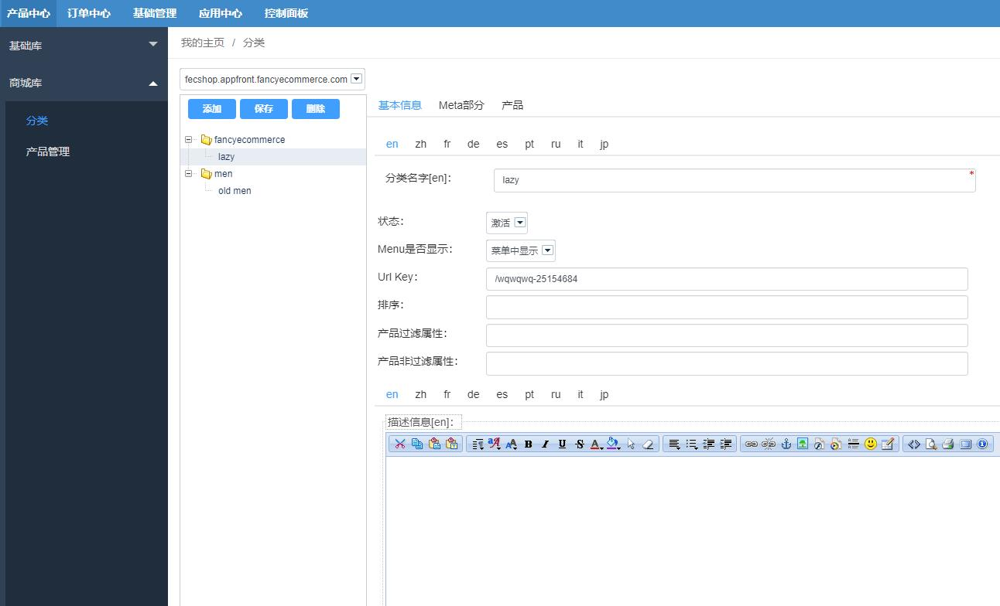
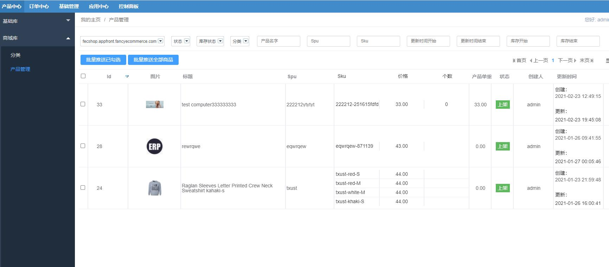
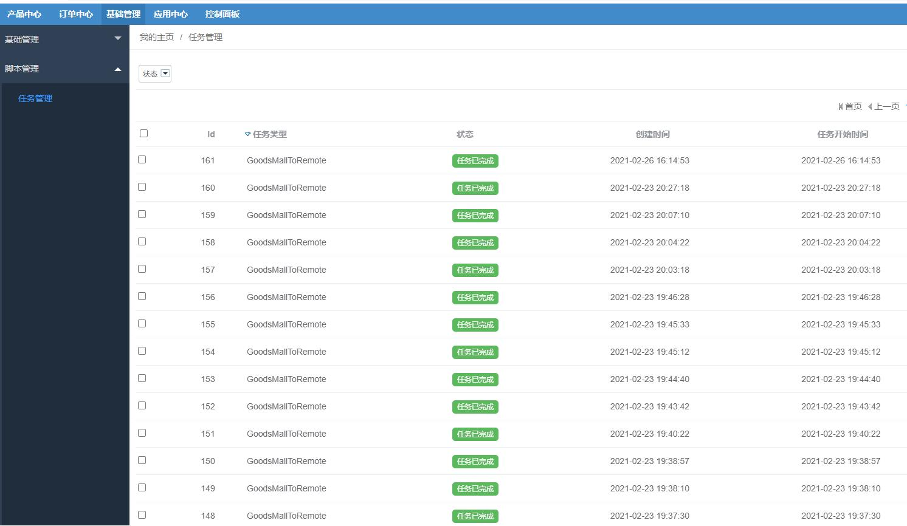

ERP商城产品管理
=========

> 商城产品库管理

### ERP商城产品管理

当您在 后台   `基础管理` --> `网站配置` 添加了网站后，就可以为这个网站商城添加分类和商品了

1.网站商城分类管理

您可以点击顶部下拉条，切换不同的网站商城，为他们编辑商城分类

2.网站商城产品管理

网站商城产品，只能通过基础库同步新增，然后，可以进行产品编辑修改。

对于编辑处理完成的商品，您可以将`网站商城产品`同步到远程商城，`批量推送已勾选`  和 `批量推送全部商品` 2种方式

注意：提交推送任务后，推送不是即时的，因为推送是一个比较耗时的操作，因此是通过离线任务脚本执行的，这里仅仅是新增一个任务

您可以在这里查看任务脚本的处理情况

