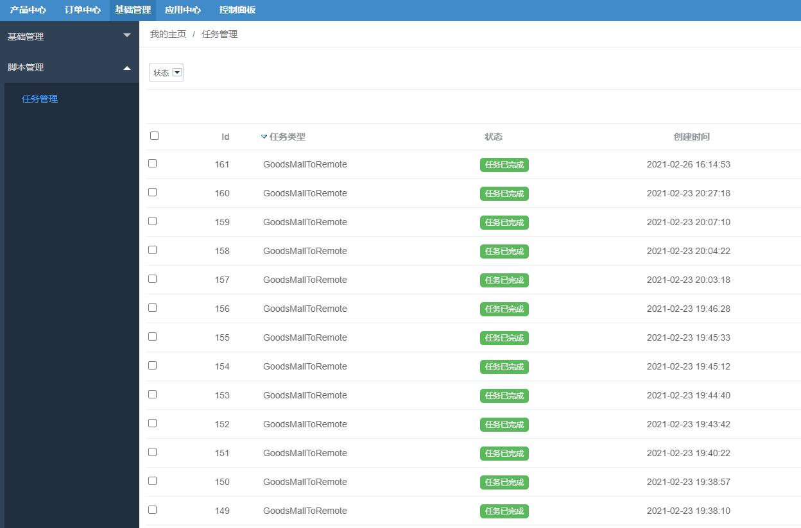

Task任务脚本
=========

> 任务处理脚本

### Task任务脚本


对于一些耗时比较长的操作，譬如同步数据，不适合即时处理，适合通过任务的方式

管理员在后台操作数据同步，就下了一个任务，然后通过离线脚本来处理任务内容

1.Task任务脚本文件路径：

```
./addons/fecmall/fecerp/shell/task.sh
```

2.通过linux CRON定时任务执行Task.sh


执行`crontab -e`,进入cron编辑部分，进行脚本添加

```
* * * * * /usr/bin/flock -xn /www/web_logs/task.lock -c '/bin/bash /www/web/demo/fecerp/addons/fecmall/fecerp/shell/task.sh  >> /www/web_logs/fecerp/task.log 2>&1'
```

由于各个task的执行时间有偏差，有时候脚本执行时间比较长，有时间比较短，而我们希望每分钟循环执行一次（增强时效性），因此需要通过锁
机制，当task执行超过一分钟没有完成，那么下一分钟的task执行的时候将会取消，直至当前task执行完成，才会执行下一个task


`/usr/bin/flock -xn /www/web_logs/task.lock -c 'xxxxxxxxxx'`： linux锁机制

`/bin/bash /www/web/demo/fecerp/addons/fecmall/fecerp/shell/task.sh  >> /www/web_logs/fecerp/task.log 2>&1`：执行的task.sh文件
路径，以及将执行结果写入到`/www/web_logs/fecerp/task.log`


2.1文件创建以及权限设置：(例子)

```
mkdir /www/web_logs

touch /www/web_logs/task.lock
chmod 777 /www/web_logs/task.lock

touch /www/web_logs/fecerp/task.log
chmod 777 /www/web_logs/fecerp/task.log

chmod 755 /www/web/demo/fecerp/addons/fecmall/fecerp/shell/task.sh
```

2.2添加cron后，您可以添加一下产品同步，譬如将基础库产品同步到商城产品库，可以在后台查看task列表：




### Task任务原理

讲解task的创建，执行步骤


1.Task的创建

譬如：当您在后台 `基础管理` --> `基础管理` -->  `网站配置` , 点击`同步基础数据`,勾选同步项，就会添加一个Task

1.1文件：`fecerp\app\appadmin\modules\Baseconfig\block\site`，大约66行代码

```
foreach ($sync_info as $item) {
    if ($item == 'mutil_lang') {
        $type = 'LanguageMallToRemote';
        Yii::$service->task->createTask($type, $taskContent);
    } else if ($item == 'currency') {
        $type = 'CurrencyMallToRemote';
        Yii::$service->task->createTask($type, $taskContent);
    } else if ($item == 'product_attr') {
        $type = 'GoodsAttrMallToRemote';
        Yii::$service->task->createTask($type, $taskContent);
    } else if ($item == 'product_brand') {
        $type = 'GoodsBrandMallToRemote';
        Yii::$service->task->createTask($type, $taskContent);
    } else if ($item == 'category') {
        $type = 'CategoryMallToRemote';
        Yii::$service->task->createTask($type, $taskContent);
    } else if ($item == 'product') {
        $type = 'GoodsMallToRemote';
        Yii::$service->task->createTask($type, $taskContent);
    }
}
```

然后机会执行函数`Yii::$service->task->createTask($type, $taskContent)`创建task

1.2打开文件@fecerp/services/Task.php  , 查看代码

```
public function createTask($type, $taskContent)
{
    $this->initTaskServiceByType($type);
    $model = new $this->_modelName;
    $model->type = $type;
    $model->task_content = $this->_taskTypeService->getTypeTaskContent($taskContent);
    $model->created_at = time();
    $model->plan_at = $this->_taskTypeService->getPlanAt();    // $planAt;
    $model->status = $this->getInitStatus();
    
    return $model->save();
}

public function initTaskServiceByType($type)
{
    $obName = $type;
    if (isset($this->taskTypeServices[$type]) && $this->taskTypeServices[$type]) {
        $obName = $this->taskTypeServices[$type];
        if (substr($obName,0,1) == '@') {
            $currentService = Yii::getAlias($obName);
            $this->_taskTypeService = new $currentService();
            
            return;
        }
    }
    $className = get_class($this);
    $storagePath = '\\'.strtolower($className).'\\';
    $currentService =  $storagePath.ucfirst($obName);
    $this->_taskTypeService = new $currentService();
    
    return;
}
```

通过传递的`$type`,找到对应的`实例task`文件，实例化并赋值给`$this->_taskTypeService`,
譬如：当`$type = 'GoodsMallToRemote'`，将会将`@fecerp\services\task\GoodsMallToRemote.php` 实例化并赋值于  `$this->_taskTypeService`

然后通过`实例task`, 处理数据，创建Task。

```
$model->task_content = $this->_taskTypeService->getTypeTaskContent($taskContent);
$model->plan_at = $this->_taskTypeService->getPlanAt();    // $planAt;
```

erp后台的同步操作，基本都是通过该方式创建Task，创建task的本质，就是往task数据表里面插入一条数据。

2.执行task

Task的执行，是console执行的，因此您需要配置cron，通过计划任务来执行脚本，具体参看顶部`Task任务脚本`

2.1打开文件 `@fecerp/shell/task.sh`, 可以看到，最终的执行是 `yii base/task/processtask`
，这个console controller对应的文件是`@fecerp\app\console\modules\Base\controllers\TaskController.php`,
找到函数

```
public function actionProcesstask($taskPageNum, $taskContentPageNum)
{
    Yii::$service->task->processTask($taskPageNum, $taskContentPageNum);
}
```

2.2打开文件@fecerp/services/Task.php  , 查看代码

```
public function processTask($taskPageNum, $taskContentPageNum)
{
    $taskM = $this->getTaskMByPageNum($taskPageNum);
    if (!$taskM || !$taskM['type']) {
        
        return;
    }
    $type = $taskM['type'];
    $this->initTaskServiceByType($type);
    
    return $this->_taskTypeService->processTask($taskM, $taskContentPageNum);
}
```

在第1部分，我们创建了`$type = 'GoodsMallToRemote'`的task，那么通过函数`$this->initTaskServiceByType($type);`,
`$this->_taskTypeService`对应的是`@fecerp\services\task\GoodsMallToRemote.php`
，打开这个文件，找到函数`processTask($taskM, $taskContentPageNum)`

```
public function processTask($taskM, $taskContentPageNum)
{
    $task_content = $taskM['task_content'];
    $task_content = unserialize($task_content);
    $siteId = $task_content['condition']['site_id'];
    $whereArr = isset($task_content['condition']['where']) ? $task_content['condition']['where'] : [];
    if (!$siteId) {
        
        return false;
    }
    Yii::$service->mallsite->initCurrentSiteId($siteId);
    $filter = [
        'numPerPage' 	=> $this->numPerPage,
        'pageNum'		=> $taskContentPageNum,
        'asArray'  => true,
    ];
    if (is_array($whereArr) && !empty($whereArr)) {
        $filter['where'] = $whereArr;
    }
    $collData = Yii::$service->goods->mallgoods->coll($filter);
    Yii::$service->logs->info("processTask############");
    
    $apiUrlKey = '/v1/product/upsertone';
    $apiDatas = $this->getApiData($collData['coll']);
    foreach ($apiDatas as $apiData) {
        $image = $apiData['image'];
        Yii::$service->logs->info($apiData['id']);
        //Yii::$service->logs->info($image);
        // 同步细节图
        if (isset($image['gallery']) && is_array($image['gallery'])) {
            foreach ($image['gallery'] as $imgOne) {
                if (isset($imgOne['image']) && $imgOne['image']) {
                    $this->syncProductImg($siteId, $imgOne['image']);
                }
            }
        }
        // 同步主图
        if (isset($image['main']['image']) && $image['main']['image']) {
            $this->syncProductImg($siteId, $image['main']['image']);
        }
        
        //Yii::$service->logs->info('apiData####: ');
        //Yii::$service->logs->info($apiData);
        Yii::$service->task->taskApi($siteId, $apiUrlKey, 'post', ['product' => $apiData]);
    }
    
    return true;
}
```

通过这个函数进行数据同步。


到这里，task的执行逻辑讲解就完成了


### 二开扩展，创建新的task或者重写已有的Task


当您创建了自己的fecmall扩展，或者本地开发，您可以在task services中添加配置`taskTypeServices`,
进行指向。

1.添加配置

```
'services' => [
    'task' => [
        // 'class' => 'fecerp\services\Task',
        'taskTypeServices' => [
            'GoodsBaseToMall'  => '@fecxxx/services/task/GoodsBaseToMall',
            'CustomTask'  => '@fecxxx/services/task/CustomTask',
        ],
    ],
],


```


1.1对于`GoodsBaseToMall`，在erp中已经存在，通过该配置会重写`@fecerp/services/task/GoodsBaseToMall`，
因此，该配置是重写配置

1.2对于`CustomTask`，在erp中不存在，通过该配置，您可以创建您自己的Task，因此该配置是创建新Task的配置

2.创建Task实例

新创建的Task必须实现接口 `fecerp\services\task\TaskInterface`

```
<?php
namespace fecxxx\services\task;

use Yii;
use yii\base\InvalidValueException;
use fecshop\services\Service;
use fecerp\services\task\TaskInterface

/**
 * @author Terry Zhao <2358269014@qq.com>
 * @since 1.0
 */
class CustomTask extends Service implements TaskInterface
{
    ...
}

```

您可以打开`fecerp\services\task\TaskInterface`,查看需要实现的方法

```
<?php
namespace fecerp\services\task;
interface TaskInterface
{
    /**
     * @param $taskContent 
     * task service 创建task函数createTask需要调用该函数，将传递过来的$taskContent，再处理一下返回。
     * 一般是 serialize 函数处理一下返回。
     */
    public function getTypeTaskContent($taskContent);
    /**
     * task执行的时间戳，一般直接返回time()即可
     */
    public function getPlanAt();
    /**
     * @param $taskM | task model
     * 对于同步数据或者其他一些数据量比较大的task，需要多页同步，因此通过该函数返回task内容的总页数
     * 如果数据量小，这里直接返回1即可。
     */
    public function getTaskContentPageCount($taskM);
    /**
     * @param $taskM | task model
     * @param $taskContentPageNum | int，task处理内容的当前页数
     * 处理当前页的具体task内容
     */
    public function processTask($taskM, $taskContentPageNum);
}


```

3.创建任务

您可以在后台，创建任务，可以参看上面的`Task任务原理`部分，创建task任务
，将会往task任务数据表中插入任务数据


4.执行任务

当console执行task.sh脚本的时候，就会执行该task类函数`processTask`,因此您在该函数实现您执行的代码即可。


到这里任务的介绍就完成了，您可以参看上面的文档了解大致流程，然后阅读fecerp的代码，然后开发您自己的同步task。

譬如：对接新的数据，或者新的平台，都可以用fecerp的task机制完成，非常容易扩展


