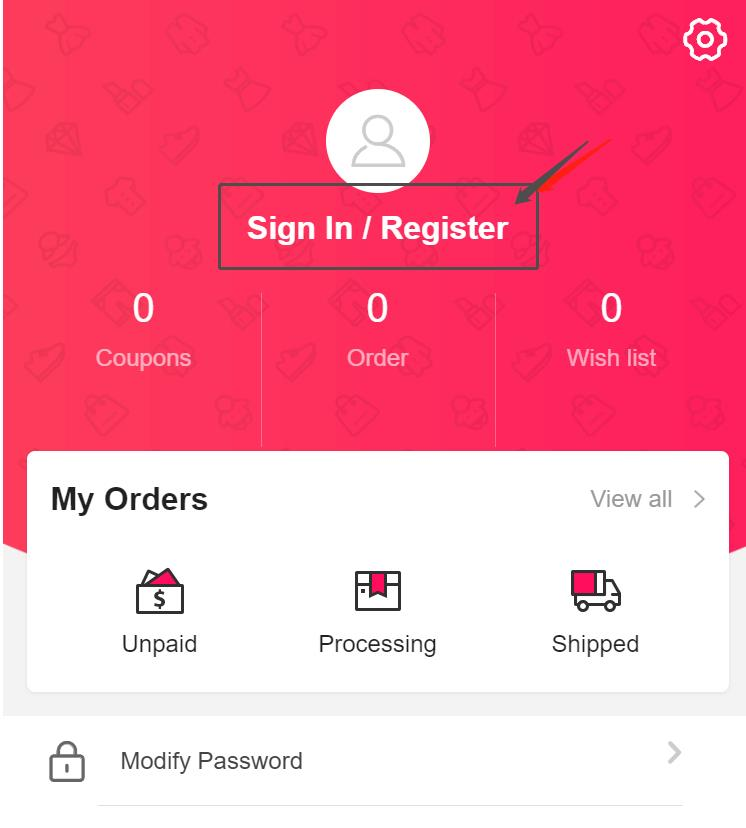
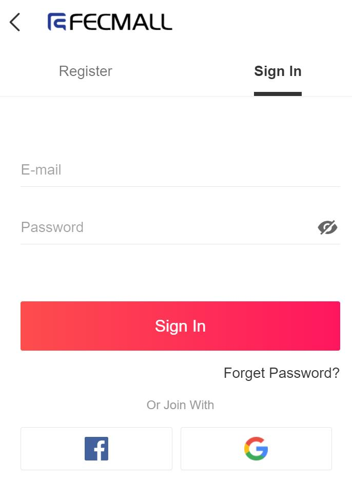
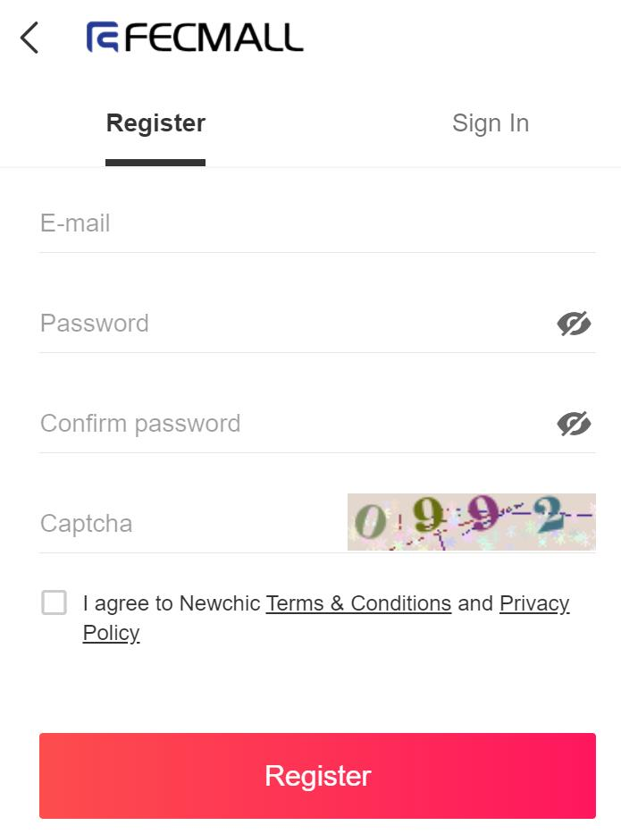
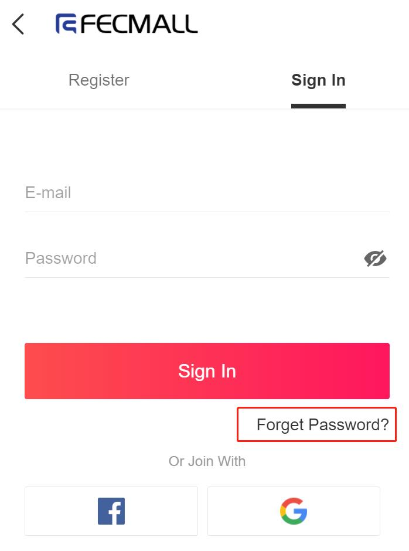
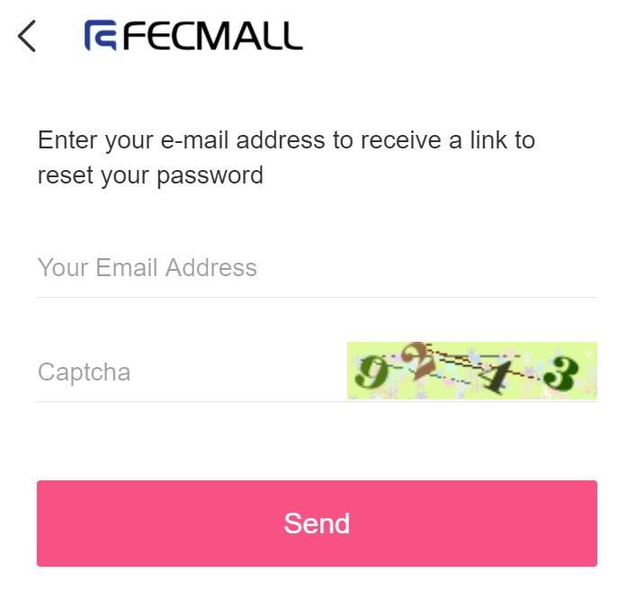
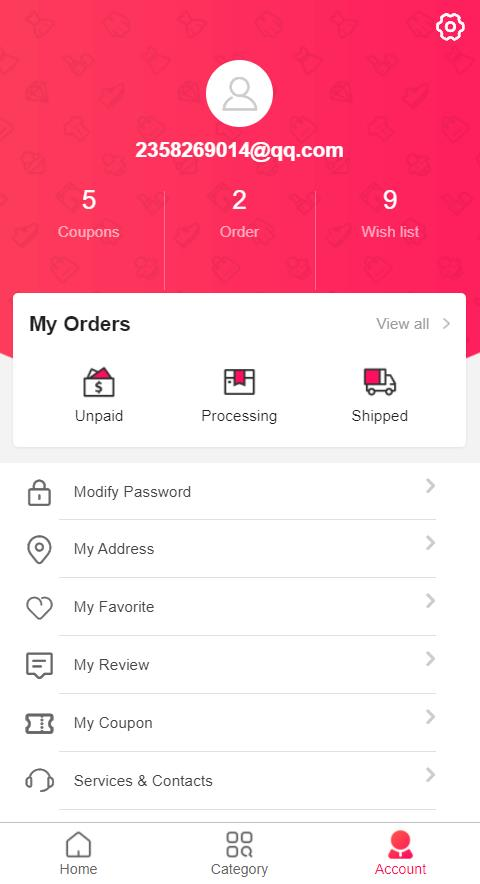
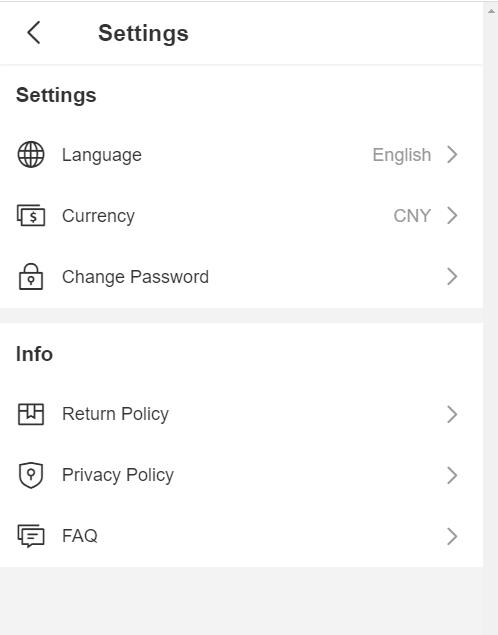

Fecro 账户中心部分
===========

> 用户账户中心部分

### 账户功能

1.账户登陆，注册

账户中心点击即可进入：

账户登陆，点击底部的google和facebook，即可使用google和facebook账户进行登陆跨境电商商城

账户注册：

2.密码找回

### 用户账户中心功能

账户中心界面如下：

1.点击右上角的`设置图标`，进入设置界面，可以设置语言，货币，修改密码，查看条款等等

2.我的订单列表

您可以在这里查看订单信息，未支付订单进行重新支付，订单收货，订单国际物流实时查询，
订单售后，重新下单等等

关于具体的订单操作流程，请参看订单流程部分，这里不做详细介绍

[Fecro订单处理流程](fecmall-fecro-order-process.md)

3.我的地址列表

详细参看：[Fecro 用户国际地址](fecmall-fecro-order-address.md)

4.我的评论列表

详细参看：[Fecro 用户评论列表](fecmall-fecro-review-list.md)

5.我的商品收藏

详细参看：[Fecro 用户商品收藏](fecmall-fecro-favorite.md)

6.我的优惠券

详细参看：[Fecro 优惠券](fecmall-fecro-coupon.md)

7.联系我们

详细参看：[Fecro 联系我们](fecmall-fecro-contacts.md)

