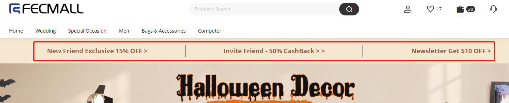
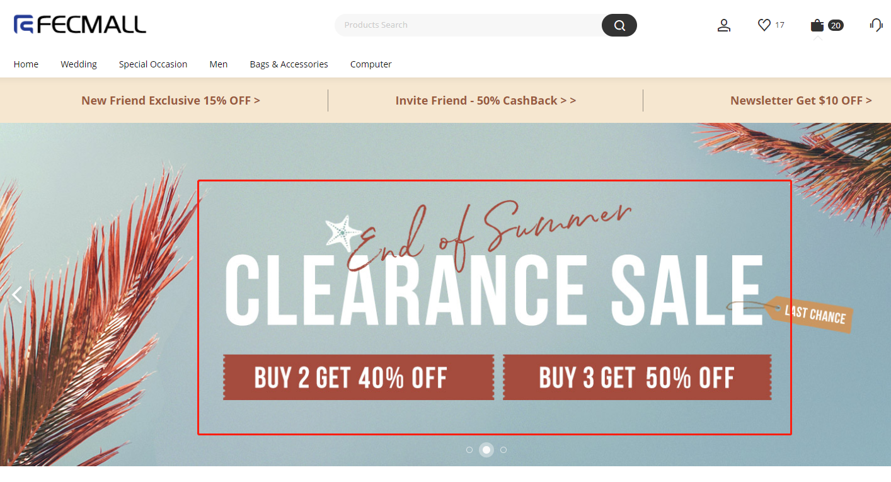
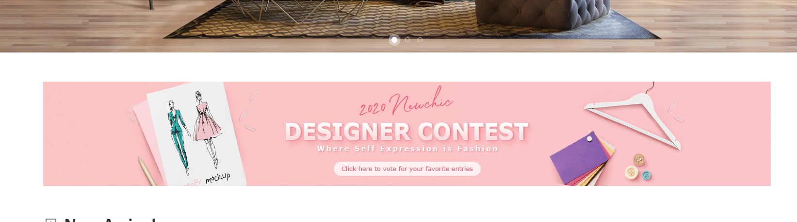
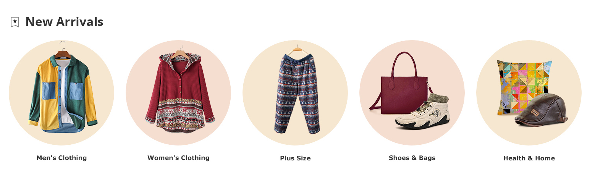
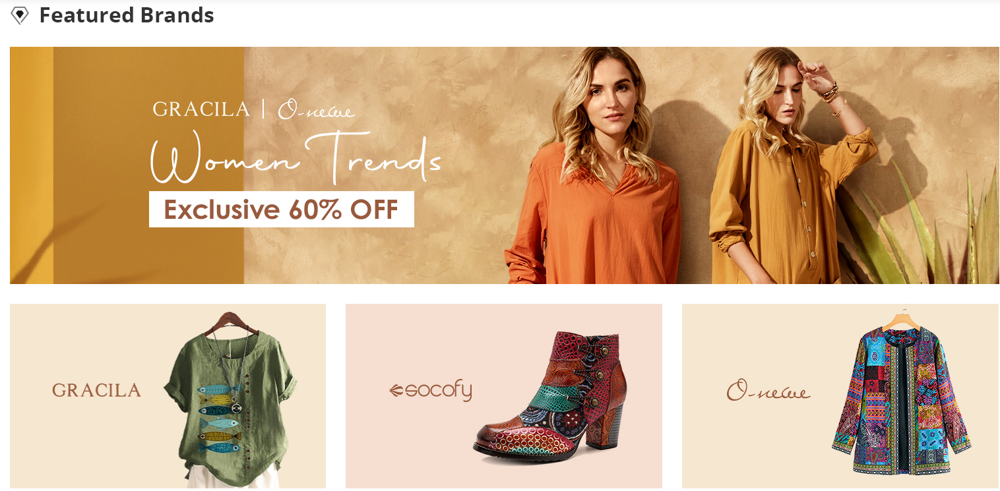
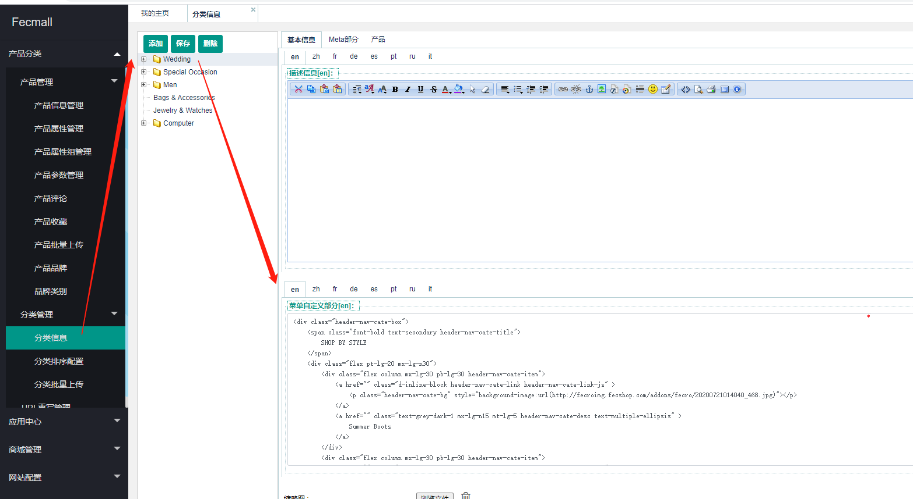

FecMall Fecro 首页Banner以及静态块配置
================

> Fecmall 首页的一些静态块的配置


### Cms StaticBlock部分配置


pc和h5部分有很多cms staticblock的配置：

1.如果您有数据库操作经验，可以直接使用sql导入：[FecMall Fecro 静态块sql快速配置](fecmall-fecro-config-sql.md)  

**注意**：操作完了sql导入，后面（第二部分）还有配置操作，不要漏掉。

2.您可以参看下面的步骤，一步一步的在后台添加配置

一：PC

1.首页顶部文字

后台， cms -->  静态块

标识符：`pc-home-top-text`

Title: `Pc：首页大图顶部文字`

内容：

```
<div class="NC-home__top-three-btn lg-8 border-right">     
	<a class="font-bold text-secondary nc-home-top-new-customer-btn-js" style="color:#99593c" href="">        New Friend Exclusive 15% OFF &gt;     </a>
</div> 
<div class="NC-home__top-three-btn lg-8 border-right">     
	<a class="font-bold text-secondary" style="color:#99593c" href="">        Invite Friend - 50% CashBack &gt; &gt;     </a> 
</div> 
<div class="NC-home__top-three-btn lg-8">     
	<a class="font-bold text-secondary" style="color:#99593c" href="">        Newsletter Get $10 OFF &gt;     </a> 
</div> 
```

该部分对应pc首页顶部文字，如图：




2.首页走马灯大图

后台， cms -->  静态块

标识符：`pc-home-top-image`

Title: `Pc：首页大图`

内容：

```
<div class="item carousel-item top-carousel-item-js active">     
	<a href="" class="carousel-item-img-container d-block">             </a> 
</div> 
<div class="item carousel-item top-carousel-item-js">     
	<a href="" class="carousel-item-img-container d-block">             </a> 
</div> 
<div class="item carousel-item top-carousel-item-js">     
	<a href="" class="carousel-item-img-container d-block">              </a> 
</div> 
```

该部分对应pc首页顶部文字，如图：




3.首页大图下面的banner

后台， cms -->  静态块

标识符：`pc-home-top-banner-image`

Title: `Pc：首页大图下面的长条banner图`

内容：

```
<a href="" style="width:100%;" class="d-block index-banner NC-obscuration">    </a> 
```

该部分对应pc首页顶部文字，如图：




4.首页New Arrival部分

后台， cms -->  静态块

标识符：`pc-home-new-arrival`

Title: `Pc：首页New Arrival部分`

内容：

```
<div class="lg-20per px-lg-15">     
	<a href="" class="d-block index-banner NC-obscuration">            </a> 
</div> 
<div class="lg-20per px-lg-15">     
	<a href="" class="d-block index-banner NC-obscuration">              </a> 
</div> 
<div class="lg-20per px-lg-15">     
	<a href="" class="d-block index-banner NC-obscuration">             </a> 
</div> 
<div class="lg-20per px-lg-15">     
	<a href="" class="d-block index-banner NC-obscuration">              </a> 
</div> 
<div class="lg-20per px-lg-15">     
	<a href="" class="d-block index-banner NC-obscuration">             </a> 
</div> 
```

该部分对应pc首页顶部文字，如图：




5.首页New Arrival部分

后台， cms -->  静态块

标识符：`pc-home-banner-2`

Title: `Pc：首页第二个Banner图`

内容：

```
<div class="flex my-lg-30">     
	<a href="" style="width:100%;" class="d-block index-banner NC-obscuration">             </a> 
</div> 
<div class="flex mx-lg-n15 my-lg-30">     
	<div class="lg-8 px-lg-15">         
		<a href="" class="d-block index-banner NC-obscuration">                    </a>     
	</div>     
	<div class="lg-8 px-lg-15">         
		<a href="" class="d-block index-banner NC-obscuration">                    </a>     
	</div>     
	<div class="lg-8 px-lg-15" data-banner-id="51937">         
		<a href="" class="d-block index-banner NC-obscuration">                     </a>     
	</div> 
</div> 
```

该部分对应pc首页顶部文字，如图：




6.首页footer底部部分

后台， cms -->  静态块

标识符：`pc-home-footer`

Title: `Pc：首页Footer底部部分`

内容：

```
<div class="container common-footer__trust-icon-container">    
	<div class="bg-white flex justify-content-around">        
		<div class="common-footer__trust-icon-item text-center py-lg-40">            
			<span class="common-footer__trust-icon-item-img d-inline-block mb-lg-5"></span>            
			<p class="font-bold text-black mb-lg-5">
				High-quality Goods
			</p>            
			<p class="font-small text-grey">
				Enjoy top quality items for less
			</p>        
		</div>        
		<div class="common-footer__trust-icon-item text-center py-lg-40">            
			<span class="common-footer__trust-icon-item-img d-inline-block mb-lg-5"></span>            
			<p class="font-bold text-black mb-lg-5">
				24/7 Livechat
			</p>            
			<p class="font-small text-grey">
				Get instant assistance whenever you need it
			</p>        
		</div>        
		<div class="common-footer__trust-icon-item text-center py-lg-40">            
			<span class="common-footer__trust-icon-item-img d-inline-block mb-lg-5"></span>            
			<p class="font-bold text-black mb-lg-5">
				Express Shipping
			</p>            
			<p class="font-small text-grey">
				Fast &amp; reliable delivery options
			</p>        
		</div>        
		<div class="common-footer__trust-icon-item text-center py-lg-40">            
			<span class="common-footer__trust-icon-item-img d-inline-block mb-lg-5"></span>            
			<p class="font-bold text-black mb-lg-5">
				Secure Payment
			</p>            
			<p class="font-small text-grey">
				Multiple safe payment methods
			</p>        
		</div>    
	</div>
</div>
<div class="container font-small">    
	<div class="flex">        
		<div class="wid-24">            
			<h3 class="font-bold footer-index__category font-bold">
				Company Information
			</h3>            
			<ul>                
				<li class="footer-index__item">                    
					<a class="footer-index__link" href="" rel="nofollow">                        About Fecmall                    </a>                
				</li>                
				<li class="footer-index__item">                    
					<a class="footer-index__link" href="" rel="nofollow">                        Privacy Policy                    </a>                
				</li>                
				<li class="footer-index__item">                    
					<a class="footer-index__link" href="" rel="nofollow">                        Return Policy                    </a>                
				</li>                
				<li class="footer-index__item">                    
					<a class="footer-index__link" href="" rel="nofollow">                        Terms And Conditions                    </a>                
				</li>                
				<li class="footer-index__item">                    
					<a class="footer-index__link" href="" rel="nofollow">                        Intellectual Property Claims                    </a>                
				</li>                
				<li class="footer-index__item hidden footer-index-impressum-js">                    
					<a class="footer-index__link" href="" rel="nofollow">                        imprint                    </a>                
				</li>            
			</ul>        
		</div>        
		<div class="wid-24">            
			<h3 class="font-bold footer-index__category font-bold">
				                Customer Service            
			</h3>            
			<ul>                
				<li class="footer-index__item">                    
					<a class="footer-index__link" href="" rel="nofollow">                      Track Order                    </a>                
				</li>                
				<li class="footer-index__item">                    
					<a class="footer-index__link" href="" rel="nofollow">                        Shipping FAQ                    </a>                
				</li>                
				<li class="footer-index__item">                    
					<a class="footer-index__link" href="" rel="nofollow">                        Order FAQ                    </a>                
				</li>                
				<li class="footer-index__item">                    
					<a class="footer-index__link" href="" rel="nofollow">                        Shipping Methods                    </a>                
				</li>                
				<li class="footer-index__item">                    
					<a class="footer-index__link" href="" rel="nofollow">                        Payment Methods                    </a>                
				</li>                
				<li class="footer-index__item">                    
					<a class="footer-index__link footer-top-searches-js" href="">                        Top Searches                    </a>                
				</li>            
			</ul>        
		</div>        
		<div class="wid-24">            
			<h3 class="font-bold footer-index__category font-bold">
				                Cooperation            
			</h3>            
			<ul>                
				<li class="footer-index__item">                    
					<a class="footer-index__link" href="" rel="nofollow">                        Blogger Program                    </a>                
				</li>                
				<li class="footer-index__item footer-index-affiliate-js">                    
					<a class="footer-index__link" href="" rel="nofollow">                        Affiliate - Make Money                    </a>                
				</li>                
				<li class="footer-index__item">                    
					<a class="footer-index__link" href="" rel="nofollow">                        VIP Program                    </a>                
				</li>                
				<li class="footer-index__item footer-index-dropship-js">                    
					<a class="footer-index__link" href="" rel="nofollow">                        Dropship Program                    </a>                
				</li>                
				<li class="footer-index__item footer-index-wholesale-js">                    
					<a class="footer-index__link" href="" rel="nofollow">                        Wholesale Program                    </a>                
				</li>                
				<li class="footer-index__item footer-index-student-program-js">                    
					<a class="footer-index__link" href="" rel="nofollow">                        Student Program                    </a>                
				</li>                
				<li class="footer-index__item hidden footer-index-student-es-program-js">                    
					<a class="footer-index__link" href="" rel="nofollow">                        programa de estudiantes                    </a>                
				</li>            
			</ul>        
		</div>        
		<div class="wid-28 flex column justify-content-between">            
			<div class="footer-index-subscribed-content-js justify-content-start">                
				<div class="mb-lg-20 footer-sub-form-container-js hidden">                
				</div>                
				<h3 class="font-bold footer-index__category font-bold footer-index__subscribed-tips footer-index-subscribed-tips-js">
					                    FOLLOW US AND GET NEWEST INFORMATION                
				</h3>                
				<div class="lg-fit">                    
					<ul class="flex footer-index-community footer-index-community-js mx-lg-n10" data-site="en">                        
						<li class="mx-lg-10 footer-index__link--icon-container link--icon__vk-icon hidden footer-index-vk-js">                            
							<a class="footer-index__link--icon" href="" rel="nofollow" target="_blank">                                <span class="nc-icon nc-icon-vk" style="font-style: italic;"></span>                            </a>                        
						</li>                        
						<li class="mx-lg-10 footer-index__link--icon-container link--icon__facebook-icon">                            
							<a class="footer-index__link--icon footer-index-facebook-js" href="" rel="nofollow" target="_blank">                                <span class="nc-icon nc-icon-facebook" style="font-style: italic;"></span>                            </a>                        
						</li>                        
						<li class="mx-lg-10 footer-index__link--icon-container link--icon__instagram-icon">                            
							<a class="footer-index__link--icon footer-index-instagram-js" href="" rel="nofollow" target="_blank">                                <span class="nc-icon nc-icon-instagram1" style="font-style: italic;"></span>                            </a>                        
						</li>                        
						<li class="mx-lg-10 footer-index__link--icon-container link--icon__twitter-icon">                            
							<a class="footer-index__link--icon footer-index-twitter-js" href="" rel="nofollow" target="_blank">                                <span class="nc-icon nc-icon-twitter" style="font-style: italic;"></span>                            </a>                        
						</li>                        
						<li class="mx-lg-10 footer-index__link--icon-container link--icon__pinterest-icon">                            
							<a class="footer-index__link--icon footer-index-pin-js" href="" rel="nofollow" target="_blank">                                <span class="nc-icon nc-icon-pinterest1" style="font-style: italic;"></span>                            </a>                        
						</li>                        
						<li class="mx-lg-10 footer-index__link--icon-container link--icon__youtube-icon">                            
							<a class="footer-index__link--icon footer-index-youtube-js" href="" rel="nofollow" target="_blank">                                <span class="nc-icon nc-icon-youtube" style="font-style: italic;"></span>                            </a>                        
						</li>                        
						<li class="mx-lg-10 footer-index__link--icon-container link--icon__blogger-icon">                            
							<a class="footer-index__link--icon" href="" rel="nofollow" target="_blank">                                <span class="nc-icon nc-icon-blogger" style="font-style: italic;"></span>                            </a>                        
						</li>                    
					</ul>                
				</div>            
			</div>            
			<div class="flex justify-content-start align-items-center">                
				<a class="d-inline-block footer-app__qr">                                    </a>                
				<div class="lg px-lg-20 font-bold font-normal footer-download-tip-js">
					                    Get a free gift and use                     <span style="color:#E30057;">20% OFF</span>                     coupon now                
				</div>            
			</div>        
		</div>    
	</div>    
	<div class="mt-lg-50">        
		<div class="flex justify-content-center align-items-center">            
			<div class="my-lg-10 mx-lg-5 footer-authitem__img footer-paypal-img">                
				            
			</div>            
			<div class="my-lg-10 mx-lg-5 footer-authitem__img footer-visa-img">                
				            
			</div>            
			<div class="my-lg-10 mx-lg-5 footer-authitem__img footer-mastercard-img">                
				            
			</div>            
			<div class="my-lg-10 mx-lg-5 footer-authitem__img footer-mada-img">                
				            
			</div>            
			<div class="my-lg-10 mx-lg-5 footer-authitem__img footer-oxxo-img">                
				            
			</div>            
			<div class="my-lg-10 mx-lg-5 footer-authitem__img footer-sofort-img">                
				            
			</div>            
			<div class="my-lg-10 mx-lg-5 footer-authitem__img footer-ideal-img">                
				            
			</div>                    
		</div>        
		<div class="font-small text-grey pt-lg-10 pb-lg-30 text-center">
			            Copyright &copy; 2014-2020 <a style="color:#777" target="_blank" href="http://www.fecmall.com">Fecmall.com</a> All Rights Reserved.        
		</div>    
	</div>
</div>
```

该部分对应pc首页顶部文字，如图：


二：H5入口


1.后台， cms -->  静态块

> html5首页顶部的大图以及底部的一些图片

标识符：`html5_home_top`

Title: `Html5 Home Top`

内容：

```

<div class="mb-0 v-card">    
	<div class="home-v2-top-banner-wrap" moduleindex="1" moduletype="2001" style="padding-bottom:0.426667rem; ">        
		<div class="agile home-top-banner-wrap ltr">            
			<div class="agile__list">                
				<div class="agile__track" style="transform:translate(0px);  transition:transform 0ms ease 0s;  ">                    
					<div class="agile__slides agile__slides--regular" style="width:100%">                        
						<a href="" class="agile__slide agile__slide--active agile__slide--current" style="width:100%">                                                    </a>                    
					</div>                
				</div>            
			</div>        
		</div>    
	</div>
</div>
<div class="mb-0 v-card">    
	<div class="home-v2-four-banner-wrap px-1" moduletype="2003" data-src="" lazy="loading" style="padding-bottom:0.426667rem;">        
		<ul>            
			<li>              
				              
				<p class="text-overflow mt-1">
					Tops
				</p>
			</li>            
			<li>              
				              
				<p class="text-overflow mt-1">
					Bottoms
				</p>
			</li>            
			<li>              
				              
				<p class="text-overflow mt-1">
					Dresses
				</p>
			</li>            
			<li>              
				              
				<p class="text-overflow mt-1">
					Lingerie
				</p>
			</li>            
			<li class="last-line">              
				              
				<p class="text-overflow mt-1">
					shoes
				</p>
			</li>            
			<li class="last-line">              
				              
				<p class="text-overflow mt-1">
					Bags
				</p>
			</li>            
			<li class="last-line">              
				              
				<p class="text-overflow mt-1">
					Accessories
				</p>
			</li>            
			<li class="last-line">              
				              
				<p class="text-overflow mt-1">
					Beauty
				</p>
			</li>        
		</ul>    
	</div>
</div>
<div class="mb-0 v-card">    
	<div class="customer-banner" style="padding-bottom:0.426667rem !important;">        
		    
	</div>
</div>
<div class="mb-0 v-card">    
	<div class="home-v2-banner-with-category" style="padding-bottom:0.426667rem; ">        
		<div>            
			<ul class="display-flex pt-2">              
				<li class="px-1">                
					<div class="pa-2 category-img">                  
						                
					</div>                
					<p class="text-overflow px-2">
						Socofy
					</p>
				</li>              
				<li class="px-1">                
					<div class="pa-2 category-img">                  
						                
					</div>                
					<p class="text-overflow px-2">
						Gracila
					</p>
				</li>              
				<li class="px-1">                
					<div class="pa-2 category-img">                  
						                
					</div>                
					<p class="text-overflow px-2">
						O-NEWE
					</p>
				</li>              
				<li class="px-1">                
					<div class="pa-2 category-img">                  
						                
					</div>                
					<p class="text-overflow px-2">
						Lostisy
					</p>
				</li>            
			</ul>            
			<div class="separating-banner ba1">              
				<div class="separating-banner-content separating-banner-subtitle">                
					<span>UP TO 60%OFF</span>
				</div>              
				<div class="separating-banner-content separating-banner-title">                
					<span>Vintage Shoes</span>
				</div>              
				<div class="separating-banner-content separating-banner-button">                
					<span class="px-2">buy now &gt;</span>
				</div>            
			</div>        
		</div>    
	</div>
</div>          

```


### 其他配置


1.首页产品配置

1.1appfront首页产品Recommend For You

`网站配置` --> `appfront配置`  --> `首页配置` ，  编辑项：`热销产品sku`

您可以填写测试数据：`p10001-kahaki-xl,sk10003-001,sk10005,sk1000-khak,sk0003,men0003,men0002,men0001`

1.2apphtml5首页产品：`You May Also Like`

`网站配置` --> `apphtml5配置`  --> `首页配置` ， 编辑项：`特色产品sku`

您可以填写测试数据：`p10001-kahaki-xl,32332,432432,sk2001-blue-zo,sk0008,sk0004,sk0003,sk0002,sk1000-black`

2.热门搜索关键词列表：

网站后台： `网站配置` -->  `Fecro Config`

3.h5，以及pc，页脚的 `FECMALL.COM`配置

在网页底部的copyright，会出现 `FECMALL.COM`的字眼，您可以在后台更改

`基础配置`  --> `基础配置` -->  `网站名称`

4.pc首页分类菜单的自定义部分

如图：


您可以在后台分类编辑部分添加




您只需要在一级分类里面添加即可，就可以在pc端一级分类的弹框中显示，下面是默认的部分

您可以复制下面的内容，在您的分类中编辑保存即可。


```
<div class="header-nav-cate-box">
    <span class="font-bold text-secondary header-nav-cate-title">
        SHOP BY STYLE
    </span>
    <div class="flex pt-lg-20 mx-lg-n30">
        <div class="flex column mx-lg-30 pb-lg-30 header-nav-cate-item">
            <a href="" class="d-inline-block header-nav-cate-link header-nav-cate-link-js" >
                <p class="header-nav-cate-bg" style="background-image:url(http://fecroimg.fecshop.com/addons/fecro/20200721014040_468.jpg)"></p>
            </a>
            <a href="" class="text-grey-dark-1 mx-lg-n15 mt-lg-5 header-nav-cate-desc text-multiple-ellipsis" >
                Summer Boots
            </a>
        </div>
        <div class="flex column mx-lg-30 pb-lg-30 header-nav-cate-item">
            <a href="" class="d-inline-block header-nav-cate-link header-nav-cate-link-js" >
                <p class="header-nav-cate-bg" style="background-image:url(http://fecroimg.fecshop.com/addons/fecro/20200809214639_190.jpg)"></p>
            </a>
            <a href="" class="text-grey-dark-1 mx-lg-n15 mt-lg-5 header-nav-cate-desc text-multiple-ellipsis" >
                Vintage Jewelry
            </a>
        </div>
        <div class="flex column mx-lg-30 pb-lg-30 header-nav-cate-item">
            <a href="" class="d-inline-block header-nav-cate-link header-nav-cate-link-js" >
                <p class="header-nav-cate-bg" style="background-image:url(http://fecroimg.fecshop.com/addons/fecro/20200811032400_384.jpg)"></p>
            </a>
            <a href="" class="text-grey-dark-1 mx-lg-n15 mt-lg-5 header-nav-cate-desc text-multiple-ellipsis" >
                Designer Outfit
            </a>
        </div>
        <div class="flex column mx-lg-30 pb-lg-30 header-nav-cate-item">
            <a href="" class="d-inline-block header-nav-cate-link header-nav-cate-link-js" >
                <p class="header-nav-cate-bg" style="background-image:url(http://fecroimg.fecshop.com/addons/fecro/20200721014125_699.jpg)"></p>
            </a>
            <a href="" class="text-grey-dark-1 mx-lg-n15 mt-lg-5 header-nav-cate-desc text-multiple-ellipsis" >
                Designer Shirts
            </a>
        </div>
    </div>
</div>
<div class="header-nav__banner-list flex justify-content-end">
    <div class="flex column mt-lg-10 mx-lg-15">
        <a href="" class="header-nav__banner-link header-nav-banner-image-lazyload position-relative " >
            
        </a>
        <a href="" class="banner-title font-bold ">
            Saving Tips
        </a>
    </div>
</div>
```


