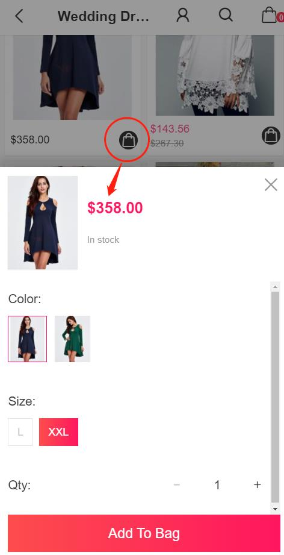
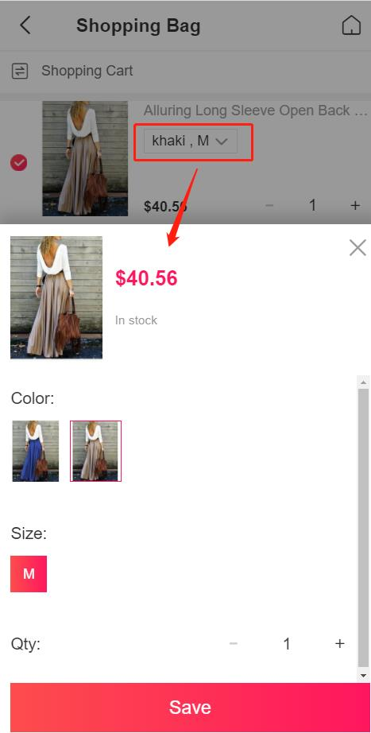
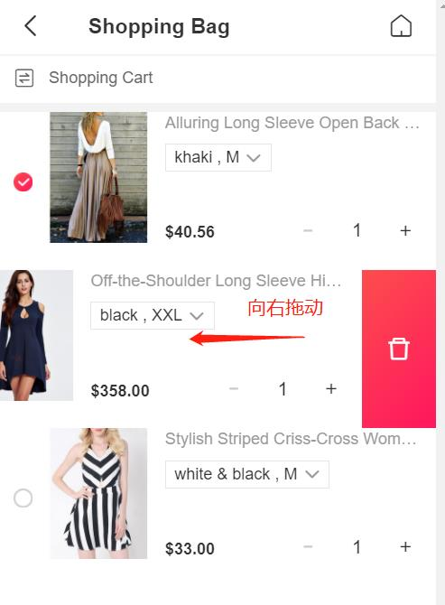

Fecro 特色购物车
==========

> Fecro购物车特色介绍

### 商品加入购物车

1.商品可以在`分类产品`，`搜索产品`列表页面，点击`加入购物车`按钮，
弹出商品`规格属性`界面，用户选择`规格`属性以及`个数`，将商品加入购物车。

2.用户在我的收藏页面，也可以将商品加入购物车

详细参看：[Fecro 用户商品收藏](fecmall-fecro-favorite.md)

3.用户在产品详情页面将商品加入购物车

### 购物车页面

购物车页面

1.购物车下单商品勾选

2.购物车商品个数修改

3.购物车`商品规格`修改，点击购物车商品规格，在弹框中`重新选择`规格，点击`save`即可。

4.购物车商品删除

