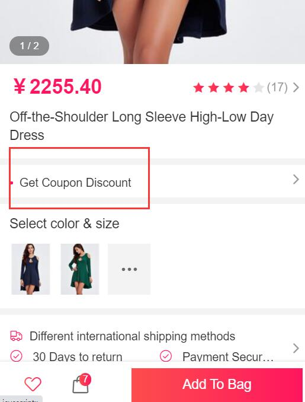
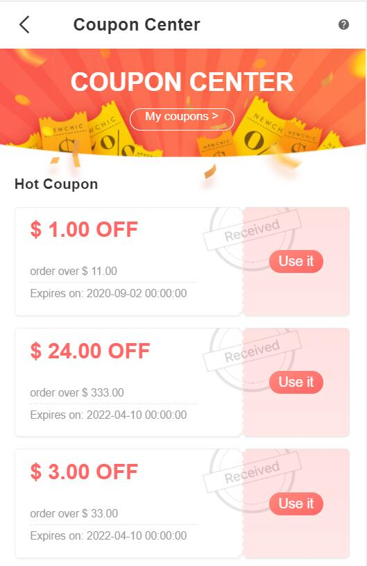
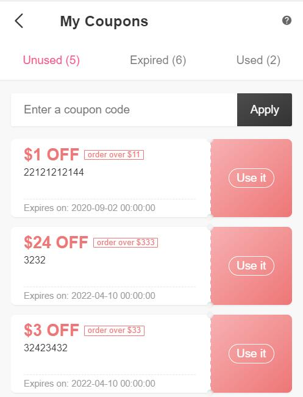
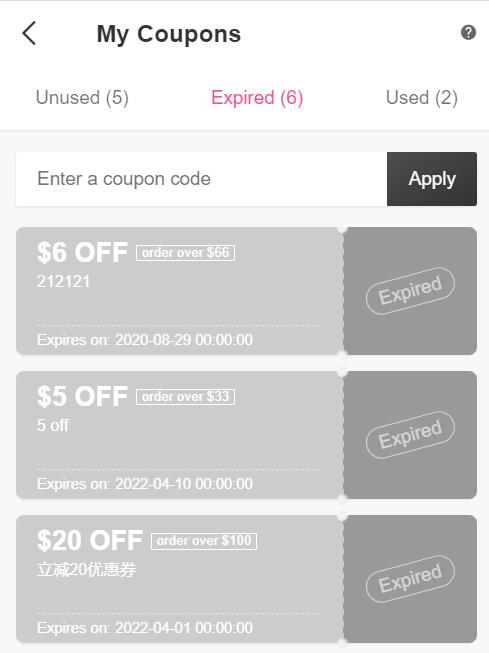
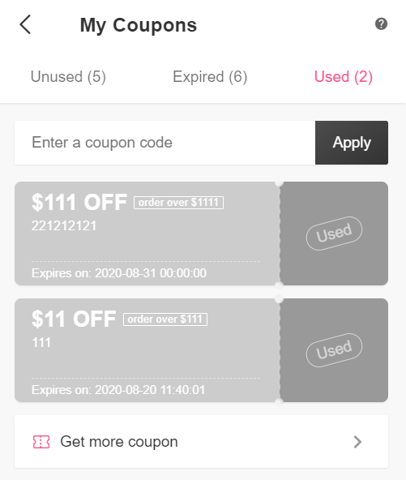
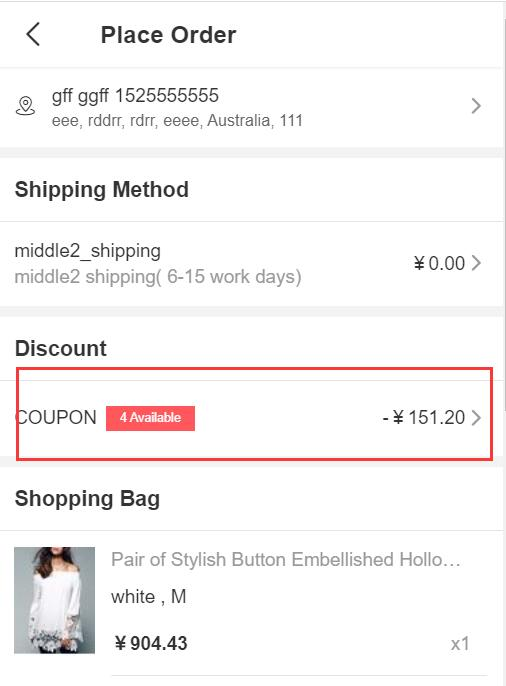
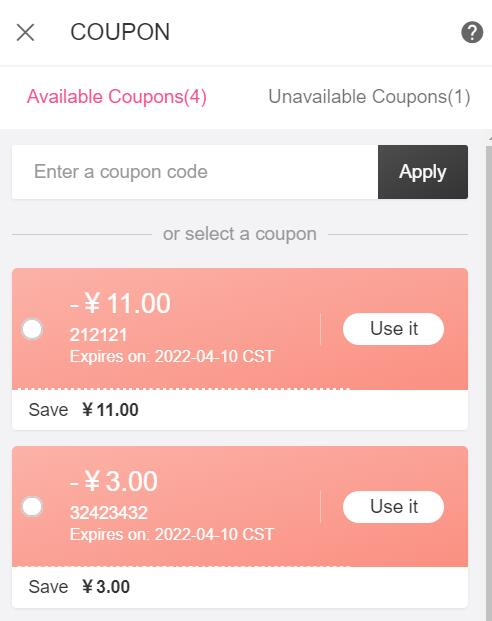

Fecro 优惠券
========

> 针对跨境电商流程的商城系统，在fecmall基础上进行了二次开发，下面是二开的功能介绍

### 优惠券介绍，以及后台编辑

1.优惠券的限制类型

> 优惠券，在后台管理员生成，优惠券可以针对`所有产品`，也可以`限制某些sku`，或者某些`分类`下的产品

1.1`所有产品`:代表所有的产品都使用该优惠券

1.2`特定产品sku`:代表只有该sku列表中的产品，可以使用该优惠券，多个sku用`英文逗号`隔开

1.3`特定分类`:代表该分类下的产品，才可以使用此优惠券

2.优惠券的有效时间

如图上，就是优惠券的`发放时间` 和 优惠券的`结束时间`, 也就是优惠券在该时间内有效，
用户领取后，必须在该时间内使用，否则优惠券无法使用

3.优惠券发放总数

优惠券领取的用户总数，当领取该优惠券的用户数达到最大值后，未领取优惠券的用户将无法领取该优惠券

4.优惠金额

使用优惠券后，优惠的金额

5.优惠券使用条件

当订单产品的金额满足条件后，才能使用该优惠券

5.1对于`限制类型`为`所有产品`, 当购物车的产品总金额> 该值，即可使用

5.2对于`限制类型`为`特定产品sku`, 优惠券限制为此产品sku列表，也就是只有这些sku才能使用该优惠券，那么，对于购物车中的产品，
将在该sku列表中的产品总额相加，当总额大于该值后，才可以使用

5.3对于`限制类型`为`特定分类`, 优惠券限制为此产品分类列表，也就是只有这些分类下的产品才能使用该优惠券，那么，对于购物车中的产品，
将在该分类列表中的产品总额相加，当总额大于该值后，才可以使用

### 优惠券的展示和领取

1.用户可以在产品页面，直接领取该产品可用的优惠券

2.用户通过账户中心，我的优惠券页面，点击`Get More Coupon`，进入领券中心

3.账户中心查看优惠券

### 优惠券的使用

下单部分使用优惠券

点击按钮，弹出优惠券列表

您可以选择已经有的优惠券，如果您有优惠券码，可以直接兑换。

点击您想使用的优惠券，即可被选中，被在当前订单使用

4，订单取消，释放优惠券

订单生成后，如果用户未支付，可以进入账户中心订单列表，取消订单，释放优惠券。

