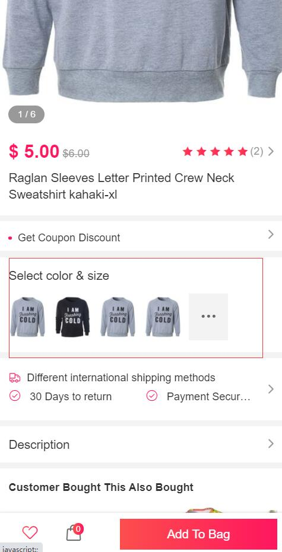
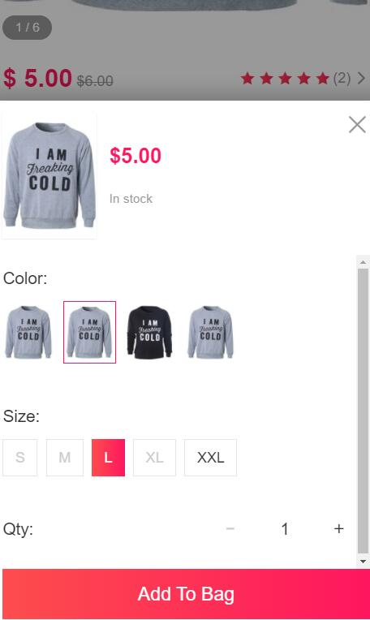

产品规格属性
==============

> 对于颜色尺码等规格属性的产品, 鉴于很多童鞋不会操作规格属性产品的编辑，进而加入了该文档进行说明。

### 产品规格属性

1.什么是规格属性

就是类似于颜色尺码

在加入购物车需要选择的规格属性，

譬如产品Demo：http://fecyo.fecshop.com/cn/raglan-sleeves-letter-printed-crew-neck-sweatshirt

fecyo本身是支持的，您可以先添加属性组，然后在属性组中添加规格属性

2.产品属性组

详细文档参看：http://www.fecmall.com/doc/fecshop-guide/instructions/cn-2.0/guide-fecmall_add_attr_custom_option.html

在上面的文档，有如何编辑产品的规格属性，一次性生成规格属性

### 淘宝产品规格属性扩展

对于多规格产品，强烈建议使用!!!! `Fecmall扩展-淘宝模式产品扩展`

fecmall默认的产品编辑，可以一次性生成多规格属性，也就是一次编辑，生成多个规格产品（多行），
但是有的童鞋希望将其看成一个产品的方式编辑，也就是在后台看到的是一行产品，而不是多行，
进而开发了淘宝扩展

详细文档： [Fecmall扩展-淘宝模式产品扩展](http://www.fecmall.com/doc/fecshop-guide/addons/cn-2.0/guide-fecmall-addons-taobao-product.html)

如果有其他问题，可以论坛发帖子咨询。

