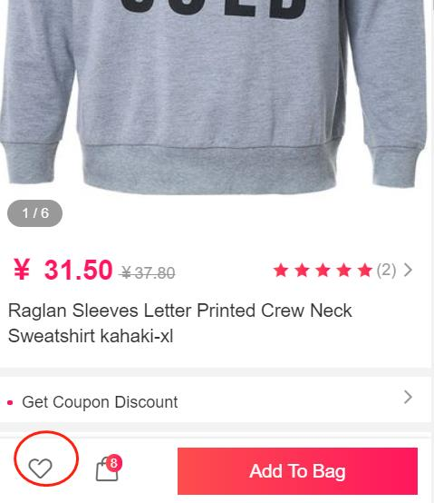
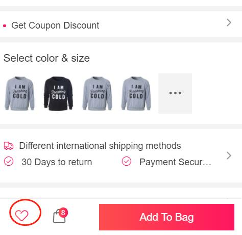
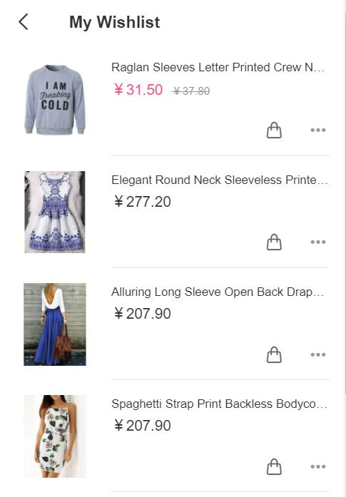
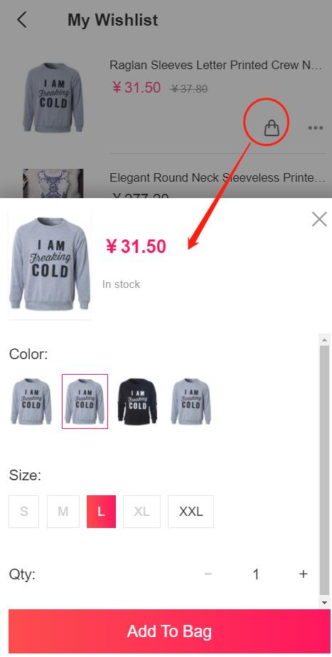
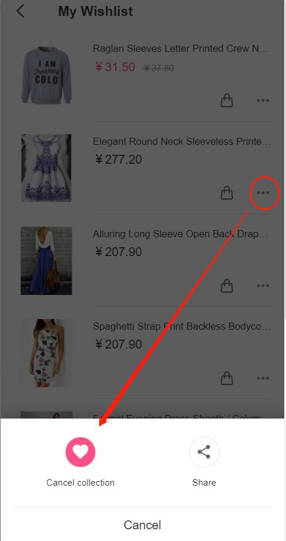

Fecro 用户商品收藏（wishlist）
=========

> 用户对产品的收藏操作，以及收藏的产品列表查看

### 用户收藏商品

在产品页面，点击收藏图标，即可进行商品收藏

收藏后，收藏图标将会`点亮`

即完成商品的收藏

### 查看商品收藏列表

账户中心，点击`My Wishlist`，即可查看收藏产品列表

点击购物车图标，可以直接将商品加入购物车

已收藏商品，进行取消收藏操作

