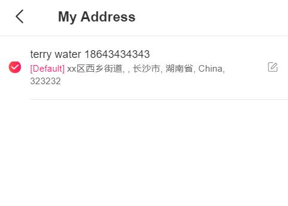
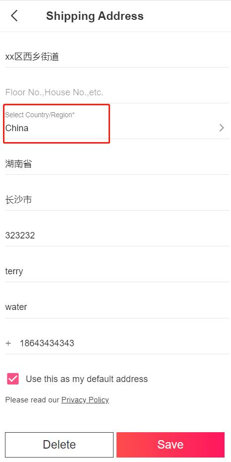
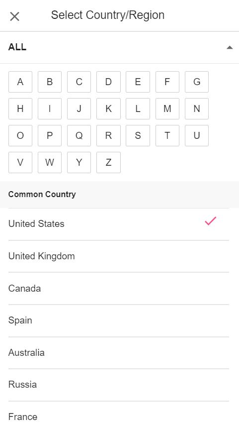

Fecro 用户国际地址
==========

> 跨境电商国际地址

### Fecro 用户国际地址

用户地址，有2种编辑流程：用户下单流程中编辑用户地址，以及，账户中心地址管理编辑地址

1.下单流程编辑用户地址，参看：*  [Fecro 用户下单流程](fecmall-fecro-order.md)

2.账户中心地址管理

账户中心页面，点击`My Address`

2.1进入`地址列表`管理页面

2.2编辑或者新建用户地址

点击国家，进入国家列表选择

您可以点击相应的首字母，进行相应国家的过滤

选择相应的国家即可，然后保存即可完成用户地址的编辑

