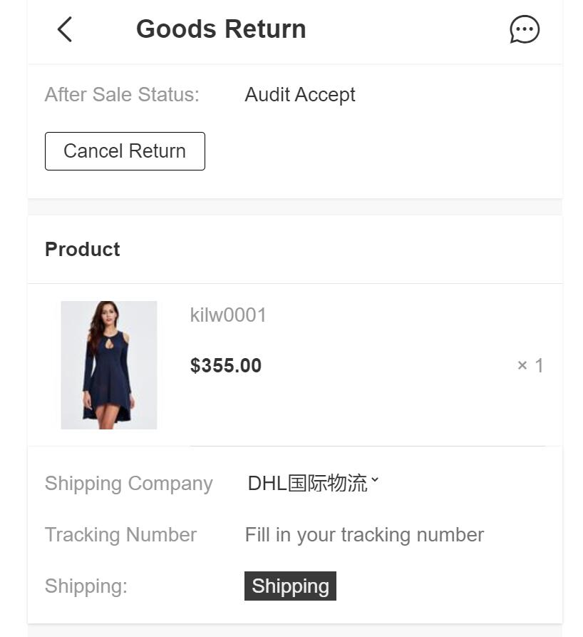
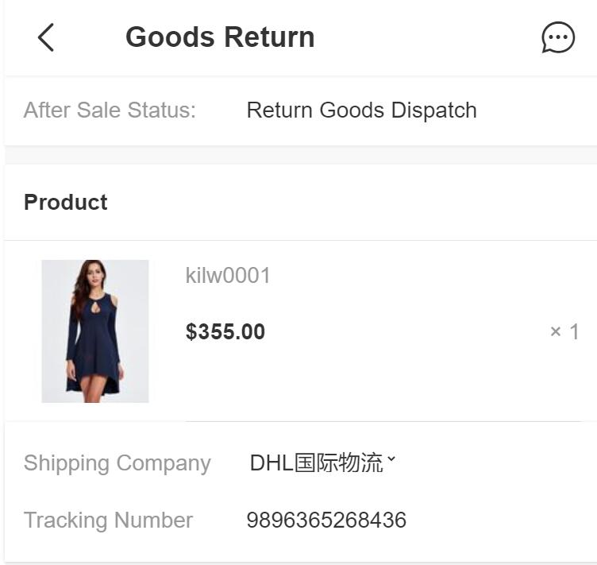

Fecmall Fecro用户退货-商品发货
=============

> 商品退货请求，管理员审核通过后，用户进行退货商品的发货操作

### 用户退货商品发货操作

1.管理员审核通过后，用户可以在账户中心订单管理，点击`after sale`，进入退货产品列表部分，

点击`Goods Return`, 进入退货部分

2.点击进入后，如果管理员审核通过，那么页面将会变成`发货页面`

2.1用户在此过程，仍然可以进行`撤销退货`操作

2.2用户选择`shipping company`，填写`tracking number`，进行退货商品`shipping`发货操作

3.操作完成后，退货状态变更为：退货商品已发货`Return Goods Dispatch`。

