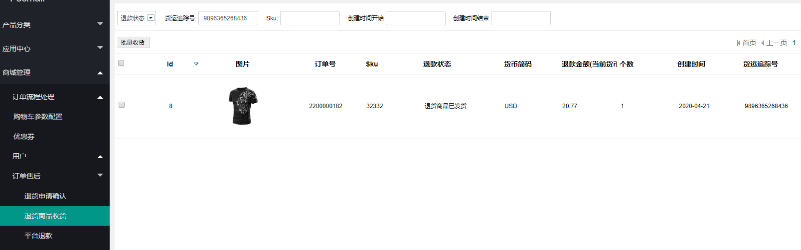

Fecmall Fecro用户退货-经销商收货
==============

> 当商家收到退货商品包裹后，进行退货商品收货操作

### 用户退货商品，商家收货操作

1.当用户的退货商品，商家可以看到已发货列表

2.用户通过快递发货后，商品收到快递包裹，可以在后台通过物流追踪号，搜索查找，如上图

3.商家可以勾选该条目，点击批量收货按钮，进行退货商品收货操作

4.退货商品收货操作，就会进入退款部分。

