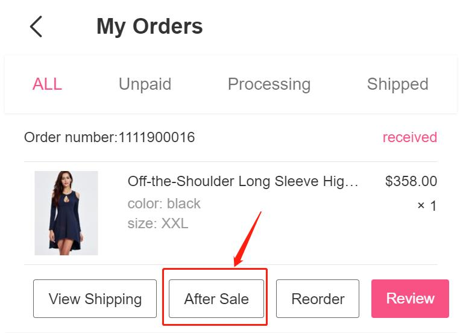
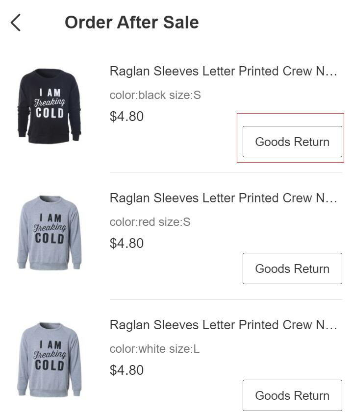
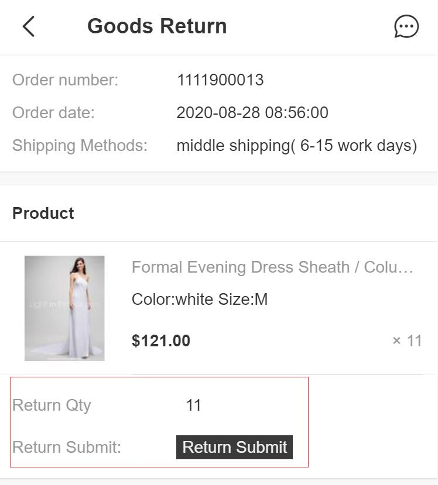
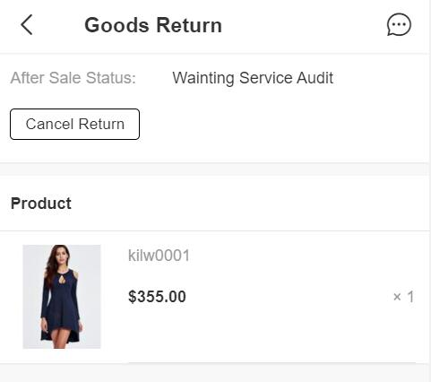

Fecmall Fecro用户发起订单商品退货流程
============

> 收货订单，如果存在质量问题，进行退货退款的操作

### 售后-用户发起订单商品退货操作

1.用户在账户中心订单管理，进行`订单收货`操作后，将会看到`After Sale`按钮，如下：

2.点击`After Sale`按钮，就进入订单详情，可以看到产品列表

退款只能针对`一个商品`操作，点击商品列表右边的`Goods Return`按钮，进入商品退货页面

3.填写退款个数，点击`Return Submit`按钮，提交退货申请

4.提交后，状态改为：`Wainting Service Audit`,需要等待管理员审核

用户可以点击`Cancel Return`按钮，取消提交的退货申请。

