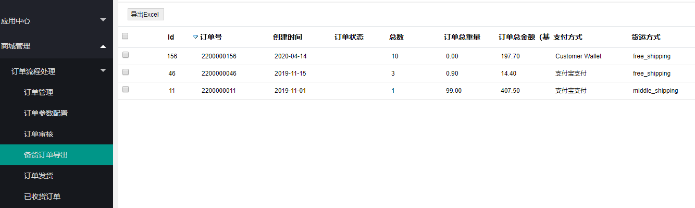
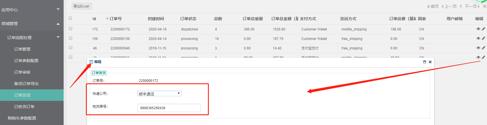
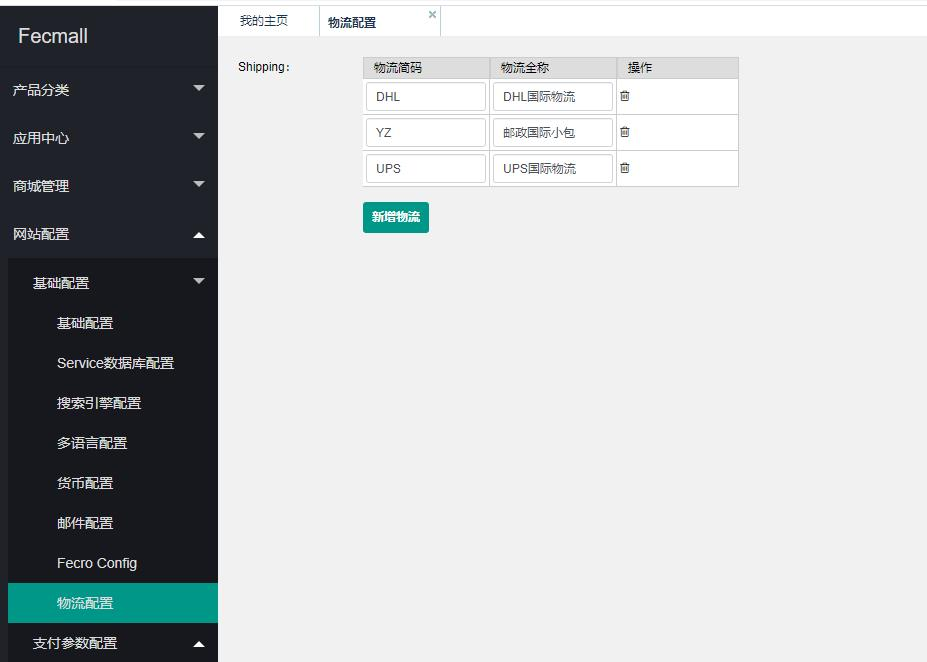

Fecmall Fecro订单发货
========

> 订单发货后，将物流快递公司填写，并填写物流追踪号，进行订单发货操作

### 订单发货

1.订单备货导出

管理员可以把需要备货的订单导出excel

2.管理员编辑订单，填写物流公司，以及物流追踪号信息，进行订单发货操作

关于物流公司列表，您可以在后台设置物流，（默认是一些国内的物流作为初始数据，后台设置后，默认的将会被清除）。

3.订单发货后，用户在账户中心可以查看订单已发货状态，查看物流追踪信息

详细参看： [Fecro 国际物流追踪](fecmall-fecro-shipping-tracking.md)

