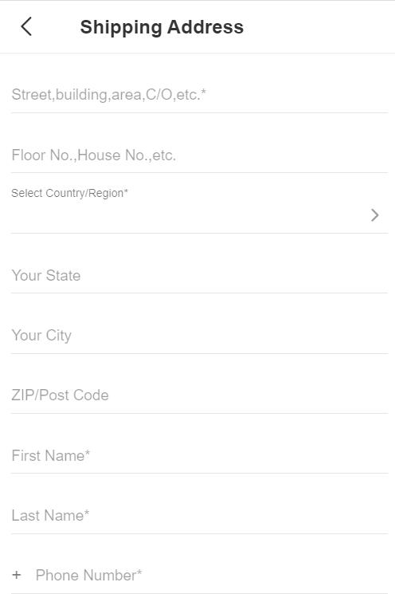
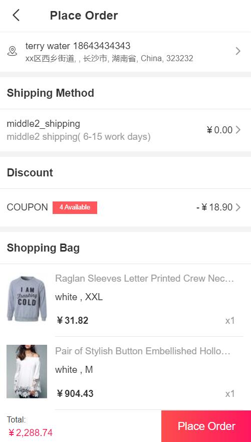
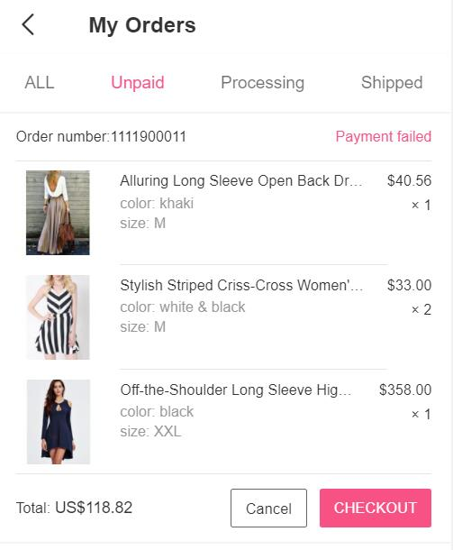
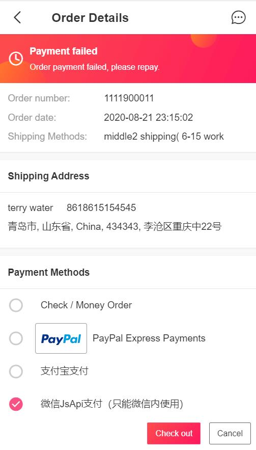

Fecmall Fecro 用户下单流程
==========

> fecmall默认的下单页面，是一页支付的方式，下单和支付一起提交，支持游客下单，
Fecro对流程进行了更改，用户必须注册登陆账户才能下单。

### Fecro 下单流程

1.用户下单需要登陆用户

用户将产品加入购物车后，在购物车页面，点击下单，进入下单页面，如果用户未登陆，会强制跳转到账户登陆页面

关于购物车，详细参看：[Fecro 购物车特色](fecmall-fecro-cart.md)

2.用户地址检测以及填写

用户登陆账户后，如果没有收货地址，那么会先让用户填写收货地址

进行国家的选择

可以点击相应的字母，进行相应国家首字母的过滤

3.进入下单页面

您可以编辑货运地址，选择快递物流，选择优惠券，进行下单

4.未支付订单，重新支付

用户下单后，如果没有支付，那么可以进入账户中心

点击 `Check Out`, 进入重新下单页面，可以重新选择支付方式，进行下单。

