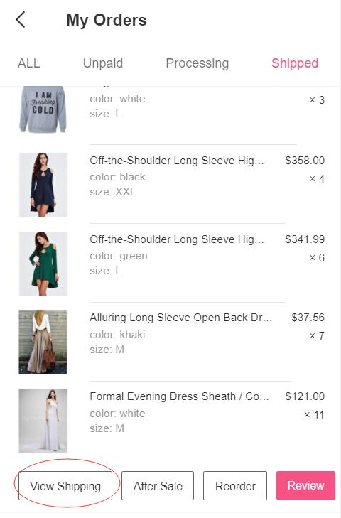
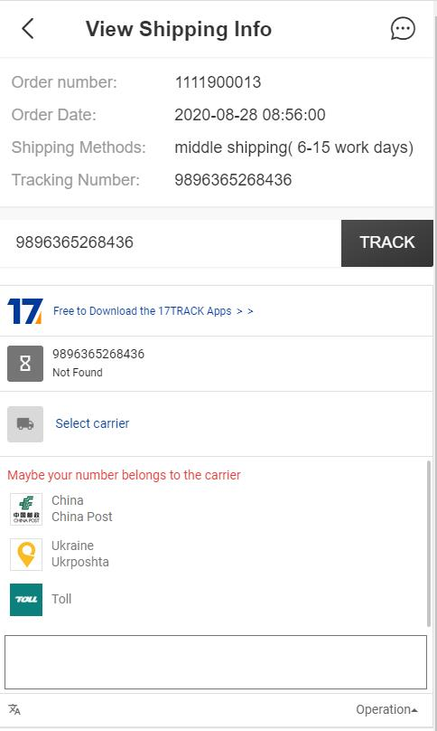

Fecro 国际物流追踪
============

> 已发货的订单，进行国际物流查询，fecro是通过17track来实现的

### Fecro 国际物流追踪

Fecro的国际物流查看，使用的是17track，对于17track，集成是免费的，但是，在物流追踪列表的底部会出现一个
17track的广告（google adverse），这个广告没有啥影响，如何对这个敏感，请自行找付费的物流追踪二开解决。

用户订单发货后，用户可以在订单中心，点击`view shipping`，查看物流信息

