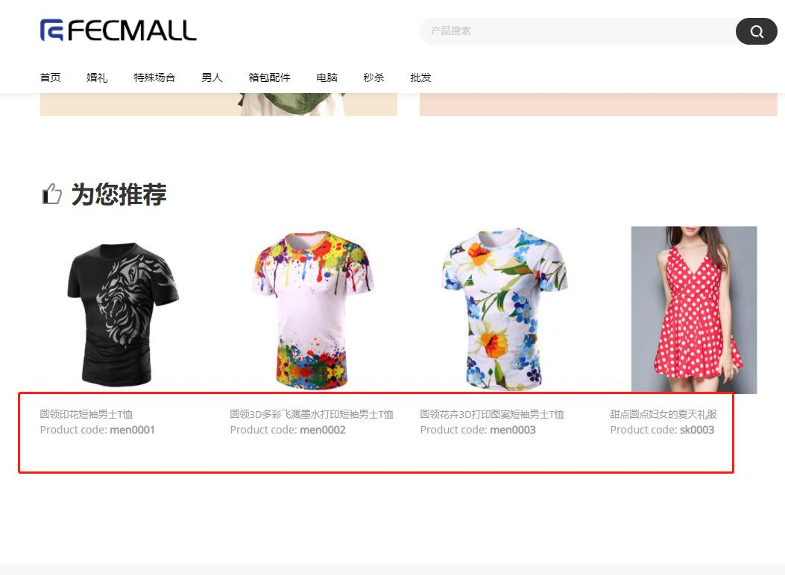
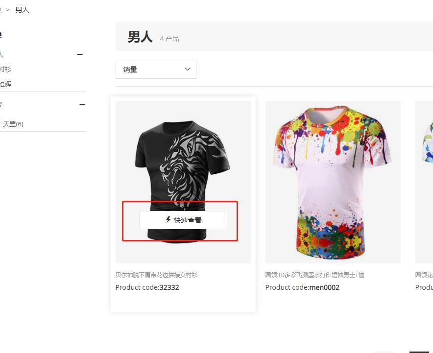
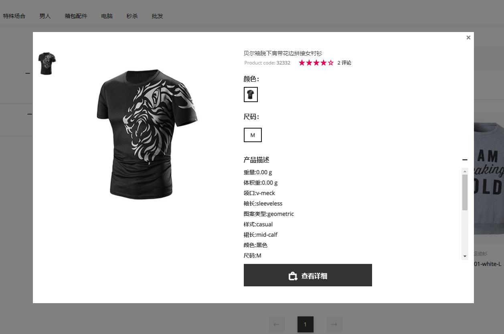
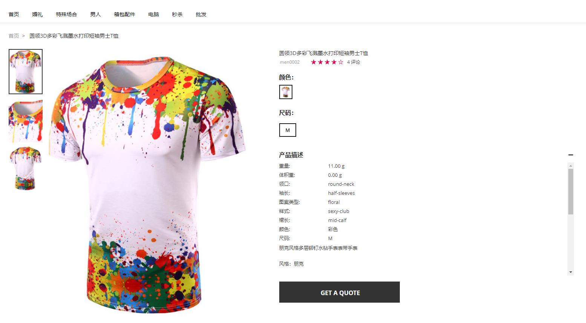
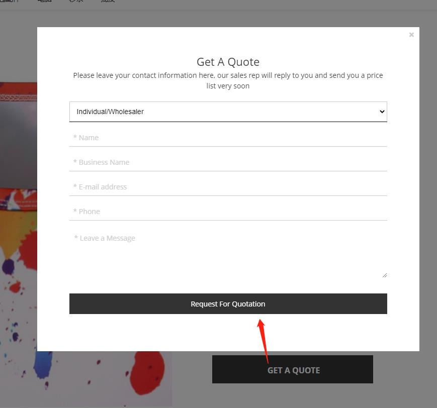
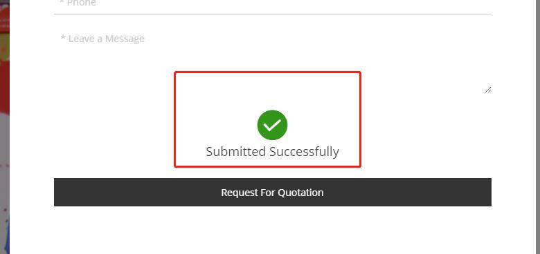
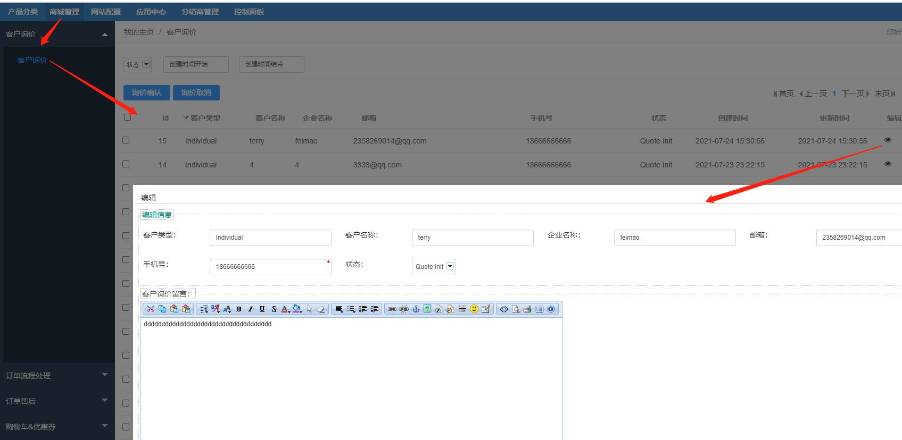

Fecrob2b 企业B2B扩展
=============

> Fecro B2B扩展

### 关于Fecro B2B扩展

b2b，也就是企业门户站，里面有一些cms企业信息，以及产品信息，和常规独立站不同的是，B2B类型的产品不显示价格，
而且不能加入购物车下单，用户可以通过提交表单留言的方式，管理员在后台看到
用户的留言，通过邮件进行沟通的过程。

### Fecro B2B扩展安装

应用市场地址：http://addons.fecmall.com/25627165

1.您需要先安装`fecro`，再安装`fecrob2b`，如何安装fecmall扩展，可以参看：[Fecmall扩展产检安装](https://www.fecmall.com/doc/fecshop-guide/addons/cn-2.0/guide-fecmall-addons-install.html)

2.安装完成后，后台设置应用优先级

`应用中心`  --->  `应用管理` ---> `已安装应用` , 将 `fecrob2b` 的优先级数字值，大于`fecro`的的优先级数字值即可

关于设置fecmall应用扩展优先级，更详细的文档参看：[Fecmall-应用扩展优先级设置](https://www.fecmall.com/doc/fecshop-guide/addons/cn-2.0/guide-fecmall-addons-score.html)

3.设置模板路径

1.Store设置（配置第三方模板路径）

1.1网站配置 --> Appfront配置  -->  Store配置

编辑，弹出框，第三方模板路径： `@fecrob2b/app/appfront/theme,@fecro/app/appfront/theme/fecro`

1.2网站配置 --> Apphtml5配置  -->  Store配置

编辑，弹出框，第三方模板路径： `@fecrob2b/app/apphtml5/theme,@fecro/app/apphtml5/theme/fecro`

### Fecro B2B扩展功能介绍

1.首页，分类，搜索页  产品列表不显示价格，只显示名称和sku

2.在产品列表页，鼠标方式，显示`快速查看`按钮

3.点击`快速查看`按钮

4.产品详细页面，只显示产品的一些信息，不显示产品价格，用户可以点击`GET A QUOTE`进行询价

5.用户点击`GET A QUOTE`后，弹出留言框

6.填写信息，点击提交

到这里，用户提交的询价表单提交完成

7.管理员后台，查看用户提交的询价表单

管理员可以更改询价单的状态，进行标记。

