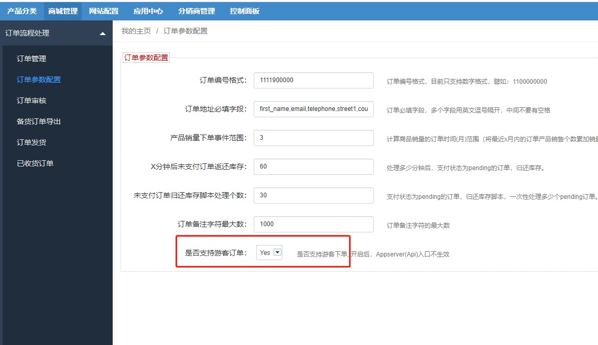
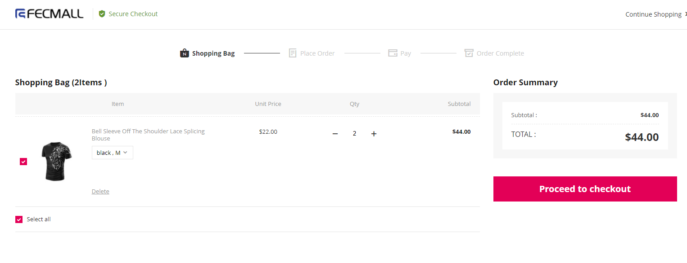
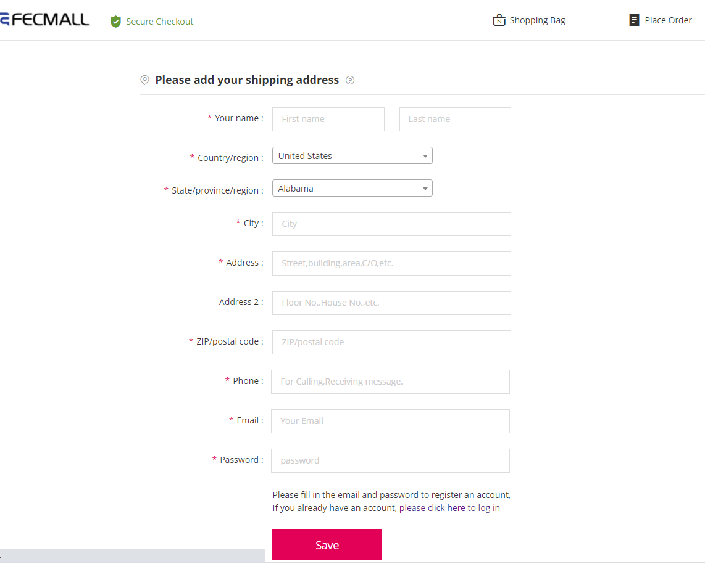
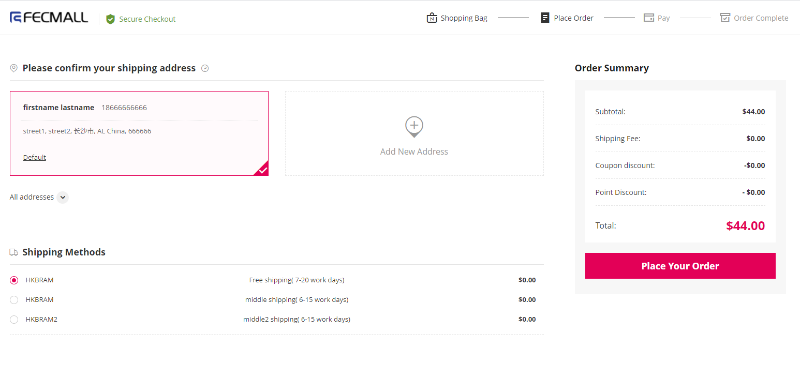

Fecroguest 游客下单扩展
=============

> 游客用户，可以直接下单的扩展，需要`fecro版本-1.5.0`+

### Fecroguest 游客下单扩展 - 安装

1.应用市场地址：http://addons.fecmall.com/96445221

2.如果安装应用，请参看文档：[Fecmall如何安装应用扩展？](https://www.fecmall.com/doc/fecshop-guide/addons/cn-2.0/guide-fecmall-addons-install.html)

3.您需要先安装fecro扩展，然后在安装fecrogusest游客下单扩展

4.安装完成后，后台设置应用优先级

`应用中心`  --->  `应用管理` ---> `已安装应用` , 将 `fecroshare` 的优先级数字值，大于`fecro`的的优先级数字值即可

关于设置fecmall应用扩展优先级，更详细的文档参看：[Fecmall-应用扩展优先级设置](https://www.fecmall.com/doc/fecshop-guide/addons/cn-2.0/guide-fecmall-addons-score.html)

5.安装fecro扩展后，进入后台，开启游客下单设置,设置`Yes`保存即可

### 扩展介绍

1.如果用户是游客用户，将产品加入购物车后，点击下单

2.进入地址填写页面，填写地址，email，以及password

填写的email和password，将自动创建账户，并登陆账户。

3.填写信息，进行提交，进入到下单页面。

