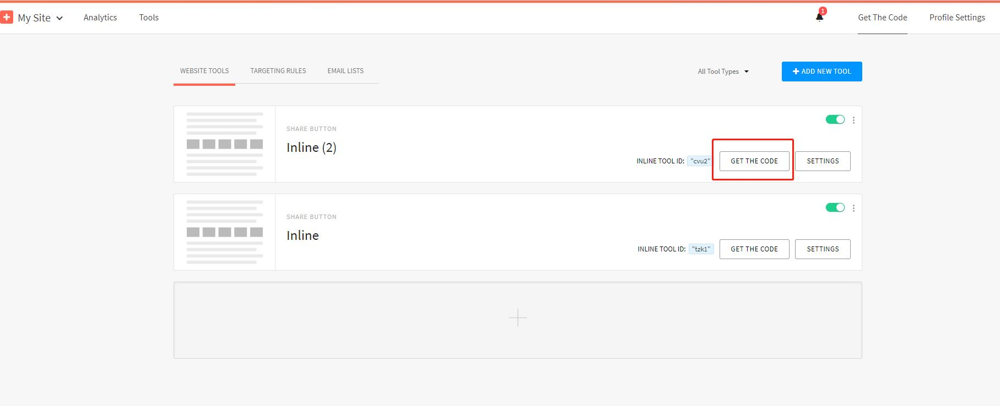
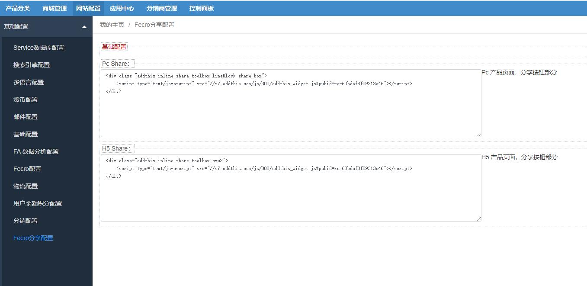

Fecro Share 分享社交平台扩展
==============

> 在产品详情页添加各个社交平台的按钮，用户只需单击一下，即可轻松共享您的内容。连接到 200 多个全球社交媒体平台，包括 Facebook、Twitter、Pinterest、WhatsApp、微信、Kakao 等。
> 帮助商城提升流量


### 关于Fecroshre 

社交平台分享，在产品详情页加入分享按钮，用户可以点击进行分享

本部分是基于`addthis`完成的，支持200 多个全球社交媒体平台，您可以在`addthis`的控制面板中控制显示的
社交平台分享按钮，以及排序，显示的样式（大小，颜色，圆角）等等

pc分享按钮演示（如图）：


h5分享按钮演示（如图）：


### Fecroshre 安装


应用市场地址：http://addons.fecmall.com/53383415

1.您需要先安装`fecro`，再安装`fecroshre`

2.安装完成后，后台设置应用优先级

`应用中心`  --->  `应用管理` ---> `已安装应用` , 将 `fecroshare` 的优先级数字值，大于`fecro`的的优先级数字值即可


### Fecroshare配置

1.addthis配置部分

您需要在addthis获取到分享代码，详细参看：[Fecroshre addthis配置](fecmall-fecroshare-addthis.md)


2.网站后台配置

通过上面的第一部分，我们在addthis中添加了pc和h5的`tool配置`

在addthis点击`GET THE CODE` （当您配置完成后，也会跳转到这个页面，当然您可以从控制面板如图所示点击进入）



得到分享代码(例子)

```
<div class="addthis_inline_share_toolbox_cvu2">
    <script type="text/javascript" src="//s7.addthis.com/js/300/addthis_widget.js#pubid=ra-60bdaf8f09313a46"></script>
</div>
```


然后进入后台，`网站配置` --> `基础配置`--> `Fecro分享配置`





将pc和h5的分享代码，按照这个格式填写进去，保存即可。

**注意**：div的class是上面获取的，譬如`addthis_inline_share_toolbox_cvu2`, 这个必须是从addthis中获取的值。


**疑问**：为什么pc和h5要分开？

**答**：因为pc和h5的分享，`样式`不同，而且显示的分享`按钮内容`也不同，譬如`h5`显示`whatsapp`的按钮，
但是pc不显示这个分享按钮。


3.保存后，您可以看到`pc`和`h5`有了分享按钮，但是样式需要更改


您可以参看：[Fecroshre addthis样式](fecmall-fecroshare-addthis-style.md)，在这里更改分享按钮的样式。


4.当用户进行分享，您就可以在addthis控制台查看数据统计了


