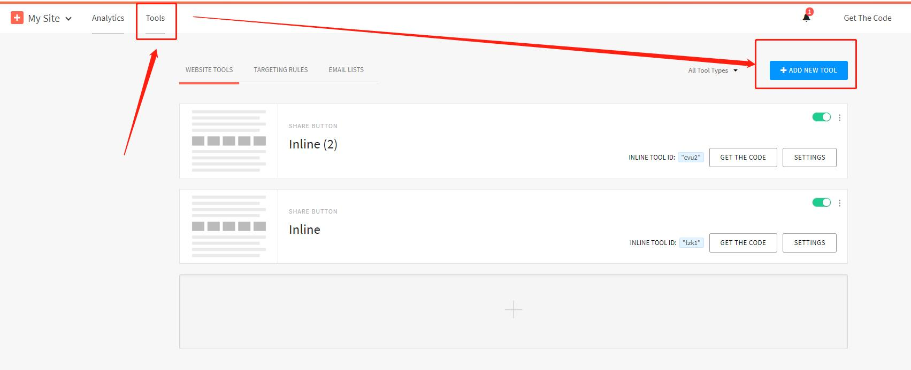
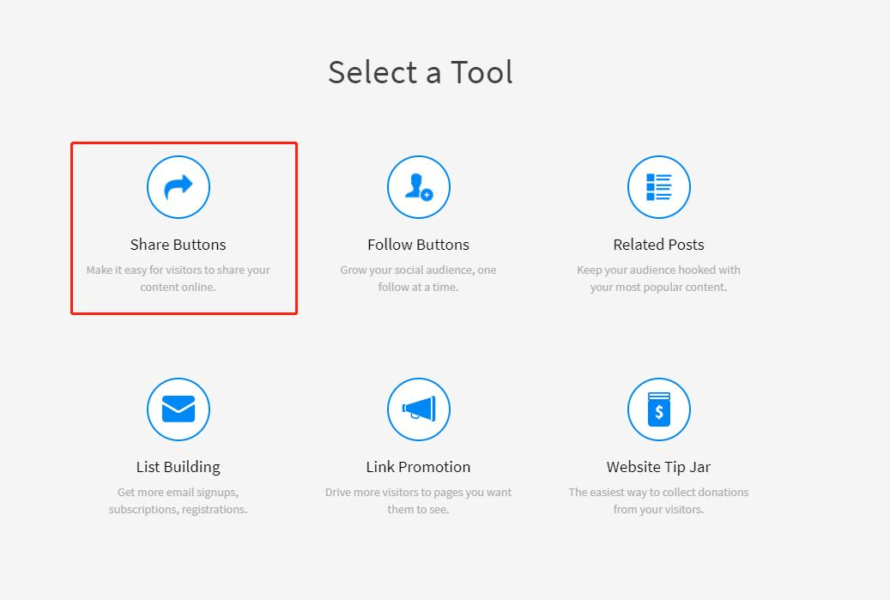
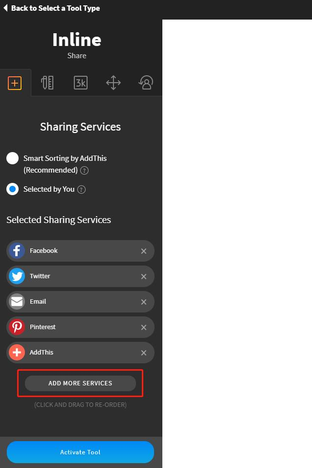
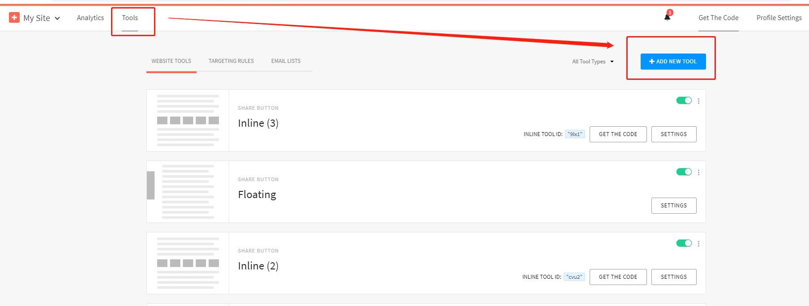

Fecro Share addthis配置
==============

> 如何在addthis，进行配置，获取分享代码


### Addthis配置，获取分享代码


1.注册账户

`addthis官网`： https://www.addthis.com/

访问addthis官网，注册账户。

2.登陆账户，点击进入控制面板


3.点击`tools` ，`add new tools`




4.点击`share buttons`





5.点击inline


6.添加分享按钮




您可以根据需要，添加您想要的分享按钮，以及删除掉不显示的按钮，还可以上下拖动进行排序。


7.点击`activate Tools`即可完成


可以看到分享的代码，分为js部分，和html部分

```
<!-- Go to www.addthis.com/dashboard to customize your tools --> 
<script type="text/javascript" src="//s7.addthis.com/js/300/addthis_widget.js#pubid=ra-60bdaf8f09313a46"></script>
```


```
<!-- Go to www.addthis.com/dashboard to customize your tools -->
<div class="addthis_inline_share_toolbox_9lx1"></div>

```


您将其组合起来即可得到分享代码，如下：


```
<div class="addthis_inline_share_toolbox_9lx1">
    <script type="text/javascript" src="//s7.addthis.com/js/300/addthis_widget.js#pubid=ra-60bdaf8f09313a46"></script>
</div>

```

**注意**：`div`的`class`必须使用addthis生成的编码，不用乱改,譬如上面的`addthis_inline_share_toolbox_9lx1`


这样分享代码就完成了。


因为我们需要pc和h5两个分享代码，因此您可以点击如下，继续操作，添加`h5`的分享代码





最后，我们得到了pc和h5的两个分享代码


