Fecrot扩展-介绍: 积分，秒杀，批发
=========

> 基于Fecro功能详细介绍

### Fecrot功能详细介绍

1.`积分功能`：用户下单可以获取积分，再次下单可以使用积分抵消订单金额

2.`秒杀功能`：通过设置商品的特价开始和结束时间，进行商品的限时特价

3.`批发功能`: 商品sku一次购买多个可以享受批发价格，方便批发用户

下面详细介绍：

### Fecrot积分功能

1.后台管理`积分`：

1.1管理员后台设置积分参数。

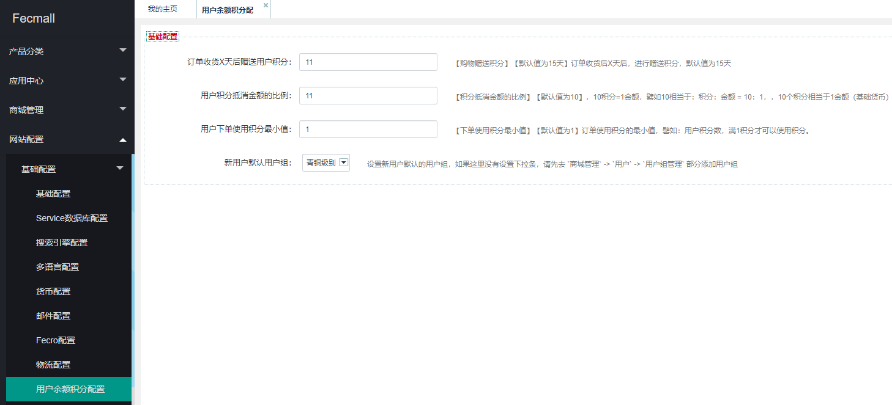

1.2管理员设置`用户组`，不同的用户组，购物进行不同比例的返现，以及用户购物满X金额后，进行用户组的变更。

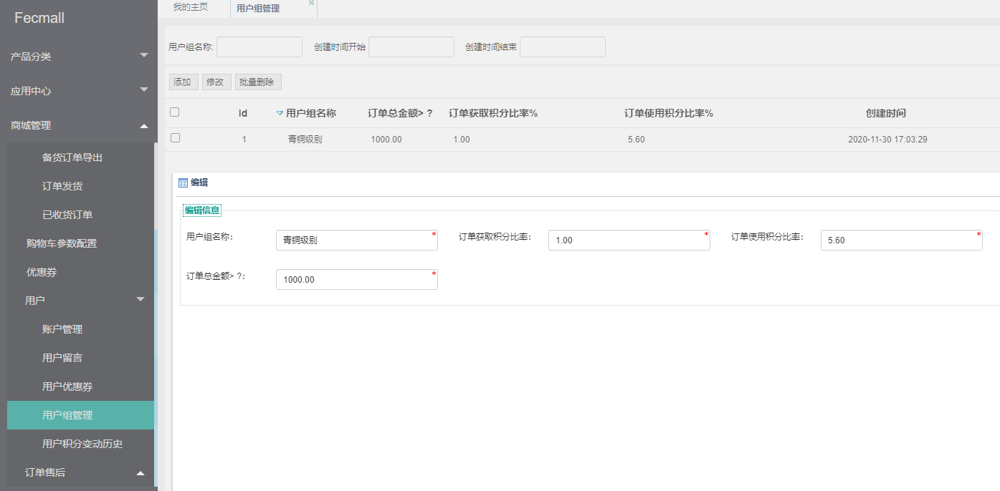

1.3管理员可以在后台查看各个用户的`积分变动历史`

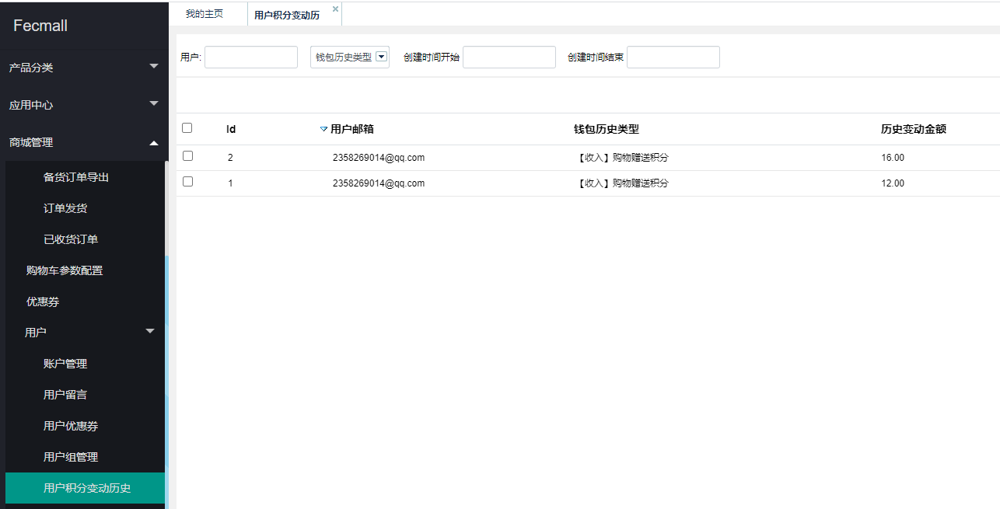

2.用户中心查看用户积分总额，以及用户`积分变动历史`

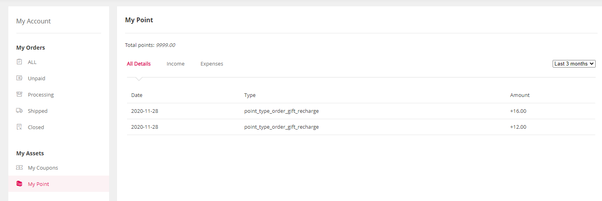

3.用户购物下单，收货`x天`后，可以获取积分，积分获取后，可以在用户中心积分管理部分，查看积分变动历史，如上图

4.当用户有了积分后，再次购物车下单，即可使用积分

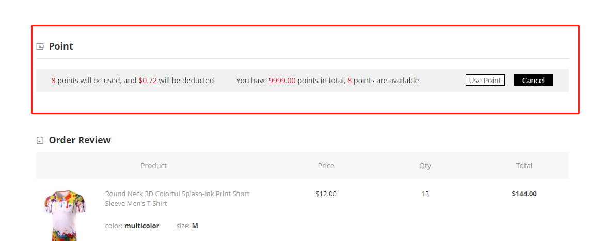

下单后，积分会被扣除，用户可以在`积分变动历史`，查看`积分的变动`

### 秒杀功能

1.用户在商城点击`Flash Deals`，即可进入秒杀产品列表，显示秒杀的商品，售出个数，比例等

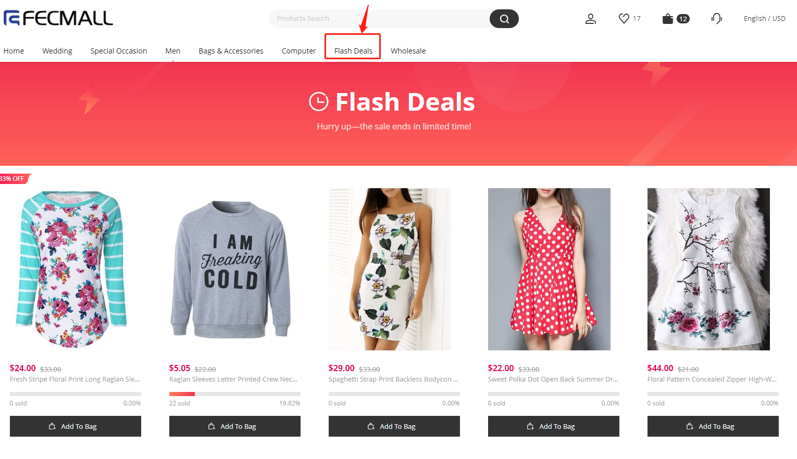

2.管理员可以在后台，商品管理部分， 设置某个商品成为`秒杀商品`

设置说明：

2.1如果只设置了`特价`，而没有设置`开始`和`结束时间`，那么在商城，不会出现在`秒杀页面（Flash Deals）`, 会作为一个长久的特价产品价格显示

2.2如果设置了`秒杀特价`，`秒杀开始时间`，`秒杀结束时间`，就会出现在秒杀页面`（Flash Deals）`

2.3设置秒杀总数，让下单数达到秒杀总数，那么秒杀结束

2.4秒杀已售数，代表这个商品秒杀已经出售的个数，您可以设置一个初始值（譬如10），让这个秒杀商品显得有点火的样子。

3.用户点击菜单的`Flash Deals`,进入秒杀页面，可以点击`Add To Bag`，查看`产品详细`，选择`规格`，将商品`加入购物车`

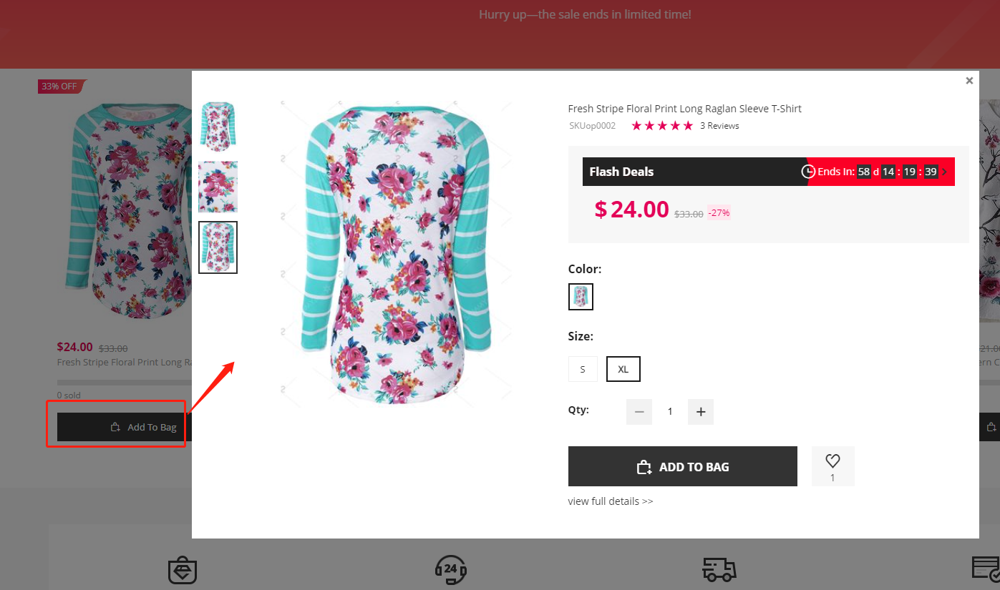

4.用户也可以点击商品名称，图片，进入商品详细

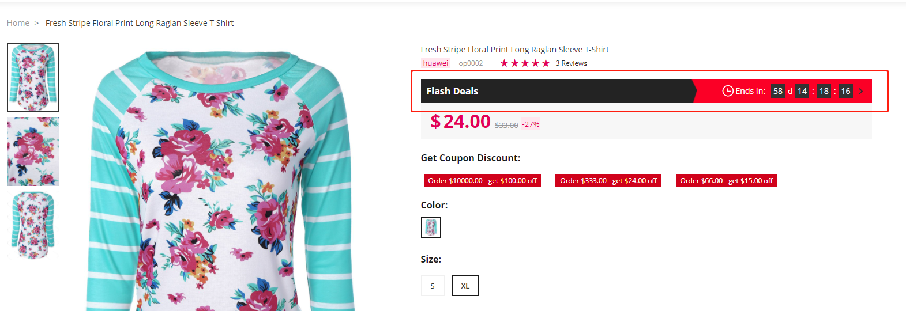

5.秒杀结束时间到期后，秒杀自动结束。

### 批发功能

在顶部菜单点击`wholesale`,即可进入批发页面，如下：

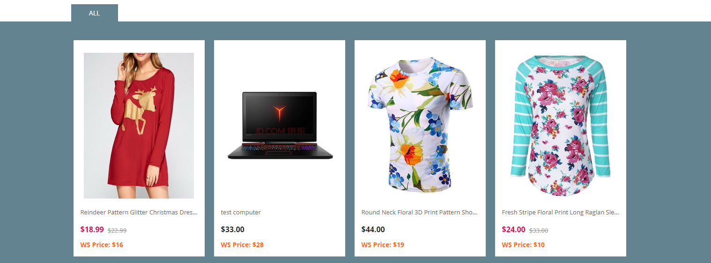

显示商品的`原价`，`特价`，以及`批发价格`

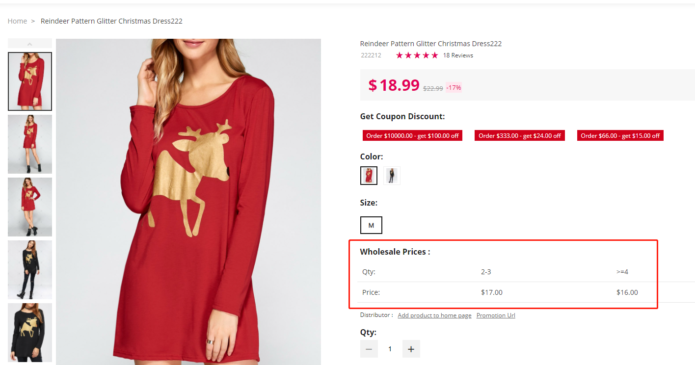

管理员可以在后台设置商品的`批发阶梯价格`。

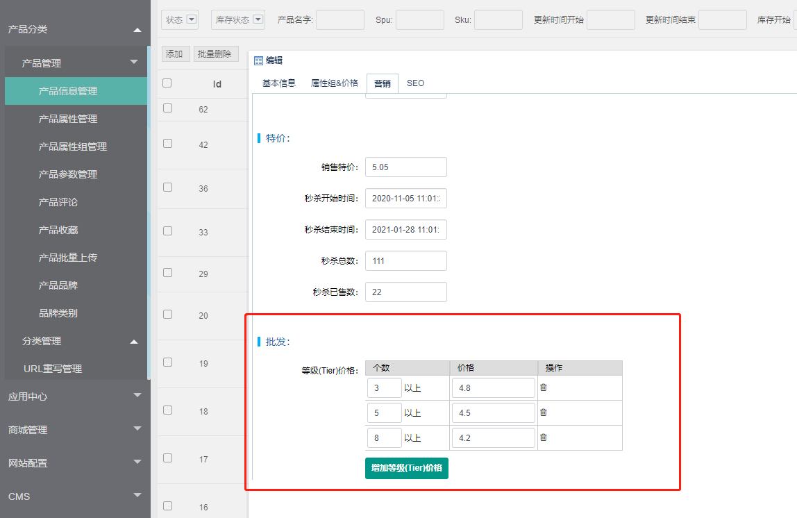

