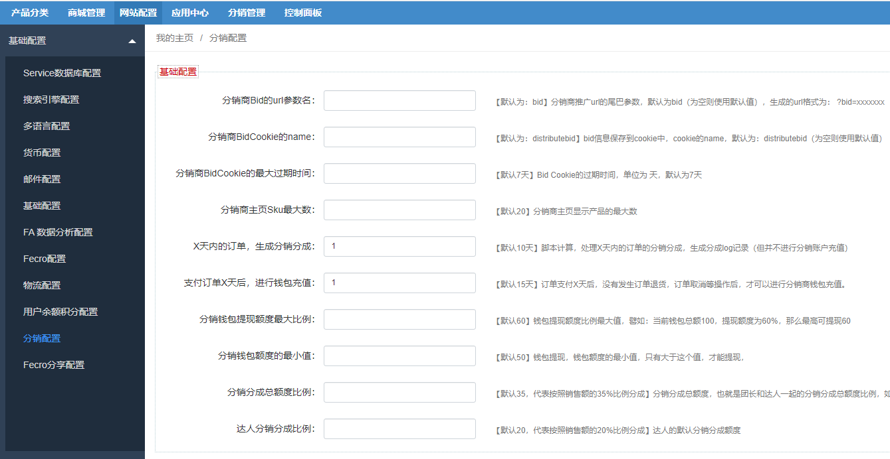

Fecrote团长达人分销扩展-安装和介绍
=============

> 团长，达人分销模式的跨境电商扩展


### Fecrote团长达人分销扩展 - 介绍

详细参看：[Fecrote团长达人分销扩展-详细逻辑说明](fecmall-fecrote-info.md)


### Fecrote团长达人分销扩展 - 安装


您需要先安装fecmall开源系统，然后再进行插件的安装

1.fecmall应用市场地址：http://addons.fecmall.com/88887436

2.如何应用市场`安装`应用，请参看文档：[Fecmall安装应用](https://www.fecmall.com/doc/fecshop-guide/addons/cn-2.0/guide-fecmall-addons-install.html)

3.您需要先安装fecmall开源商城，fecro扩展，fecrot扩展，然后在安装fecrote扩展

4.安装完成后，您需要设置fecrote插件的优先级,设置成最高，如何设置插件优先级，
请参看：[Fecmall-应用扩展优先级设置](https://www.fecmall.com/doc/fecshop-guide/addons/cn-2.0/guide-fecmall-addons-score.html)

优先级：`fecrote`  > `fecrot`  > `fecro`.


### Fecrote团长达人分销扩展 - 配置


1.配置模板路径

1.1后台菜单  `网站配置` ---> `Appfront配置` ---> `Store配置`

找到您激活的store（行），点击右侧的编辑按钮，在弹框中，`第三方模板路径`设置如下值：

```
@fecrote/app/appfront/theme,@fecrot/app/appfront/theme,@fecro/app/appfront/theme/fecro
```

1.2后台菜单  `网站配置` ---> `Apphtml5配置` ---> `Store配置`

找到您激活的store（行），点击右侧的编辑按钮，在弹框中，`第三方模板路径`设置如下值：

```
@fecrote/app/apphtml5/theme,@fecrot/app/apphtml5/theme,@fecro/app/apphtml5/theme/fecro
```

2.分销配置

您可以在这里设置分销的参数




