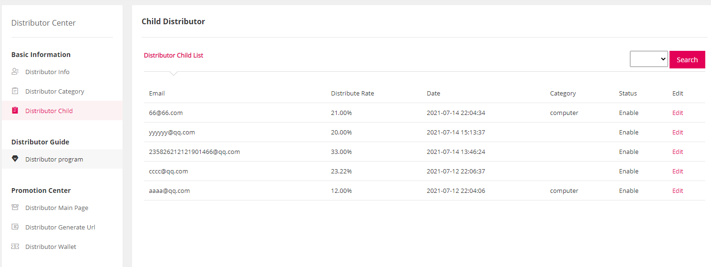

Fecrote团长达人分销扩展-操作流程
=====================

> 本部分详细说明整个分销的操作流程

### 团长部分

1.团长在前端商城注册普通账户

2.团长通过线下，将商城前端注册的邮箱账户，发给客服管理人员

3.客服管理，在后台，将这个邮箱账户设置成团长账户

客服在这里对团长进行管理，可以添加团长，和删除团长（注意：这里的删除团长，只是删除商城用户的团长身份
，并没有删除这个用户，因此可以继续通过添加团长，再添加进来）。

团长可以在商城账户中心，设置自己的名字，如下图，设置后，在客服后台可以显示出来（如上图）

4.团长中心

当客服管理，将账户设置成团长账户后，在商城登陆该团长账户后，可以在账户中心，看到分销中心菜单

点击distribute center  进入团长分销中心

5.团长在分销中心，生成 `分享达人注册链接`。

点击如图按钮，即可生成`分享达人注册链接`，并`自动复制`到`粘贴板`

然后粘贴到另外一个浏览器即可注册达人账户（注意，如果您的团长账户用的是chrome，那么您可以用IE，火狐浏览器
访问`分享达人注册链接`）
，注册后，达人和团长就会进行绑定

注意：达人账号注册，必须通过团长分享链接，如果去掉了团长的分享url尾巴参数，则会注册失败

6.您可以看到达人分销中心，和团长分销中心类似，不过少了一些团长操作的菜单。

管理员可以在后台看到注册的达人列表

7.团长编辑`达人分类`

如果团长有很多达人，那么可以给达人进行分类。

8.团长管理达人

8.1团长查看达人列表

8.2点击edit，可以对达人信息进行编辑，可以添加备注，自定义达人的分成比例（最高不超过团长总额度），
以及设置达人的分类。

9.分销主页管理

对于网站首页，默认是管理员后台设置的商品，达人和团长可以自定义首页商品，方便推广

达人和团长，都可以进行分销，都可以将某个商品加入首页

达人或团长，将某个商品加入分销主页（注意：必须登陆达人或者团长账户）

加入后，访问首页，即可看到添加成功

您也可以在分销中心查看分销主页商品

在这里，您可以删除分销主页商品，点击`Promotion Url`, 复制分销url

10.生成分销链接url

您可以将商城的任何一个链接复制进去，生成分销url，如图：

点击`copy url`按钮，即可复制分销url

11.分销钱包

当达人或者团长，通过分销url带来的用户下单，支付，并完成订单，那么分成收益将充值到分销钱包

点击 `Wallet Cash` 按钮，进行`提现申请`

客服后台审核，没有问题后，线下打款，然后状态设置为`批量审核通过`

钱包发生了变动，达人或者团长可以在 `Distributor Wallet` 中查看钱包历史变动

12.分销订单

当用户点击达人或者团长的分销链接，下单并支付，那么，达人或者团长就可以看到该订单

13.分销订单分成

达人或团长的分销url点击过来的用户下单完成后，系统脚本会进行计算，生成分销订单分成

团长除了自己推广的订单带来的分成，还有旗下达人推广的订单带来的分成。

管理员可以在后台查看达人和团长的分销订单分成

到这里，达人团长分销的逻辑说明就介绍完了

您可以使用多个不同的浏览器，测试 团长达人的注册，分享分销url，用户点击url下单支付，查看分销提成等等。

