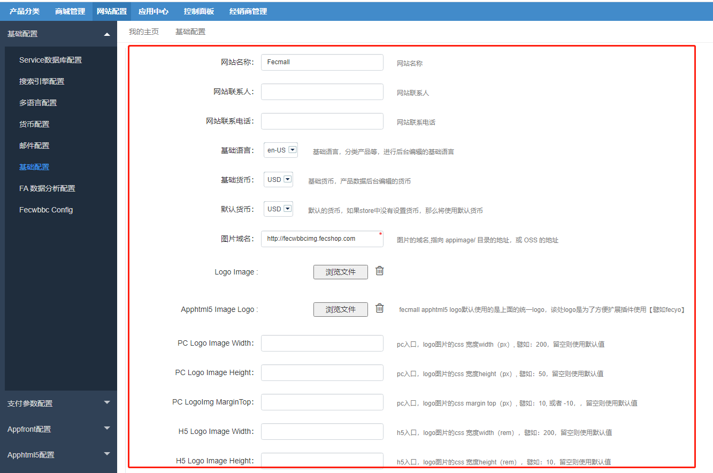
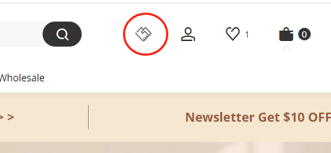

FecWbbc基础配置设置
=========

> 一些基础化的配置

### 基础配置

基础部分配置

`网站名称`: 网站部分的名称，您可以配置您的域名，譬如 `fecmallcom`

`基础语言`: 商城的基础语言，注意，这里不是pc和h5的语言，基础语言是指，产品和分类编辑数据的基础语言，也就是产品，分类编辑
的时候，基础语言是必填的，其他的语言可以选填。

`基础货币`: 商城的`基础货币`，一般设置`USD`为`基础货币`，产品编辑的价格，就是基础货币的价格，另外货币设置`汇率比例`，也是以
和基础货币的换算比例作为`汇率比例`

`默认货币`: 如果商城store没有设置货币，则会使用默认货币，您将该值设置成和`基础货币`
一样的值即可。

`图片域名`: 图片域名，安装后不需要更改，如果有需要更改图片域名，可以这里更改

`Logo Image`: 可以上传您的logo图，用于pc入口的图片显示

`Apphtml5 Image Logo`: 用于html5入口的logo图片

`PC Logo Image Width`: pc入口的logo图的css width值（px）

`PC Logo Image Height`: pc入口的logo图的css height值（px）

`PC LogoImg MarginTop`: pc入口的logo图的css margin-top值（px）

`H5 Logo Image Width`: html5入口的logo图的css width值（px）

`H5 Logo Image Height`: html5入口的logo图的css height值（px）

`H5 LogoImg MarginTop`: html5入口的logo图的css margin-top值（px）

`PC is show Bdmin Link`: pc入口，商城顶部，是否显示经销商注册链接？

`Fb Login Enable`: 用户登陆页面，是否显示facebook登陆按钮

`Google Login Enable`: 用户登陆页面，是否显示google登陆按钮

