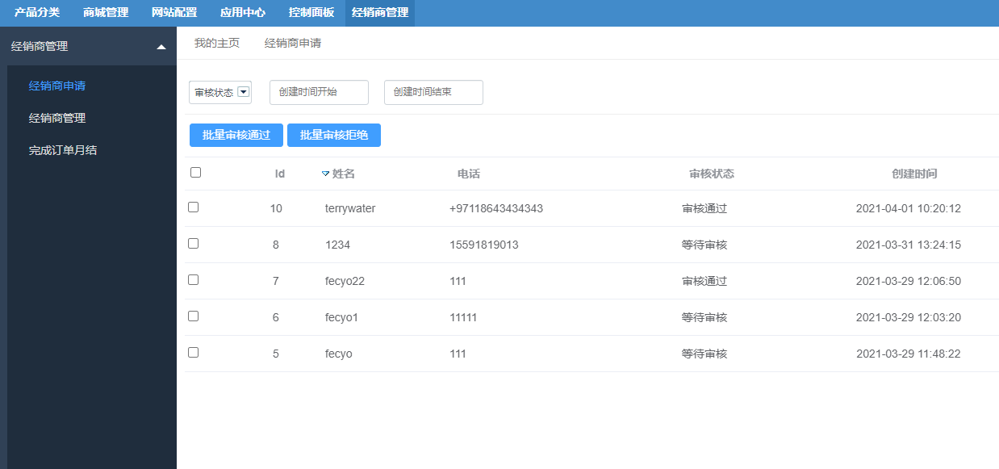
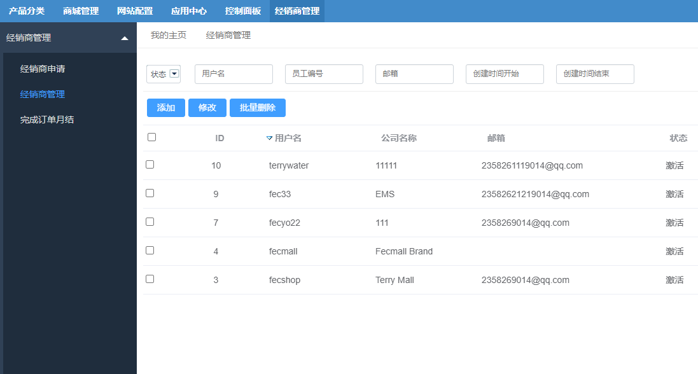

FecWbbc跨境多商户 - 经销商管理
===========

> FecMall经销商的管理

### Fecwbbc跨境多商户 - 经销商管理

1.经销商申请审核

对于[经销商申请资质](fecwbbc-bdmin-audit.md)，提交申请后，管理员可以在平台后台进行审核

2.经销商列表管理

在平台后台，对`经销商`进行管理，在这里可以添加`经销商`，以及删除，更新等操作

添加`经销商`后，经销商可以在`经销商后台`登陆账户，进行`产品发布`等操作

