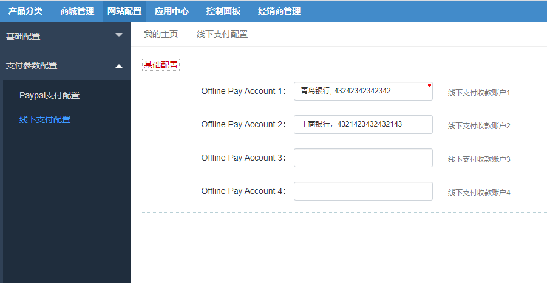
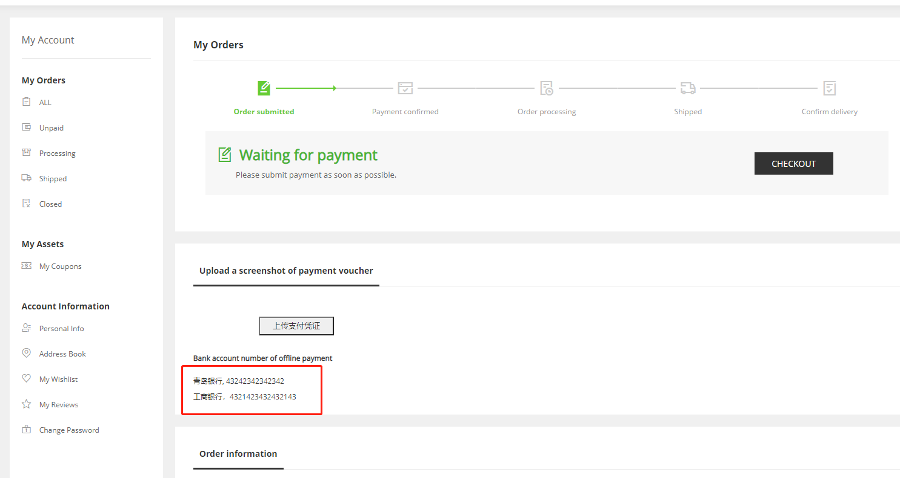
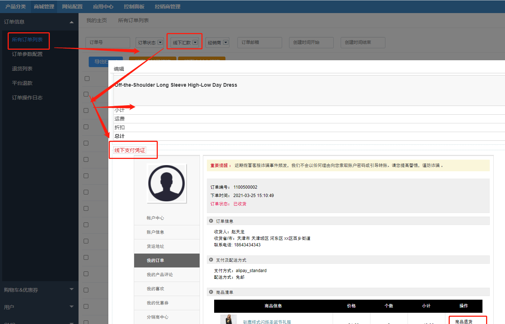
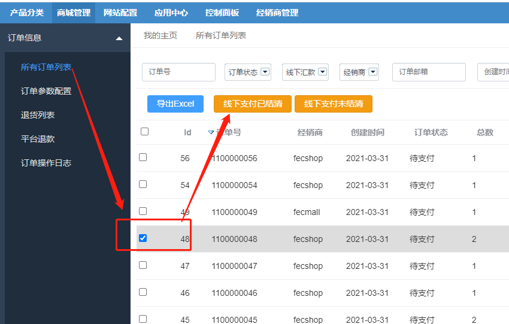
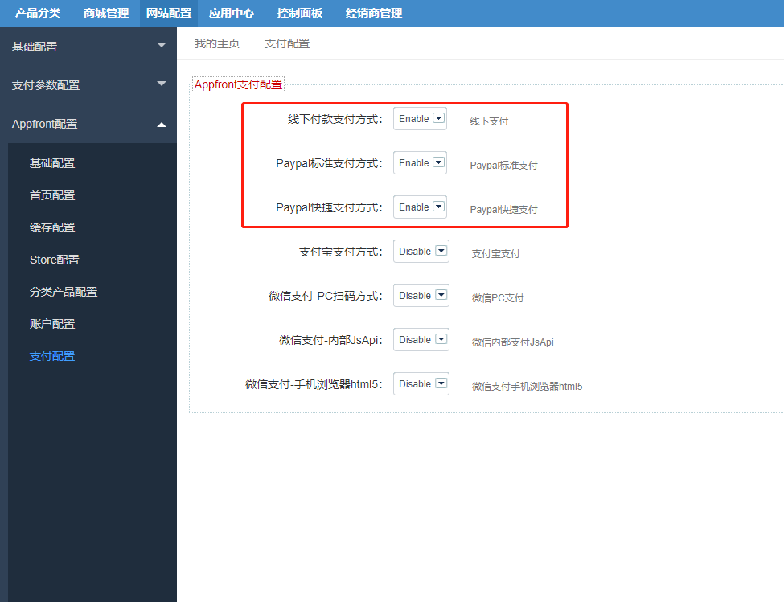
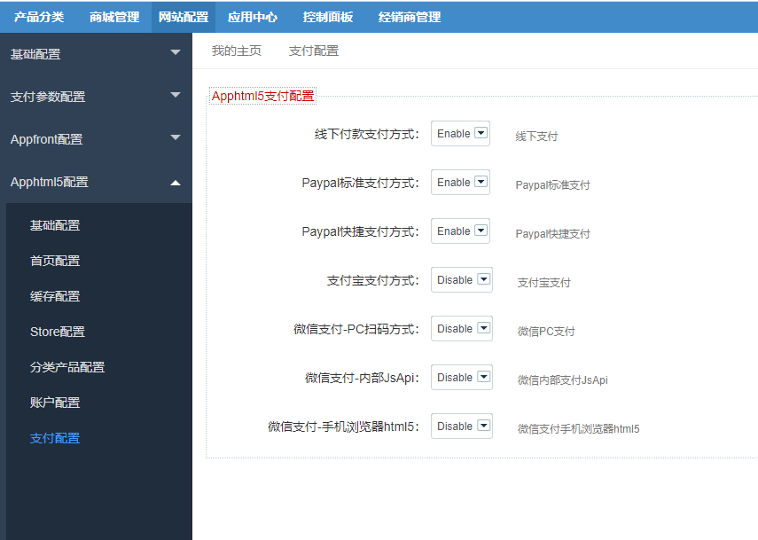

Fecwbbc跨境多商户 -设置支付
=========

> 设置跨境多商户支付

### 支付设置

1.paypal支付设置

如何设置paypal，参看：[paypal 正式线上收款账户设置](http://www.fecmall.com/topic/297)

2.线下支付设置

线下支付，这里设置您的线下收款账户，您最多可以设置4个账户

设置后，用户可以在订单详情部分看到收款账户信息。

如果用户订单支付选择的是线下支付，那么可以通过线下打款，然后上传支付凭证，管理员在后台进行审核

审核通过后，勾选，进行线下支付已结清操作即可。

### 支付开启

Appfront和apphtml5的支付，都要在配置中进行开启

1.Appfront配置支付开启

1.Apphtml5配置支付开启

