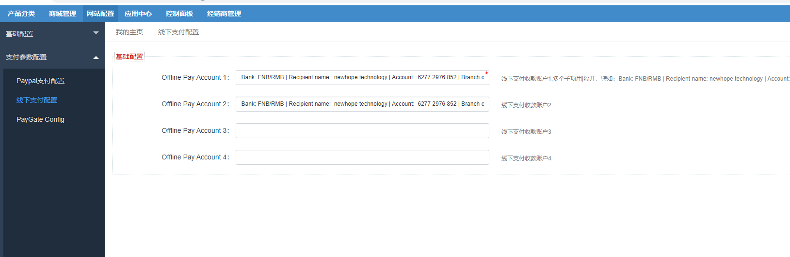
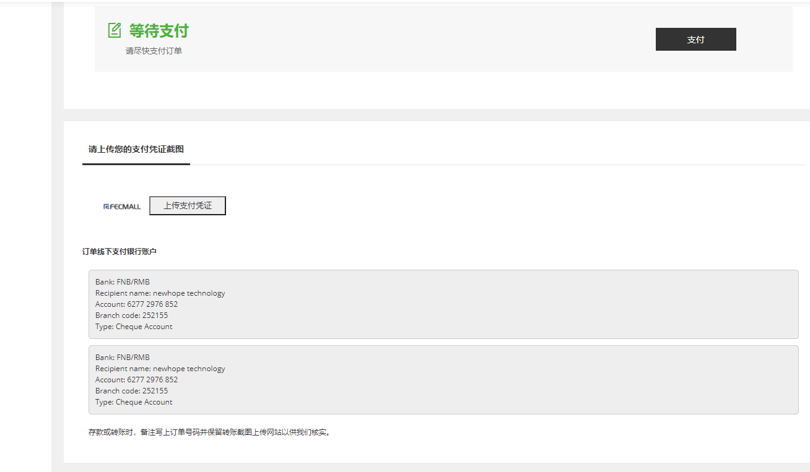

Fecwbbc跨境多商户 -设置支付
=========

> 设置跨境多商户支付


目前默认支持paypal支付，线下支付 2种订单支付方式，您可以安装其他的支付插件，来支持braintree，stripe，paygate等支付方式
，详细参看：http://addons.fecmall.com/other-mall-2

### paypal支付设置


如何设置paypal，参看：[paypal 正式线上收款账户设置](http://www.fecmall.com/topic/297)

### 线下支付设置



线下支付，这里设置您的线下收款账户，您最多可以设置4个账户

需要注意的是：线下支付收款账户多个子项用 `|` 隔开，譬如：

```
Bank: FNB/RMB | Recipient name:  newhope technology | Account:  6277 2976 852 | Branch code: 252155 | Type: Cheque Account
```


设置后，用户可以在订单详情部分看到收款账户信息。





如果用户订单支付选择的是线下支付，那么可以通过线下打款，然后上传支付凭证，管理员在后台进行审核


审核通过后，勾选，进行线下支付已结清操作即可。


### 其他支付

[Braintree支付方式](https://www.fecmall.com/doc/fecshop-guide/addons/cn-2.0/guide-fecmall-addons-system-braintree-payment.html)


[Stripe支付方式](https://www.fecmall.com/doc/fecshop-guide/addons/cn-2.0/guide-fecmall-addons-system-stripe-payment.html)

[Paygate（南非）支付方式](https://www.fecmall.com/doc/fecshop-guide/addons/cn-2.0/guide-fecmall-addons-system-paygate-payment.html)

这些支付方式，都支持跨境多商户安装，不过需要一些个性化配置，请仔细查看说明


