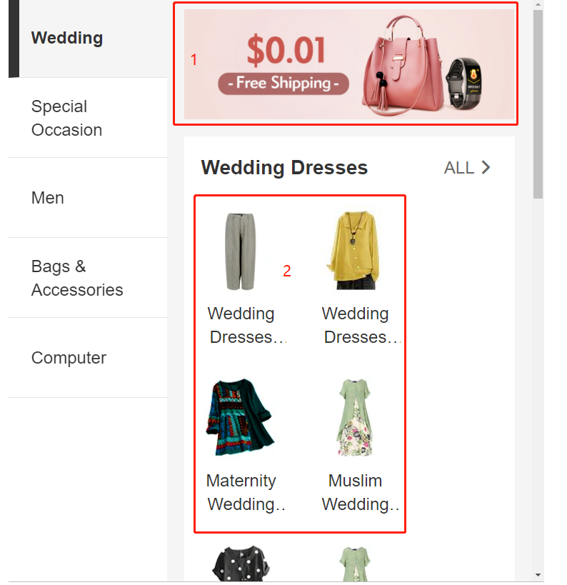
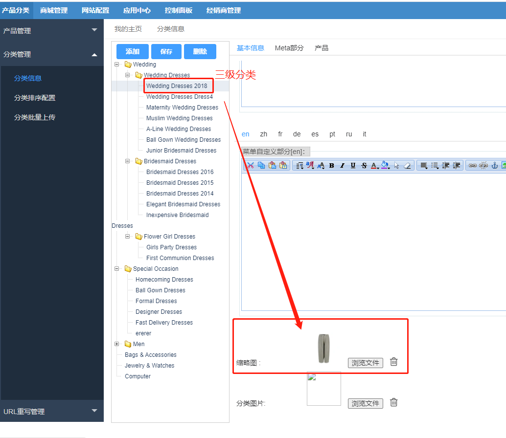

FecWbbc跨境多商户 - 分类Banner设置
====================

> 对于pc入口一级分类弹出子分类弹框的banner部分，以及h5 分类部分的分类图片的设置

### pc首页分类菜单的自定义部分（非必须）

如图：

您可以在后台分类编辑部分添加

您只需要在一级分类里面添加即可，就可以在pc端一级分类的弹框中显示，下面是默认的部分

在您的分类中编辑保存即可。

### h5分类部分的图片

打开h5部分，如下：

1.对于1部分的图片，图片文件路径`@appimage/common/addons/fecwbbc/20191204030142_927.jpg`
,您ftp上传您的新图片即可

2.对于2部分的多个分类小图，是分类的banner图，您可以在平台后台，分类编辑部分，
上传您的分类banner图。您需要为您的三级分类，上传banner图。

您需要将所有的三级分类，都做一个banner图，然后上传图片，保存分类即可

