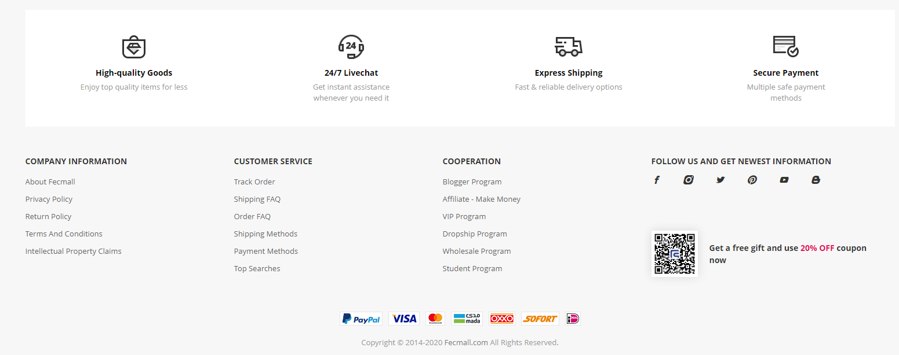
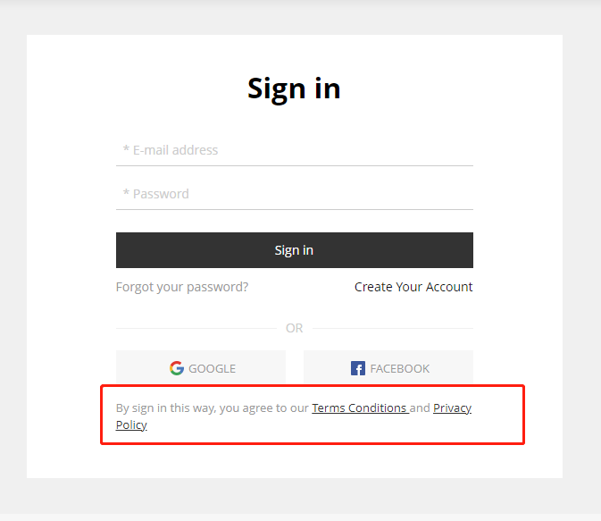

FecWbbc静态块和Page页设置
===============

> 首页，页面底部，以及一些page单页的设置

### 静态块的设置。

静态块：指的是首页的一些banner图，页面的底部文字条款块等。

譬如：

静态块的设置，都是在fecwbbc安装的时候进行的配置，
在后台菜单：`网站配置`--> `cms` --> `静态块`，里面配置，详细参看
文档：[FecWbbc 静态块配置](fecwbbc-config-sql.md)，打开后，查看第2部分即可看到对应关系

### 首页产品的配置

参看：[FecWbbc 首页产品的配置](fecwbbc-banner-config.md)

### Page页的添加

在商城的底部，账户注册页面，会发现一些链接，点击后404，这个需要您自己新建单页

譬如：http://fecwbbc.xxxxx.com/terms-conditions

您需要进入后台： `商城管理` --> `cms` -->  `page管理`

进行添加page页即可，操作参看文档：[Fecmall Page 管理文档](http://www.fecmall.com/doc/fecshop-guide/instructions/cn-2.0/guide-fecmall_page.html)

