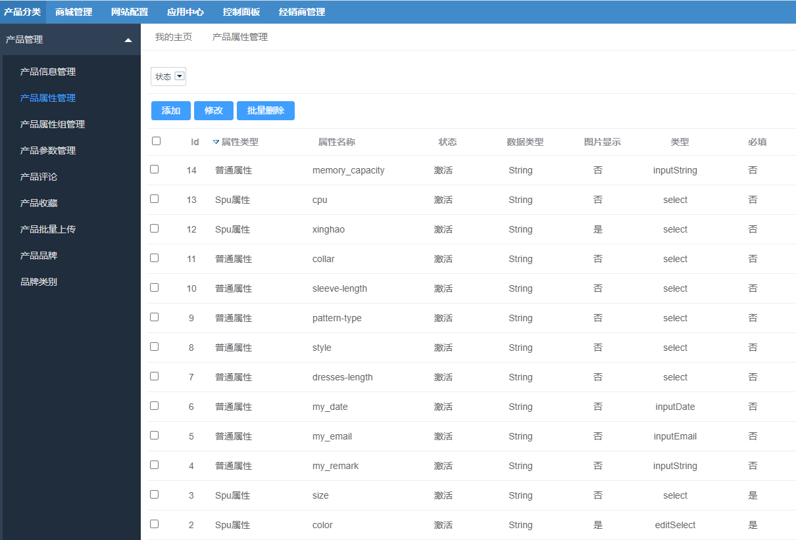

FecWbbc跨境多商户 -  - 产品属性和属性组
============

> 平台后台对产品的属性和属性组的管理

### Fecmall产品属性和属性组

平台商，在后台对`产品属性`和`属性组`的管理

对于这个部分的管理，详细参看文档：

[Fecmall 如何添加规格属性(自定义属性),并新建相应的产品](http://www.fecmall.com/doc/fecshop-guide/instructions/cn-2.0/guide-fecmall_add_attr_custom_option.html)

