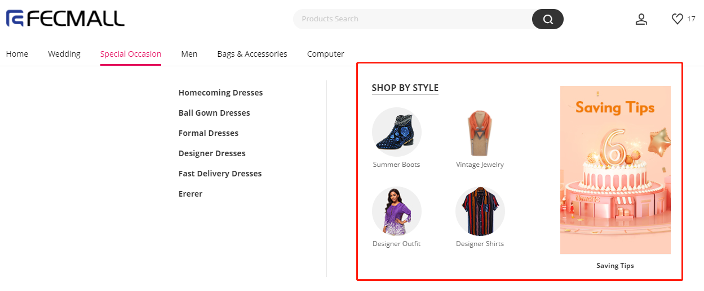
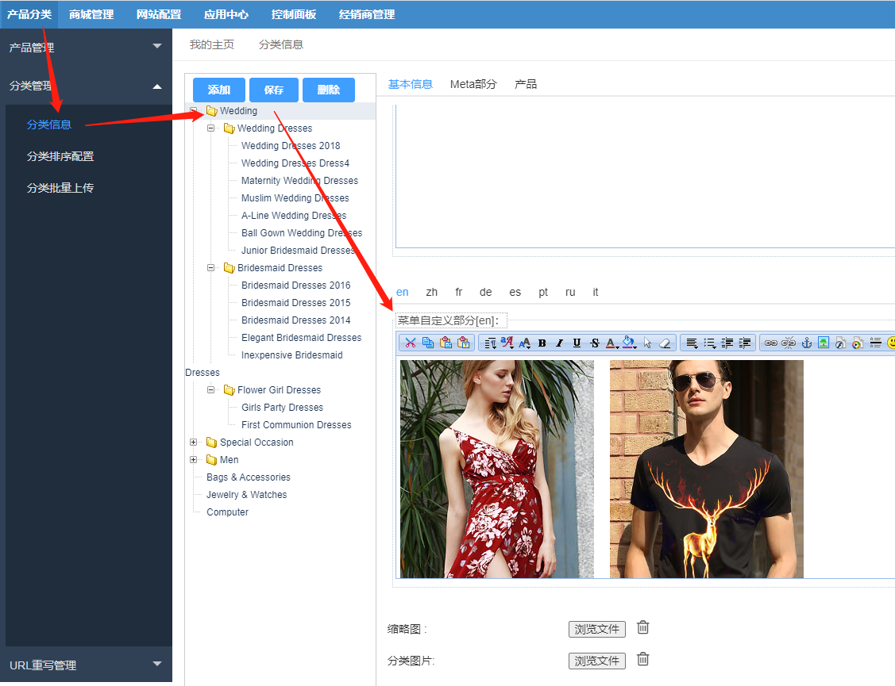

FecWbbc跨境多商户 -  初始化配置
================

> Fecwbbc 首页的一些静态块的配置


### Cms StaticBlock部分配置


pc和h5部分有很多cms staticblock的配置：

参看：[FecWbbc 静态块配置](fecwbbc-config-sql.md)


### 首页产品配置

1.appfront首页产品Recommend For You

`网站配置` --> `appfront配置`  --> `首页配置` ，  编辑项：`热销产品sku`

您可以填写测试数据：`p10001-kahaki-xl,sk10003-001,sk10005,sk1000-khak,sk0003,men0003,men0002,men0001`

2.apphtml5首页产品：`You May Also Like`

`网站配置` --> `apphtml5配置`  --> `首页配置` ， 编辑项：`特色产品sku`

您可以填写测试数据：`p10001-kahaki-xl,32332,432432,sk2001-blue-zo,sk0008,sk0004,sk0003,sk0002,sk1000-black`

### pc首页分类菜单的自定义部分（非必须）

如图：



您可以在后台分类编辑部分添加




您只需要在一级分类里面添加即可，就可以在pc端一级分类的弹框中显示，下面是默认的部分

您可以复制下面的内容，在您的分类中编辑保存即可。


```
<div class="header-nav-cate-box">
    <span class="font-bold text-secondary header-nav-cate-title">
        SHOP BY STYLE
    </span>
    <div class="flex pt-lg-20 mx-lg-n30">
        <div class="flex column mx-lg-30 pb-lg-30 header-nav-cate-item">
            <a href="" class="d-inline-block header-nav-cate-link header-nav-cate-link-js" >
                <p class="header-nav-cate-bg" style="background-image:url(http://fecroimg.fecshop.com/addons/fecro/20200721014040_468.jpg)"></p>
            </a>
            <a href="" class="text-grey-dark-1 mx-lg-n15 mt-lg-5 header-nav-cate-desc text-multiple-ellipsis" >
                Summer Boots
            </a>
        </div>
        <div class="flex column mx-lg-30 pb-lg-30 header-nav-cate-item">
            <a href="" class="d-inline-block header-nav-cate-link header-nav-cate-link-js" >
                <p class="header-nav-cate-bg" style="background-image:url(http://fecroimg.fecshop.com/addons/fecro/20200809214639_190.jpg)"></p>
            </a>
            <a href="" class="text-grey-dark-1 mx-lg-n15 mt-lg-5 header-nav-cate-desc text-multiple-ellipsis" >
                Vintage Jewelry
            </a>
        </div>
        <div class="flex column mx-lg-30 pb-lg-30 header-nav-cate-item">
            <a href="" class="d-inline-block header-nav-cate-link header-nav-cate-link-js" >
                <p class="header-nav-cate-bg" style="background-image:url(http://fecroimg.fecshop.com/addons/fecro/20200811032400_384.jpg)"></p>
            </a>
            <a href="" class="text-grey-dark-1 mx-lg-n15 mt-lg-5 header-nav-cate-desc text-multiple-ellipsis" >
                Designer Outfit
            </a>
        </div>
        <div class="flex column mx-lg-30 pb-lg-30 header-nav-cate-item">
            <a href="" class="d-inline-block header-nav-cate-link header-nav-cate-link-js" >
                <p class="header-nav-cate-bg" style="background-image:url(http://fecroimg.fecshop.com/addons/fecro/20200721014125_699.jpg)"></p>
            </a>
            <a href="" class="text-grey-dark-1 mx-lg-n15 mt-lg-5 header-nav-cate-desc text-multiple-ellipsis" >
                Designer Shirts
            </a>
        </div>
    </div>
</div>
<div class="header-nav__banner-list flex justify-content-end">
    <div class="flex column mt-lg-10 mx-lg-15">
        <a href="" class="header-nav__banner-link header-nav-banner-image-lazyload position-relative " >
            
        </a>
        <a href="" class="banner-title font-bold ">
            Saving Tips
        </a>
    </div>
</div>
```


