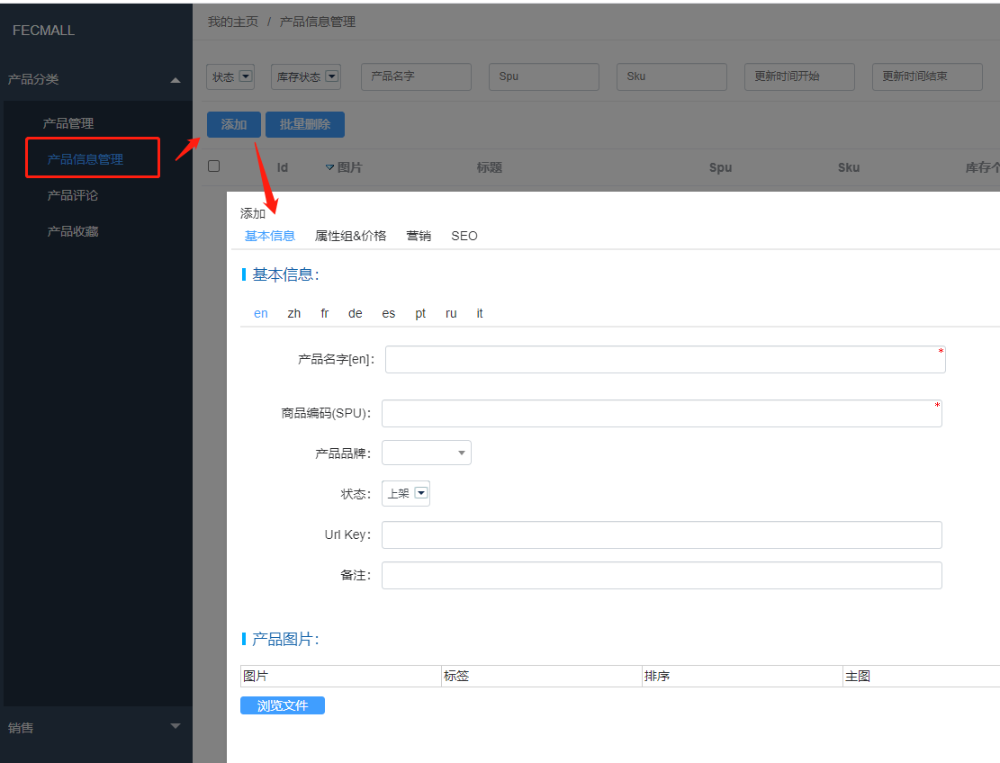
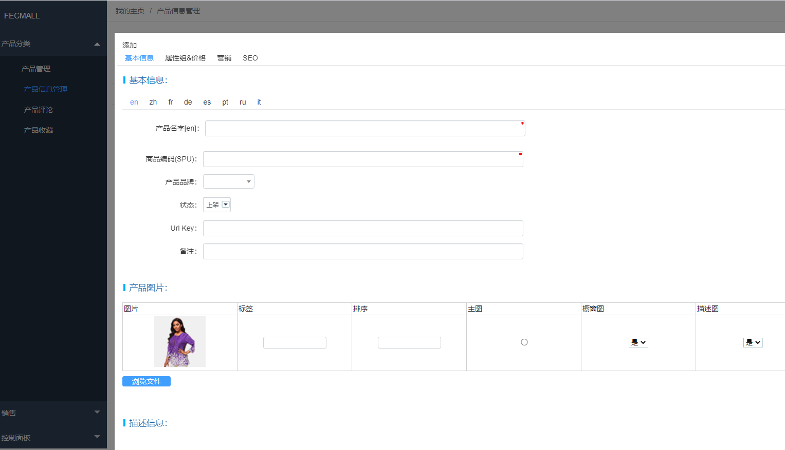
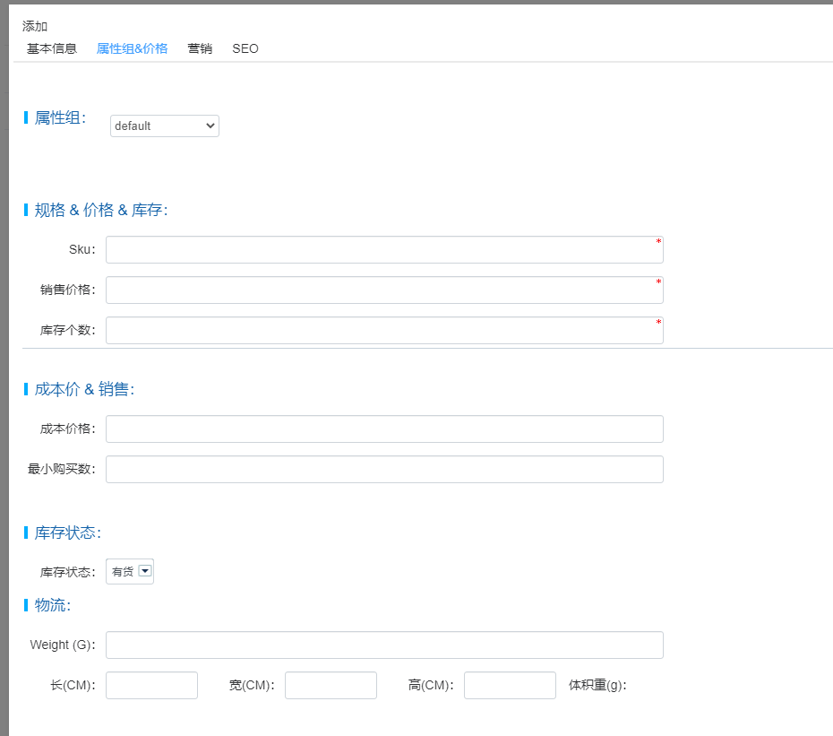
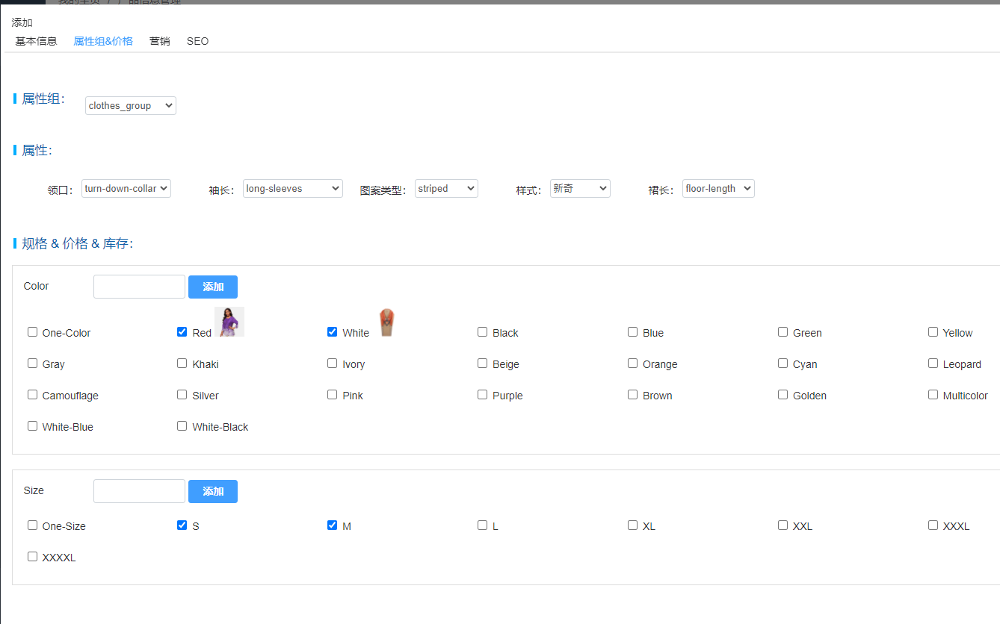
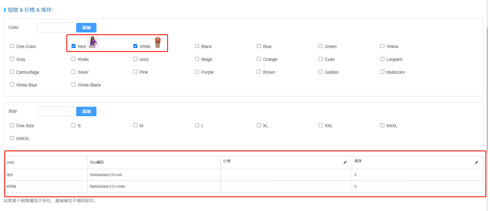
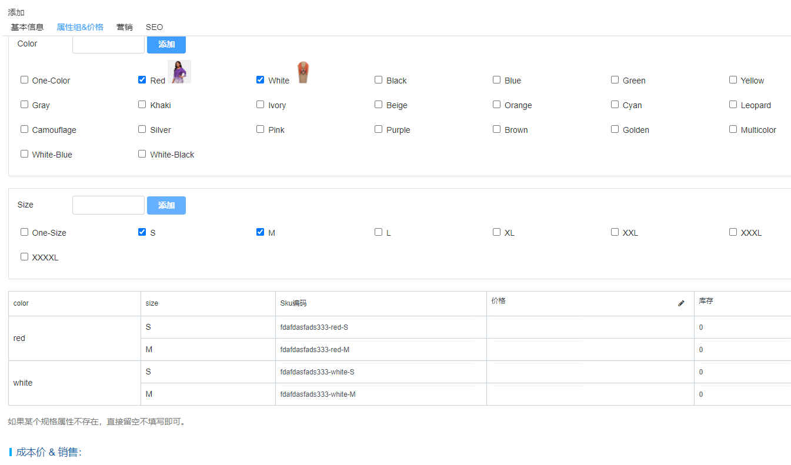
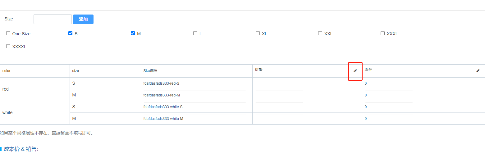

FecWbbc 跨境多商户-经销商产品管理
===========

> 经销商对产品进行的管理

在编辑产品之前，先了解两个术语，spu和sku

`spu`：标准化产品单元。是商品信息聚合的最小单位，是一组可复用、易检索的标准化信息的集合，该集合描述了一个产品的特性。通俗点讲，属性值、特性相同的商品就可以称为一个SPU

`sku`：最小库存单位

上面是专业的解释，通俗的解释：

一款鞋子，有4个尺码，那么每一个尺码就是一个`sku`，这款鞋子是一个`spu`，也就是说，
这4个不同的`sku`，他们的spu是相同的。

### 后台编辑产品（跨境多商户-经销商）

经销商在后台进行产品的添加和编辑

### 基本信息

您可以在这里填写产品的基本信息，可以点击语言进行不同语言的编辑，
上传图片，选择主图，编辑产品描述，为产品选择分类（可以多选）

### 属性组&价格

1.`属性组切换`：

您可以点击`属性组`下拉条，选择不同的`属性组`，进行切换，
譬如点击服装的属性组，切换如下：

`属性部分`：属性组对应的普通描述属性

`规格 & 价格 & 库存`：属性组对应的规格属性，您可以勾选规格，如果规格是图片格式，可以选择图片，
勾选后，下面就会出来规格

2.`属性组规格`

2.1如果您想要的规格值在列表中不存在，您可以在输入框中填写您的属性值，然后点击添加，进行添加

2.2对于多个规格，譬如color和size，您可以只勾选其中的一个规格，如上图，只勾选了color，
那么规格列表中只有color，而没有size，这种方式比较灵活，您如果color和size都勾选，如下图：

2.3规格的sku，是根据spu，和规格值生成，因此在生成规格之前，请先填写spu编号

2.4您可以点击编辑按钮，批量填写价格和库存

3.`成本价 & 销售`

`成本价格`: 商品的成本价格，商品的售价必须大于`成本价格`，否则无法保存

`最小购买数`:商品购买的最低数，不填写代表最低购买1个，您可以根据需要填写大于1的值，譬如`3`,用户一次性最低买3个

4.`库存状态`

产品的库存状态

5.`物流`

`Weight(G)重量`: 商品的重量，单位为克。

`长(CM)`, `宽(CM)`, `高(CM)`: 【选填】商品的长宽高，可以用于商品的信息展示，另外比较重要
的是，该数值可以用来计算体积重，如果您填写了该值，
那么商品的总量，将从 `Weight(G)重量` 和 `体积重` 中选择一个最大值，
作为商品的物流重量。

关于`体积重`，参看文档：[Fecmall体积重计算公式](http://www.fecmall.com/topic/659)

###  营销

您可以在这里设置产品的`特价`, `特价开始时间`，`特价结束时间`，以及`批发价格`

