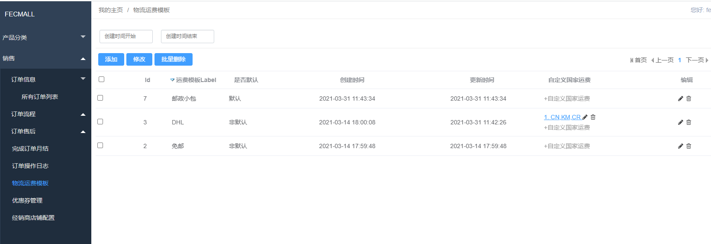
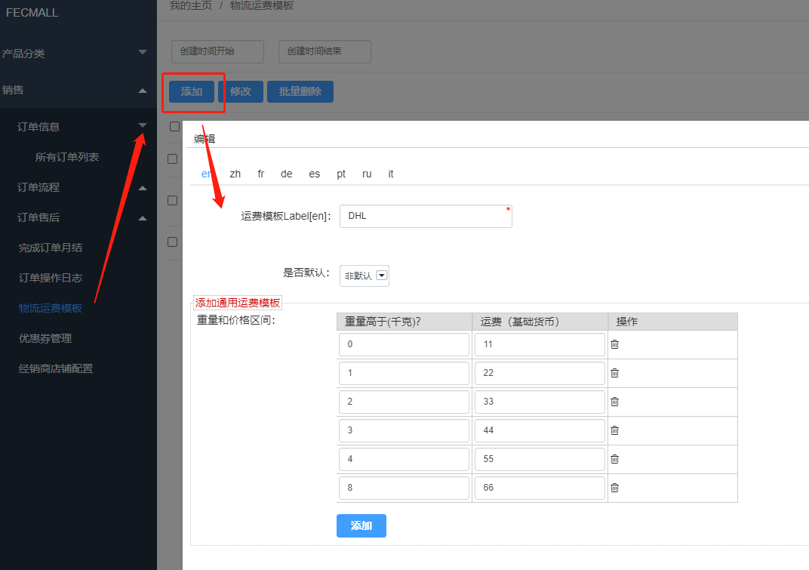
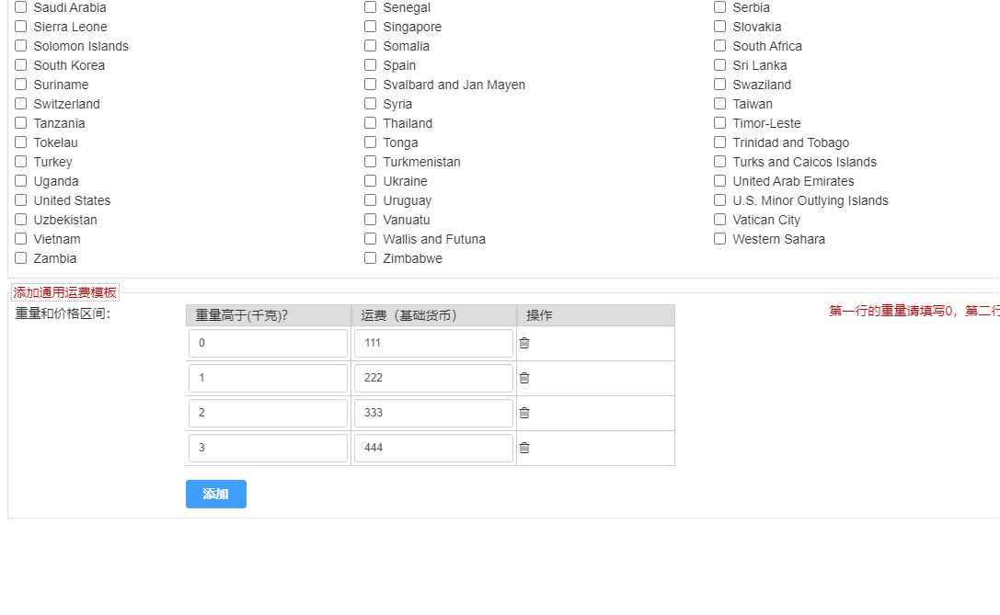
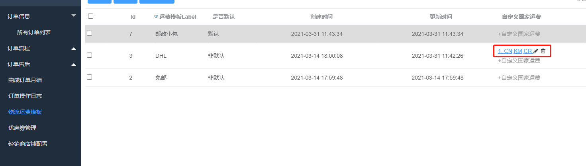

Fecwbbc 跨境多商户 - 经销商设置物流
===================

> 对于经销商，物流需要自己在`后台`设置

### 经销商设置物流

经销商可以在`后台`设置物流

1.添加物流方式，点击添加按钮

为物流方式添加一个通用的物流计算区间

如上图说明，`重量和价格区间`:

`0-1`千克：运费为`11`（基础货币）

`1-2`千克：运费为`22`（基础货币）

`2-3`千克：运费为`33`（基础货币）

依次类推。

设置完成后保存即可

2.为某些国家单独设置物流运费

当我们设置完成后，可以在列表页面，列表行看到一个按钮`+自定义国家运费`，点击即可

2.1勾选国家，可以多选

2.2设置物流运费区间值

保存即可，保存后可以看到 国家自定义的物流运费行，您可以点击编辑和删除

目前的运费模板，只做到了国家层面的运费区间自定义，还没有细化到省市层面。

3.删除运费模板

如果您删除了某一行运费模板，那么您的`自定义国家运费`也会一起删除。

