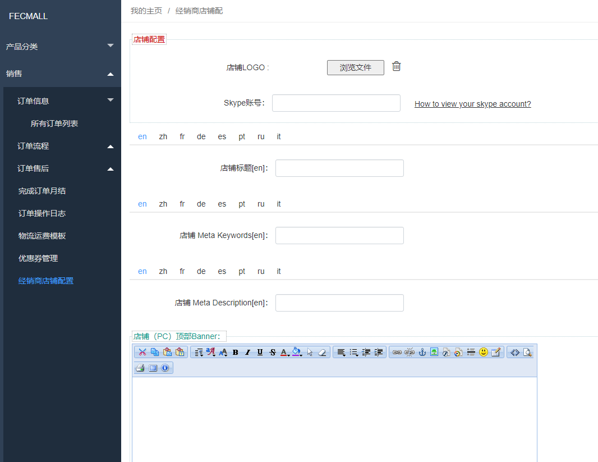
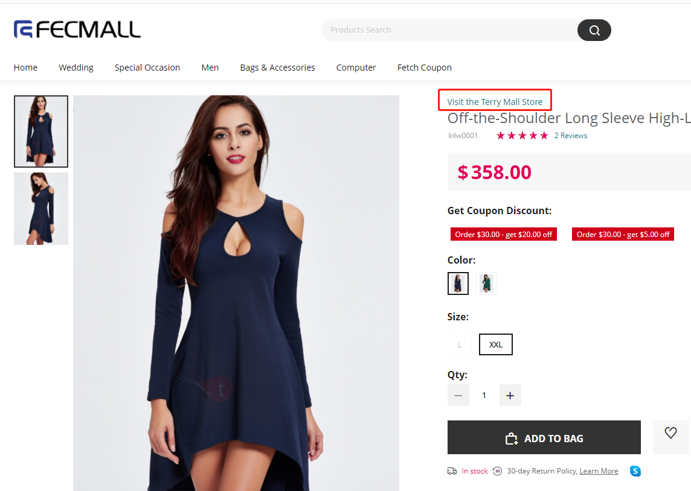
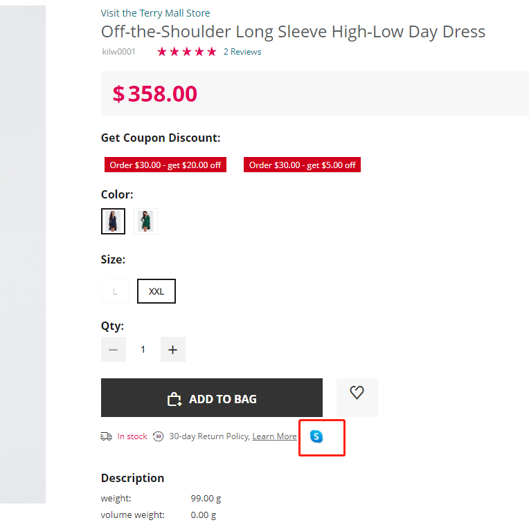
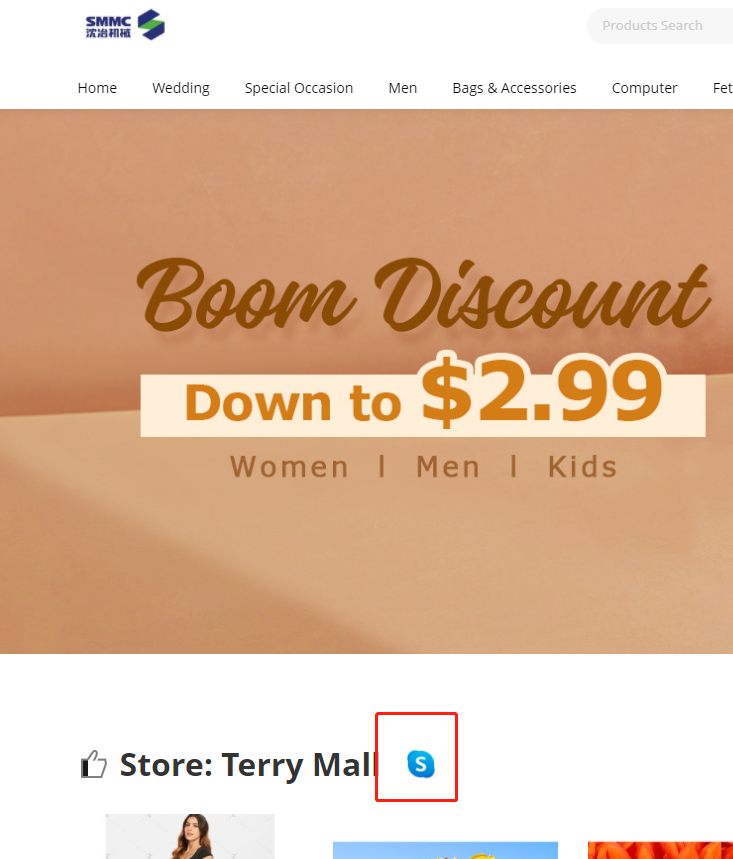
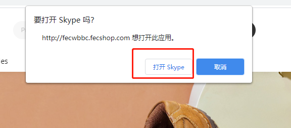
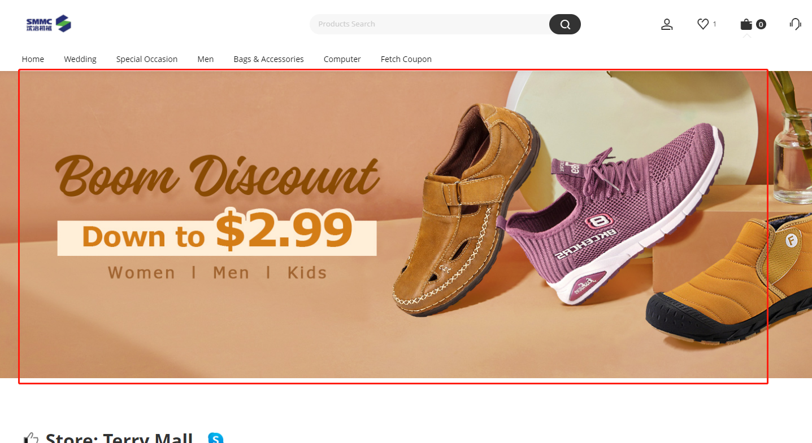

Fecwbbc 跨境多商户 - 经销商店铺配置
===========

> 经销商在后台设置店铺

### 经销商店铺配置

对于Fecwbbc 跨境多商户，每个经销商都有自己的店铺

1.`店铺LOGO`: 经销商店铺主页的logo，我们可以在产品详情页点击store链接，进入
经销商主页

进入店铺页面，可以看到顶部的logo是经销商自定义的logo图

2.`Skype账号`: 经销商的Skype账号

如何查看您的Skype 账号，参看文档：[如何获取您的skype用户名？](http://www.fecmall.com/topic/4919)

填写后，在您的店铺产品页面，以及您的店铺主页就可以看到skype的图标，当用户电脑或者手机安装了skype，
点击后，就会启动您的skype软件，进行聊天。

产品详情页skype图标

经销商主页skype图标

点击图标后：（需要您本地电脑或者手机安装skype）

然后就弹出skype的对话框了，用户可以商家进行对话。

4.`店铺标题`: 店铺主页的title

5.`店铺 Meta Keywords`: 店铺主页的 Meta Keywords

6.`店铺 Meta Description`: 店铺主页的 Meta Description

7.`店铺（PC）顶部Banner`: pc入口，店铺主页顶部的大图部分

8.`店铺（H5）顶部Banner`: h5入口，店铺主页顶部的大图部分

