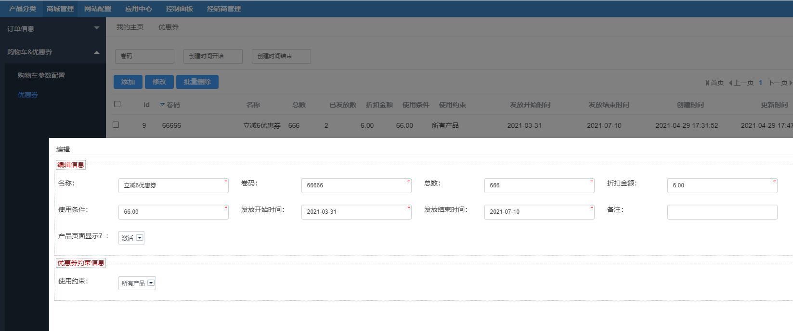
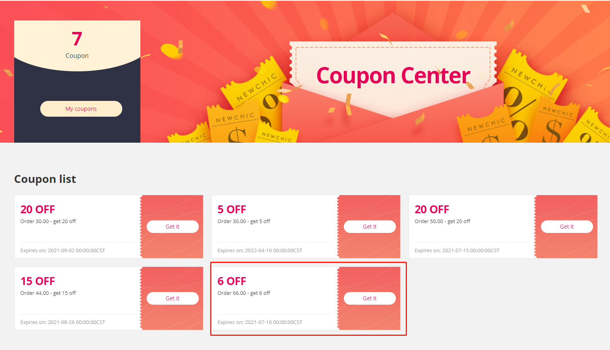
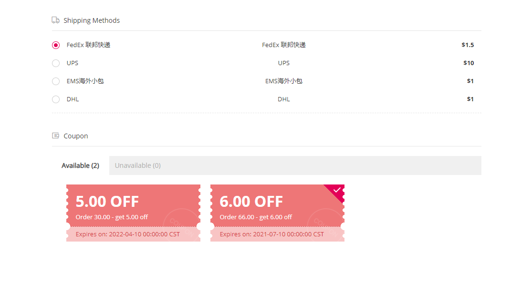

FecWbbc 平台优惠券
=============

> 由平台创建的优惠券，用户使用下单后，优惠的金额由平台进行补贴给商家。

### FecWbbc 平台优惠券逻辑

平台方发布的优惠券，费用由平台补贴，详细逻辑如下：

1.后台客服后台添加平台优惠券

1.1平台优惠券基本信息：平台`客服`在`平台后台`添加优惠券的`卷码`，`优惠金额`等优惠券基本信息

1.2平台优惠券的领取限制：`领取开始时间`，`领取到期时间`

1.3平台优惠券的使用限制：`商家限制`，`无任何限制`，`用户使用金额限制`

1.4添加优惠券类型，用于区分`商家优惠券`和`平台优惠券`

2.用户领取`平台优惠券`

用户在领券中心领取优惠券，将优惠券加入个人账户

3.用户下单，使用`平台优惠券`

3.1如果用户下单使用`平台优惠券`，查看订单中的`可用`(优惠券使用的商家限制等)`平台优惠券`的商品进行金额相加，将可用`平台优惠券`的商品总额，进行逻辑判断，是否满足`平台优惠券`的金额限制，如果满足，则
进行订单折扣优惠。

3.2订单表需要加字段`coupon_type`记录，该优惠券是`平台优惠券`

3.3如果用户取消订单，则进行`平台优惠券`的返还

4.用户退货退款

如果用户退货退款，那么只退款优惠后的订单总额

5.平台和商家结算

平台和商家结算的时候，通过订单表的字段`coupon_type`进行判断优惠券类型，如果订单使用的是`平台优惠券`，那么`结算金额` = `订单总额` + `平台优惠券优惠金额`，

也就是说平台优惠券的优惠金额，由`平台补贴`。

### 平台优惠券操作

1.平台管理员，在平台后台添加平台优惠券

2.用户在前台领取平台优惠券

3.用户下单使用优惠券

