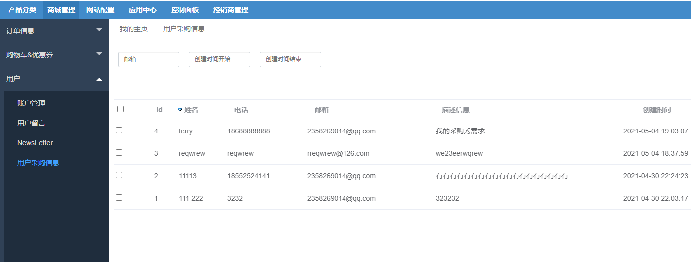
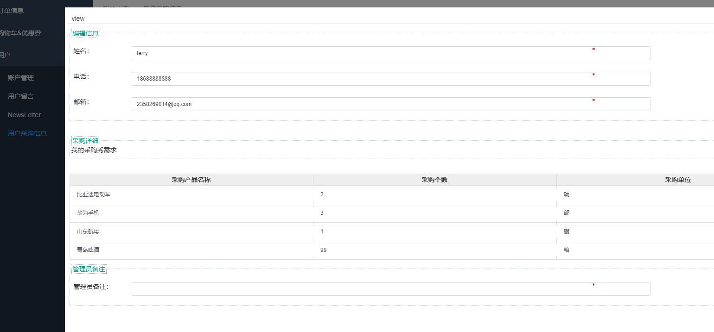

FecWbbc 用户采购留言
==========

> 用户采购商品等，需要进行联系我们，可以把自己的需求等写入表单，然后提交，管理员
后台查看信息，然后通过用户留下的信息进行联系用户

### FecWbbc 用户采购留言

用户在商城中查看商品，下单支付，而对于有的商品，商城中没有这个商品，而用户想咨询是否可以通过平台采购，
因此，用户可以提交自己的表单信息，平台看到用户的采购需求信息，通过用户留下的联系方式，联系用户进行线下采购。

1.用户提交采购需求

Demo: http://fecwbbc.fecshop.com/customer/purchasemessage

用户填写采购需求，提交

2.管理员后台查看用户提交的采购需求，联系用户。

查看采购需求详细:

