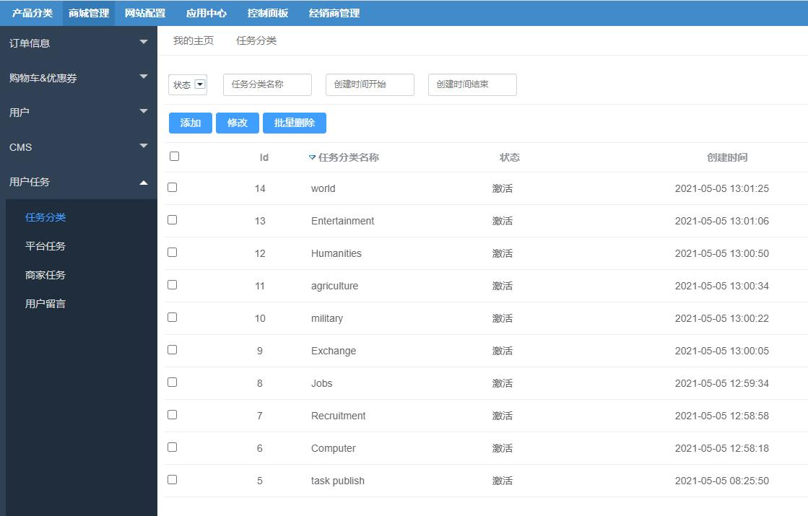
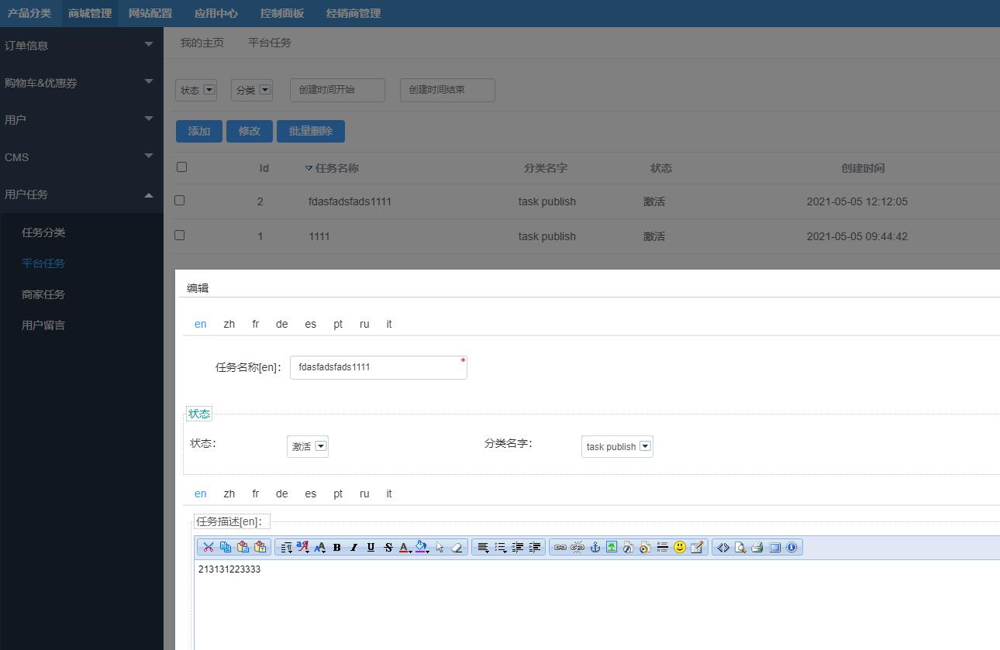
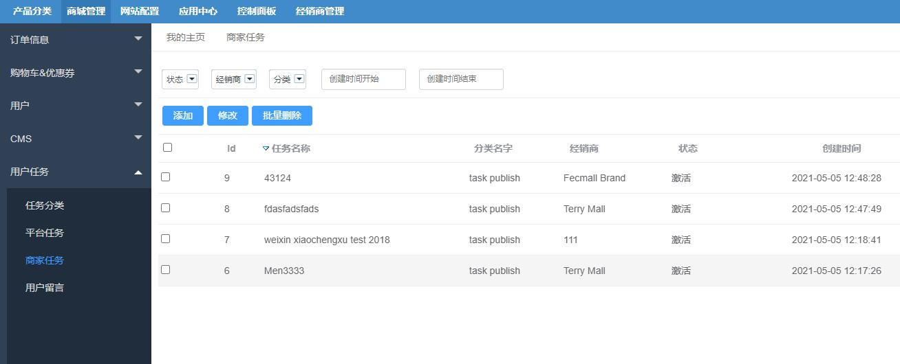
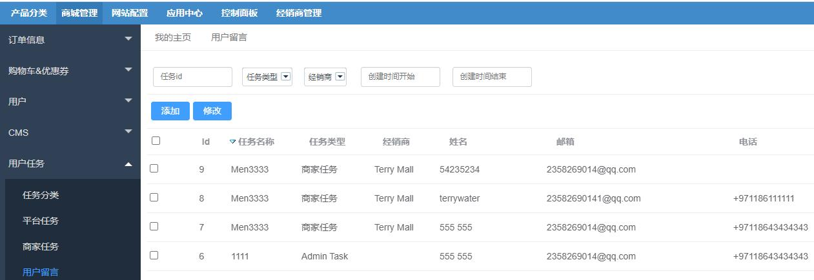
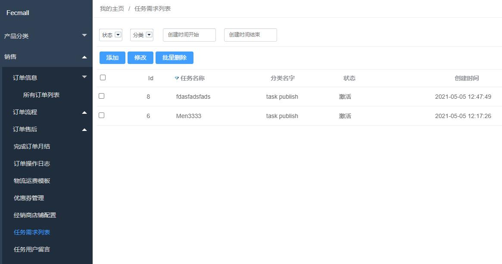
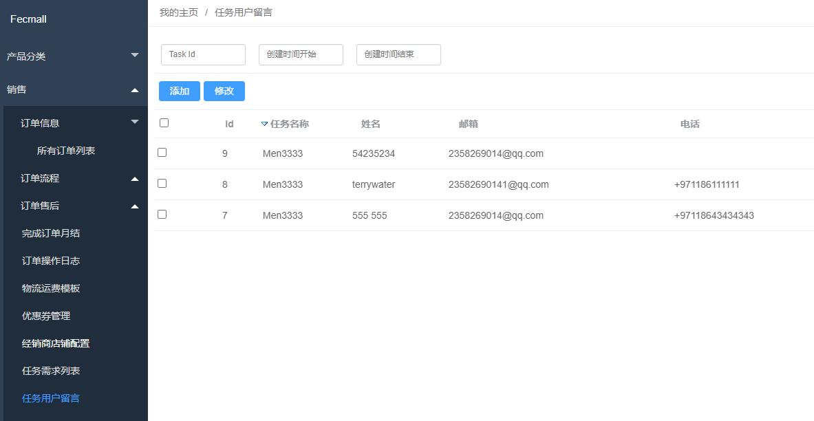
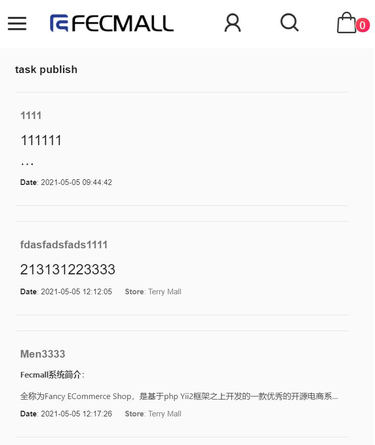
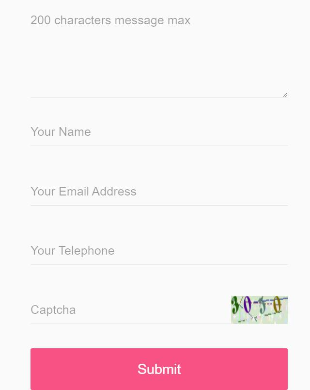

FecWbbc 任务发布
==========

### 任务发布需求

1.管理员在后台发布需求单，可以对需求单列表进行增删改查，
可以编辑需求 单名称、内容等等；
增加分类，有分类列表页，每个分类列表可以有独立链 接。

2.用户可以在前端商城查看需求单列表，点击进入需求单详细页面，查看需求 单的详细内容

3.不需要进行登陆，就可以在需求单下面留下自己的联系方式，提交表单（加 入验证码）

4.一个需求单，对应多个用户的留言，因为不需要用户登陆，理论上一个用户 提交多次也是允许的

5.管理员可以在后台查看各个需求单，以及需求单对应用户提交的留言信息， 进行线下联系。

6.发布需求单时，要有图文编辑器，发布后，上部图文介绍，下部是“国家/ 地区/城市”、姓名、联系方式。

7.前端多语种。

8.入驻的商家也可以发布需求单。

### 任务使用 - 平台后台

1.平台后台，编辑`任务分类`

2.平台任务编辑部分，类型默认为`平台类型`

3.查看商家任务，平台客服可以进行编辑

4.查看用户在前端商城，在任务详细页面，进行的留言

### 任务使用 - 商家后台

1.商家添加任务

2.商家查看用户留言

### 任务使用 - 商城部分，用户操作

1.用户查看`任务分类`列表

譬如：http://fecwbbch5.fecshop.com/cms/taskcategory （您可以将域名换成您的域名）

这个链接，您可以在网页的底部，或者其他部分，自行添加进去。

2.用户点击某个`任务分类`，查看改分类下的`任务列表`

3.用户点击某个任务，进入任务详情页面

用户可以在页面底部，进行留言/

