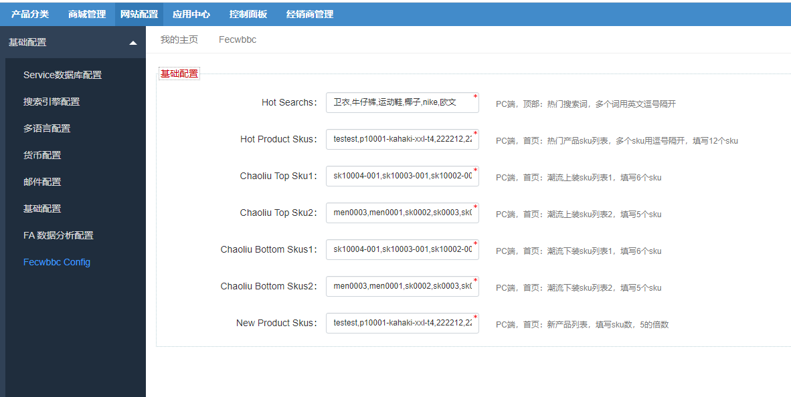
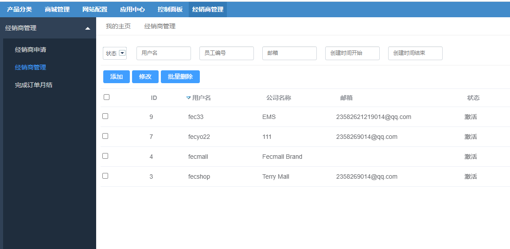

FecWbbc 跨境多商户安装教程
========

> 安装FecWbbc 跨境多商户系统的教程


### FecWbbc 跨境多商户安装

因为FecWbbc 跨境多商户是在fecmall的基础上，以扩展形式开发的独立扩展包，因此您需要先安装fecmall开源系统，
然后购买FecWbbc应用扩展，和您的应用市场账户绑定关系，然后再fecmall后台在线安装FecWbbc 跨境多商户。

1.安装fecmall开源商城


fecmall安装教程：[Fecmall-2.x安装教程](http://www.fecmall.com/doc/fecshop-guide/develop/cn-2.0/guide-fecshop-2-graphical-install.html)

注意，安装fecmall的时候，选择`跨境电商模式`(安装过程中有一个下拉条选择)。

2.应用市场注册账户，购买FecWbbc 跨境多商户系统

购买地址：http://addons.fecmall.com/28763787

[Fecmall应用市场-如何安装应用？](http://www.fecmall.com/doc/fecshop-guide/addons/cn-2.0/guide-fecmall-addons-install.html)

3.购买完成后，登陆fecmall后台， 应用中心--> 应用管理 --> 应用市场

点击在线安装`FecWbbc 跨境多商户系统`

4.安装完成后，需要nginx 添加一下经销商后台的访问域名

也将域名对应文件路径`@appbdmin/web`（@appadmin/web是平台后台地址）

`nginx`或`apache`的配置，和`appadmin`入口类似的配置，这里不做阐述


`pc入口`: 指向`appfront/web` 的域名

`h5入口`: 指向`apphtml5/web` 的域名

`平台后台入口`: 指向`appadmin/web` 的域名

`经销商后台入口`: 指向`appbdmin/web` 的域名


### 配置

1.Store配置


1.1网站配置-->Appfront配置--> Store配置

打开us的store编辑，将`第三方模板路径`值设置为：`@fecwbbc/app/appfront/theme/fecwbbc`

如需激活其他语言的store，请将其他语言的store也进行如上设置。

1.2网站配置-->Apphtml5配置--> Store配置

打开us的store编辑，将`第三方模板路径`值设置为：`@fecwbbc/app/apphtml5/theme/fecwbbc`

如需激活其他语言的store，请将其他语言的store也进行如上设置。

2.参数配置


在这里配置页面顶部的搜索词，以及首页各个板块的sku（在下面截图的右侧有注释）



您可以按照下面的内容先填写上去,安装完成后，根据自己的需要更改

`Hot Search`: `卫衣,牛仔裤,运动鞋,椰子,nike,欧文`

`Hot Product Skus`：`testest,p10001-kahaki-xxl-t4,222212,22221,p10001-kahaki-xxl,p10001-black-m,op0002-33,men0003,men0001,sk0002,sk0003,sk0008`

`Chaoliu Top Sku1`：`sk10004-001,sk10003-001,sk10002-002,sk10002,sk1000-blue,sk2001-blue-zo`

`Chaoliu Top Sku2`：`men0003,men0001,sk0002,sk0003,sk0008`

`Chaoliu Bottom Skus1`：`sk10004-001,sk10003-001,sk10002-002,sk10002,sk1000-blue,sk2001-blue-zo`

`Chaoliu Bottom Skus2`：`men0003,men0001,sk0002,sk0003,sk0008`

`New Product Skus`：`testest,p10001-kahaki-xxl-t4,222212,22221,p10001-kahaki-xxl,p10001-black-m,op0002-33,men0003,men0001,sk0002,sk0003,sk0008,sk0002,sk0003,sk0008,sk1000-blue,sk0004,sk1000-khak`


2.首页首页Banner以及静态块配置


参看：[FecWbbc 首页Banner以及静态块配置](fecwbbc-banner-config.md)


3.产品配置（测试产品）

3.1 添加经销商账户

后台：经销商管理  -> 经销商管理



添加经销商账户，成功后，就可以去经销商后台登陆了


3.2淘宝模式产品数据初始化

fecmall安装后，默认是fecmall的产品测试数据，由于fecwbbc多商户添加了淘宝模式产品，需要对这些历史数据进行初始化数据处理，
因此您需要执行一下初始化脚本

> 如果您不想处理这些数据，您可以进入数据库，将`product_flat`表的产品数据清掉,`product_flat_qty`产品库存表数据清掉，
产品分类关系表`category_product`清掉，然后后台新建产品即可


```
cd addons/fecmall/fecwbbc/shell
sh initTbProduct.sh
```

执行完后，可以在后台，产品管理部分，看到产品数据
 

 3.3为产品设置经销商,


您可以在平台后台，产品管理部分，编辑产品，上下架商品。


如果产品没有设置经销商，用户将不能将产品加入购物车。


到这里基本就配置完成了。


