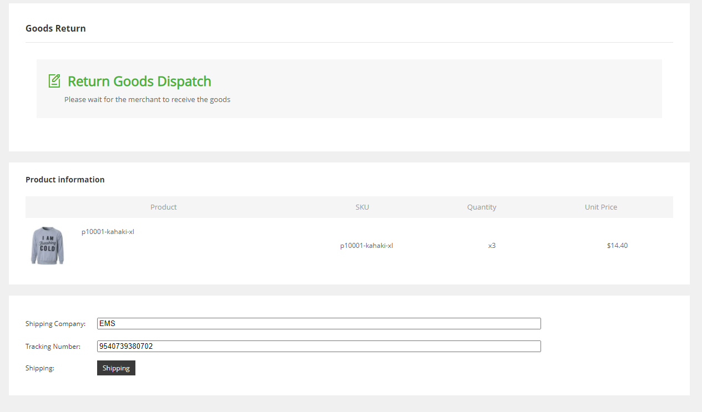
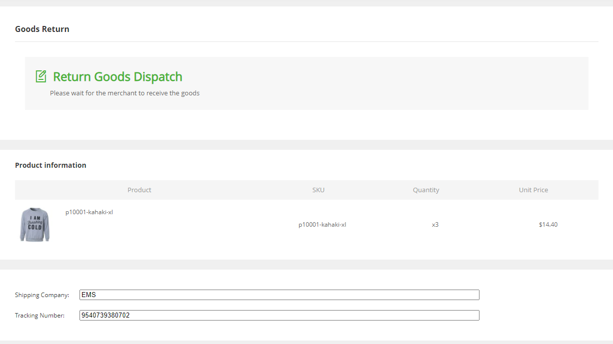

Fecwbbc跨境多商户 - 用户退货-商品发货
================

> 退货申请通过后，用户将退货的商品，通过快递的方式发出

 ### Fecwbbc跨境多商户 用户退货
 

 当管理员后台审核售后退货商品，审核通过后，用户就可以进行发货了
 
 用户通过订单列表，点击`after Sale`售后按钮，进入退货页面，如下：

  
 
在上图填写退货的物流编号，点击提交即可，提交成功后的页面内容如下图：

 

到这里，退货商品`发货`就完成了


### 订单退货-发货状态变化

1.进行操作的退货商品发货的条件

```
Yii::$service->order->info->afterSaleReturnStatusCanDispatchArr = [
    Yii::$service->order->afterSale->after_sale_status_return_accept,
];
```

满足这些条件，可以进行`退货商品- 发货`操作


2.订单退货`发货`操作

操作函数：

```
Yii::$service->order->aftersale->bdminReceiveReturnByAsId($as_id)
```


