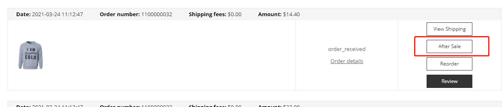
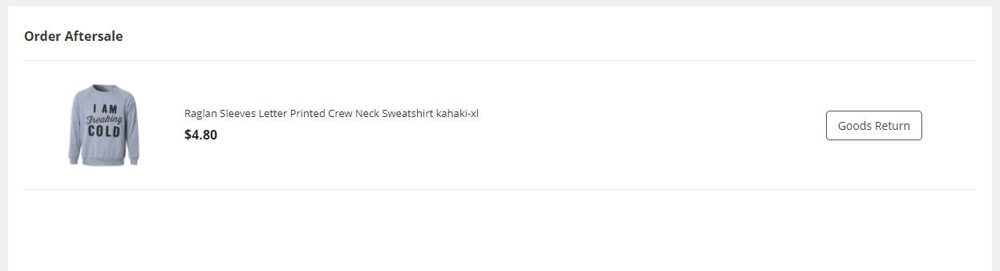
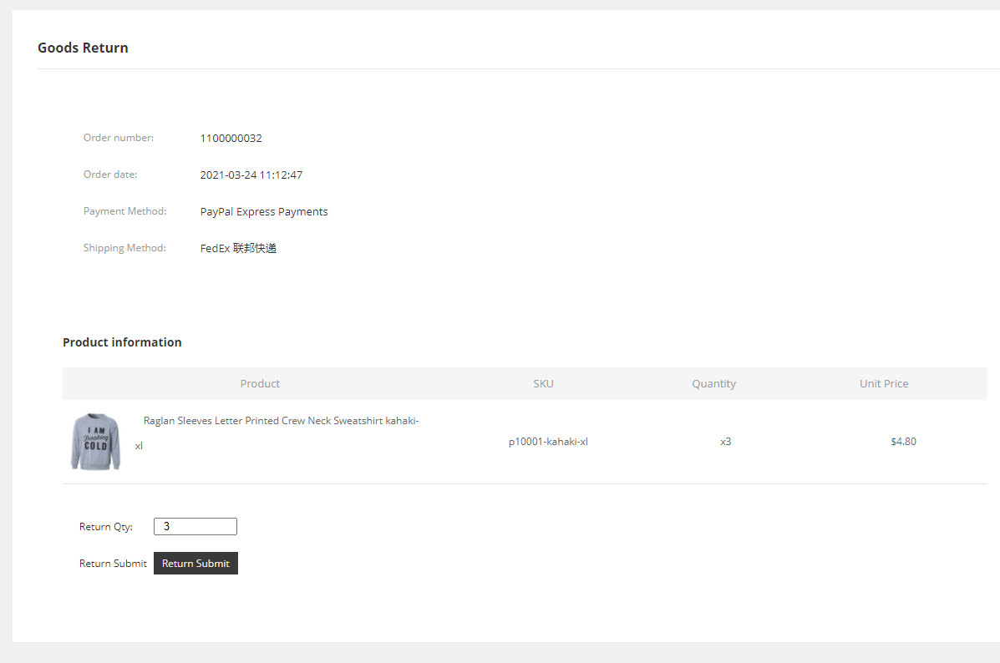
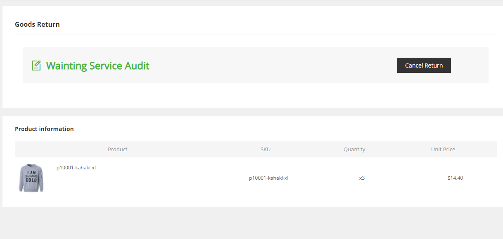
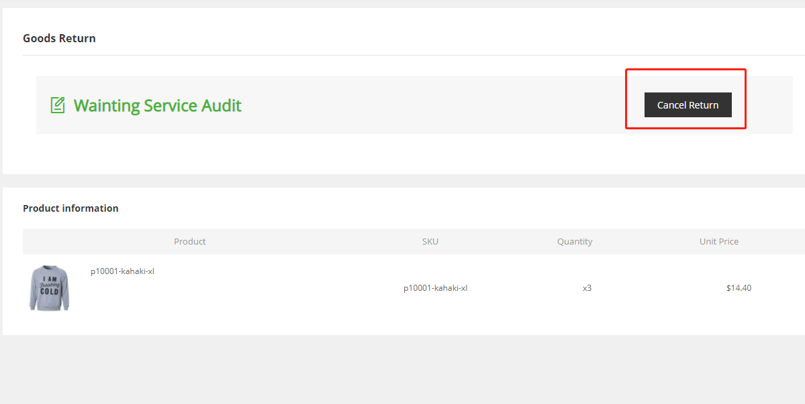

Fecwbbc跨境多商户 - 用户发起退货流程
===========

> 当产品质量存在问题等其他原因，导致商品退货的售后问题

### Fecwbbc跨境多商户 - 订单退货申请发起

当订单收货后，可以点击售后进入售后功能部分

 

点击后`售后`按钮，进入售后页面,如下：

 


可以点击`退货`按钮，进入退货部分,如下：

 

在这里，用户可以填写退货的产品的个数，点击提交，发起退货申请

提交成功，页面刷新后，如下图：

 

如果用户提交退货请求后，又不想退货了，
那么用户可以在该页面，点击`取消退货申请`按钮撤销提交的订单退货请求

 

至此，用户发起`订单退货请求`就完成了

### 创建退货请求函数

```
Yii::$service->order->aftersale->requestReturn($orderModel, $orderItemModel, $return_qty)
```


