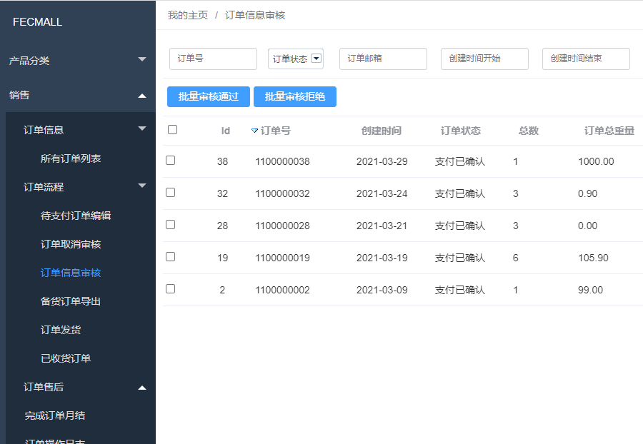
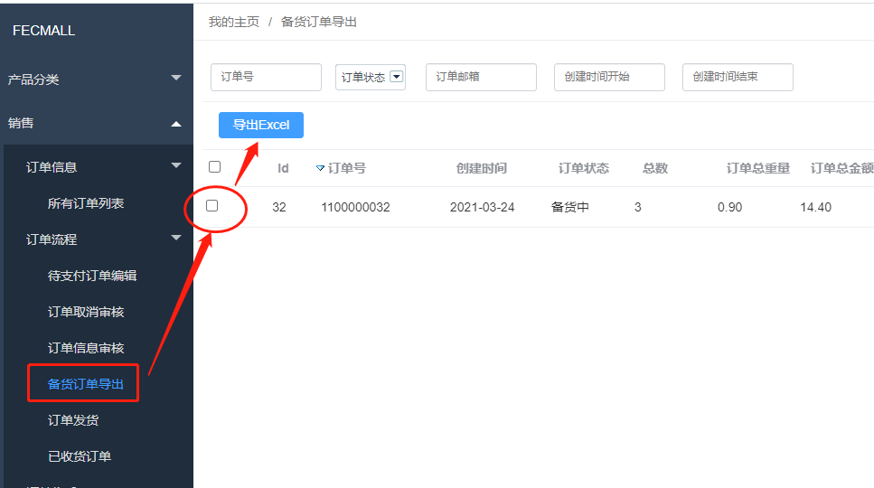

Fecwbbc 跨境多商户 - 订单信息审核
=============

> 订单支付完成后，订单信息需要经销商确认，也就是订单信息的审核过程

### 订单信息审核

`经销商`可以在后台查看`可以进行订单审核`的订单，
然后进行订单的`审核通过`，或者`订单审核拒绝`的操作



### 订单信息审核通过

1.可以进行`订单信息审核通过`操作的订单状态：

`订单在线支付成功的订单`

`订单信息审核拒绝的订单`

2.订单信息审核通过后

订单状态`order_status`变为：

```
Yii::$service->order->status_processing
```

详细代码参看

```
Yii::$service->order->process->auditOrderAccept($orderModel)
```

订单信息审核通过后，就进入备货阶段，经销商可以进行`订单产品发货`操作


### 订单审核拒绝


1.可以进行`订单信息审核拒`绝操作的订单状态：

`订单在线支付成功的订单`


2.`订单审核拒绝`后

订单状态`order_status`变为：

```
Yii::$service->order->status_audit_fail
```

详细代码参看

```
Yii::$service->order->process->auditOrderRefuse($orderModel)
```


### 订单信息审核拒绝的订单


1.`订单信息审核拒绝`的订单，经销商可以重新进行`订单信息审核通过`操作

2.`订单信息审核拒绝`的订单，用户可以在账户中心订单部分，进行`订单取消`的操作，
操作后，订单将会被直接取消掉


### 备货订单导出

订单审核通过后，订单状态为`备货订单`,经销商可以将商品导出Excel，然后导入到自己的erp
或者其他系统 ，进行`订单发货`
操作

  


