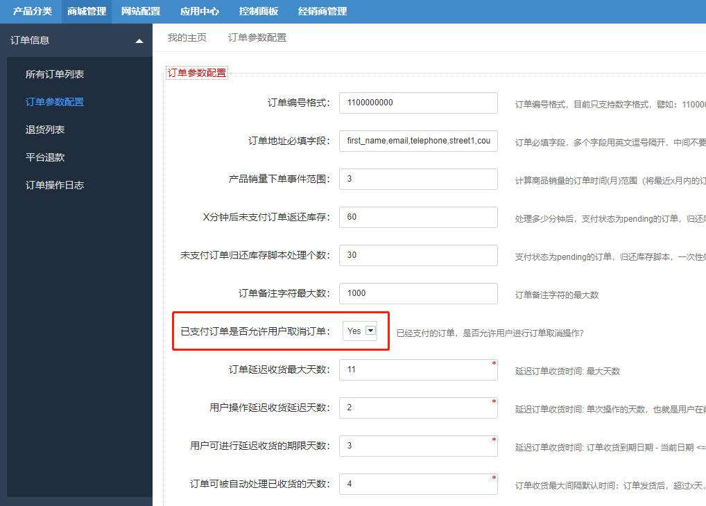
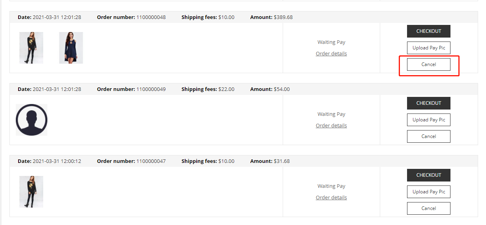
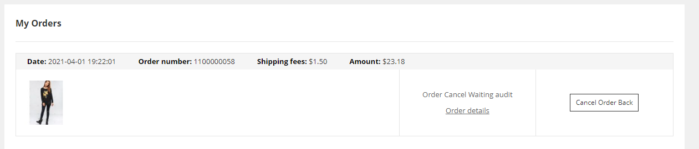
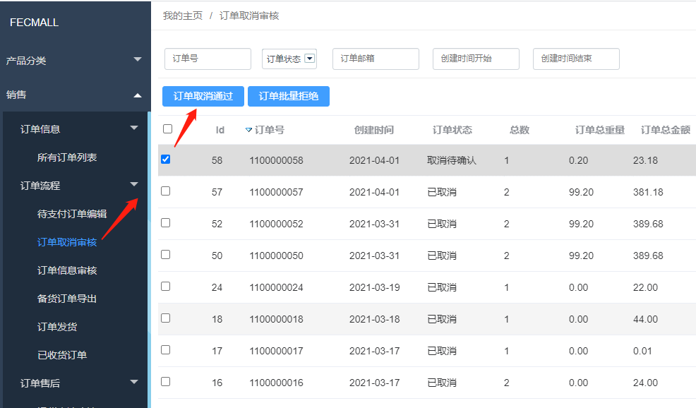
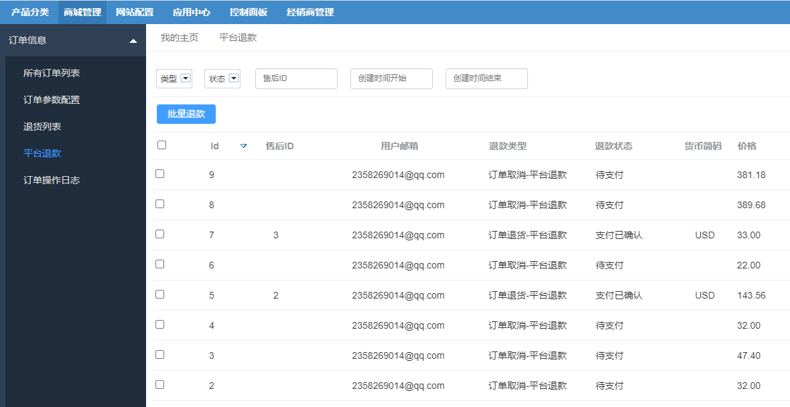

Fecwbbc 跨境多商户 - 用户取消订单
==============

> 订单创建后，用户进行订单取消的操作


### 订单取消设置

当用户下单后，用户对订单进行`订单取消`操作的说明
, 用户取消订单 有2种模式:


模式一 `已支付订单不允许用户取消订单操作`: 未支付订单，允许用户进行订单取消操作，当用户订单已经支付，
则不允许用户进行订单取消操作


模式二 `已支付订单允许用户取消订单操作`：有下面4种情况

1.`未支付订单`，允许用户进行订单取消操作

2.`已支付但经销商未审核`的订单，
用户可以直接取消订单，平台进行退款

3.`已支付经销商已审核`的订单，用户可以提交订单取消申请，经销商确认后,可以进行订单取消，平台进行退款

4.`已发货`的订单，不允许用户进行订单取消，用户只能通过售后来解决。


可以通过后台配置，来设置选择那种模式




模式一：设置`No`，保存即可

模式二：设置`Yes`，保存即可


### 订单取消操作


用户可以在`账户中心`,
订单管理功能页面，点击`取消`按钮




模式一：`已支付订单不允许用户取消订单操作`

用户只可以对`未支付订单`进行`取消订单`操作，当用户进行`订单取消`操作, 提交后，`订单直接取消`，不需要经销商审核.

模式二：`已支付订单允许用户取消订单操作`

1.`订单直接取消`:对于`未支付订单`,`以支付但经销商未订单审核`的订单，当用户进行`订单取消`操作
, 
提交后，`订单直接取消`，不需要经销商审核，如果订单已经支付，那么会发生
订单`退款`，需要在`平台商`进行`订单取消`退款（目前退款为`线下退款`,也就是通过支付渠道退款，然后在商城中更改状态）


2.`订单取消需要审核`:

如果用户订单支付后，`经销商`审核订单操作通过后，如果这个时候用户进行订单的`取消操作`,
那么需要经销商审核,订单是否可以`取消`


2.1`订单取消`请求发起后，如果用户想撤回该`请求`，用户可以点击订单`撤销取消(cancel order back)`请求，
来撤回该请求



2.2订单取消请求发起后，经销商在后台可以看到该请求
, 查看该订单是否已经发货，如果已经发货，那么订单不能被取消, 经销商进行`订单取消拒绝`

如果订单未发货，那么经销商可以进行`订单取消`操作，执行`订单取消通过`




如果点击的是`订单取消通过`，那么订单将会被`取消`，
进而发生`订单退款`


如果点击的是`订单取消拒绝`，那么`订单取消`请求将会被驳回,
订单将继续按照后续的处理流程继续处理。


4.订单发货后，用户将不能发起`订单取消请求`，如果用户坚持不要商品，只能等收到商品，确认收货后，进行退货操作（根据退款条约）


`订单取消请求`还没有审核的时候，订单无法进行其他处理（
也就是无法进行后续的订单发货操作），只能等
`订单取消审核`处理完成。

4.订单取消后
产品将会返还`库存`，
订单取消之后，代表订单终结，`订单取消`操作成功后，订单不可以进行其他的操作。

5.订单取消后，如果订单是在线支付（收款方为平台），
那么平台需要进行`订单退款`操作。



线下退款完成后，平台商在后台更改退款状态。


### 订单取消类型

`订单取消`，指的是用户下单后，进行订单取消的操作
，下面是用户（customer）在哪些订单状态下，可以进行订单取消的操作：


1.模式一：`已支付订单不允许用户取消订单操作`

```
Yii::$service->order->payment_status_pending,    // 订单创建状态（未支付）
Yii::$service->order->payment_status_processing,  //  订单支付中状态
Yii::$service->order->payment_status_canceled,    // 订单支付取消状态
Yii::$service->order->payment_no_need_status_confirmed,  // 订单-货到付款支付方式，确认
```

2.模式二：`已支付订单允许用户取消订单操作`

```
Yii::$service->order->payment_status_pending,    // 订单创建状态（未支付）
Yii::$service->order->payment_status_processing,  //  订单支付中状态
Yii::$service->order->payment_status_canceled,    // 订单支付取消状态
Yii::$service->order->payment_no_need_status_confirmed,  // 订单-货到付款支付方式，确认
Yii::$service->order->payment_status_confirmed,  // 订单支付完成
Yii::$service->order->status_audit_fail,   // 订单内容审核失败
Yii::$service->order->status_processing   // 订单内容审核通过，备货中状态
```

根据订单的状态，有的状态的订单可以直接取消，不需要经销商审核，有的需要经销商审核。

1.用户直接发起订单取消请求后，不需要经销商确认，
`直接订单取消`成功的情况：

当订单创建，支付，以及审核失败等状态，详细参看代码：

```
Yii::$service->order->info->orderStatusRedirectCancelArr = [
    Yii::$service->order->payment_status_pending,    // 订单创建状态（未支付）
    Yii::$service->order->payment_status_processing,  //  订单支付中状态
    Yii::$service->order->payment_status_canceled,    // 订单支付取消状态
    Yii::$service->order->payment_no_need_status_confirmed,  // 订单-货到付款支付方式，确认
    Yii::$service->order->payment_status_confirmed,  // 订单支付完成
    Yii::$service->order->status_audit_fail,   // 订单内容审核失败
]
```

当订单状态在上面的状态范围中，那么，当用户发起订单取消操作后，订单会被直接取消，
进行产品库存的返还，如果订单已经被在线支付，那么会进行退款处理（平台进行收款，因此由平台进行退款）。

详细代码参看：

```
Yii::$service->order->process->redirectCancel($orderModel)
```


2.订单取消发起后，需要`经销商`确认

用户发起`订单取消`请求，需要
经销商审核的情况

```
$this->orderStatusRequestCancelArr = [
    Yii::$service->order->status_processing,   // 订单审核通过，备货中
];
```   

当订单审核通过后，订单进入备货状态中，如果在该状态，用户发起`订单取消`操作，
那么需要经销商后台审核，如果进行`订单取消通过`操作，那么订单将会被取消，
如果进行`订单取消拒绝`操作（譬如已经发货了，无法取消），那么`订单取消请求`将会被拒绝，经销商可以对订单进行正常
流程的发货操作


当订单发货后，如果存在其他的问题，可以`确认收货`后，在售后部分进行`退货处理`

### 脚本取消订单

对于用户发起的订单，在一段时间内没有支付，系统脚本将会将这部分订单取消掉

详细参看： [订单取消脚本](fecmall-console-order-cancel.md)


