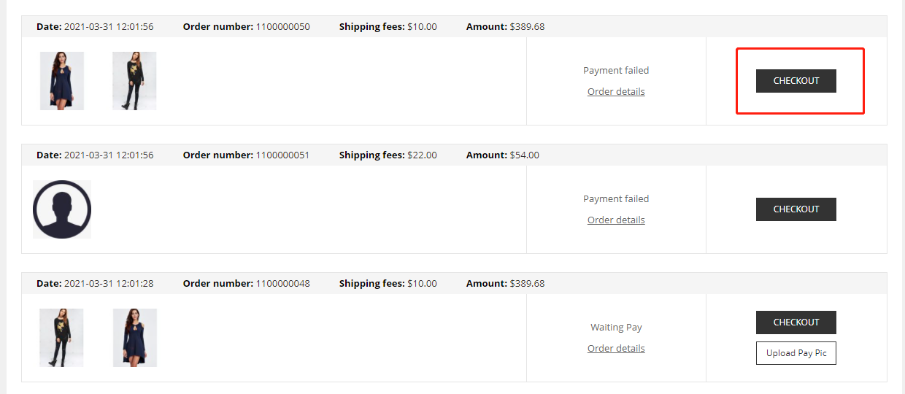
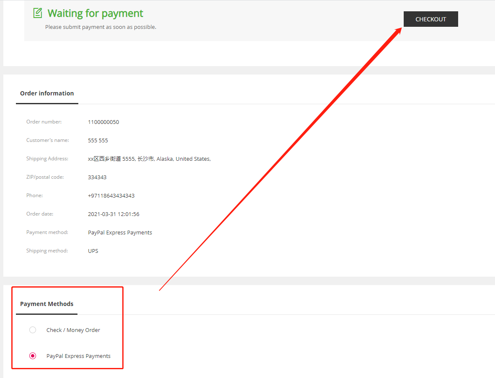

Fecwbbc跨境多商户 - 订单创建和支付
===============

> 用户创建订单，以及进行支付的过程

### Fecwbbc跨境多商户下单流程

1.用户选择产品加入购物车后，然后进行下订单操作，
填写货运地址，选择物流，选择支付方式，进行下单

2.用户下单成功后，则进入`支付页面`，这个过程表示订单创建完成，但是还`未支付`

2.1用户进入支付页面，但是没有支付，回到商城的账号中心 - 订单列表
，可以点击`支付`按钮，进行`支付`

点击`checkout`按钮，进入订单详情，用户重新为订单选择支付方式，重新下单。

2.2订单未支付前，`经销商`可以在后台修改该订单产品的价格，类似于淘宝产品拍下，
`商家`可以修改产品的价格，
这种方式一般用于`用户`和`商家`谈妥的一个价格进行支付。

经销商修改`订单产品价格`后，订单金额重新计算生成，然后，用户进行订单的`支付`，支付后的订单，经销商
则不能修改订单的价格。

目前线上支付是由`平台`收款。

