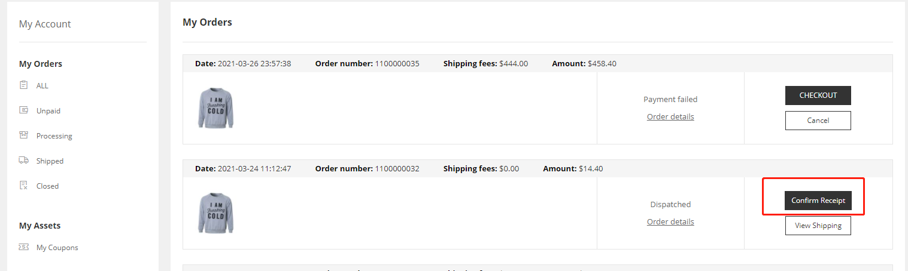
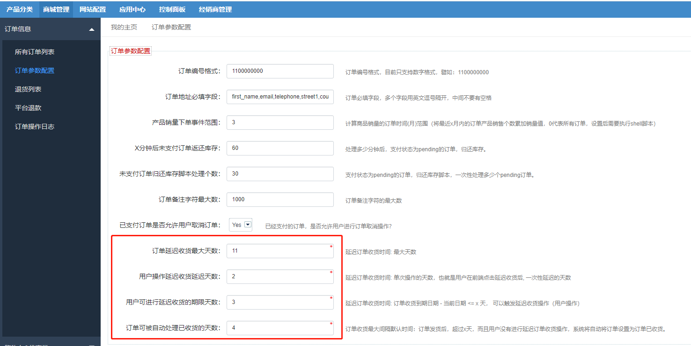

Fecwbbc 跨境多商户系统 - 用户收货
==========

> 经销商发货后，用户收到商品后，进行订单收货确认操作


### Fecwbbc 跨境多商户系统 -  用户订单收货操作

当备货订单被`订单发货`后，用户在账户中心的订单
部分可以看到`订单发货`的信息，然后进行`订单收货`操作



当在一定时间内，用户没有收到货物，规定时间内快要结束的几天内，
会出现`延迟收货按钮`，用户可以点击`延迟收货按钮`延迟`收货时间`


### 订单状态变化

1.被操作的订单状态

```
// order_status
Yii::$service->order->info->orderStatusCanReceivedArr = [
    Yii::$service->order->status_dispatched,
]
// order_operate_status
Yii::$service->order->info->orderOperateStatusCanReceivedArr = [
    Yii::$service->order->operate_status_normal,
];
```

        
2.订单收货，详细代码参看函数

```
Yii::$service->order->process->receiveOrder($orderModel) 
```
收货后，进行订单状态的更改

### 延期收货

1.参数设置, 打开Yii::$service->order->process可以看到类变量


您可以在后台进行配置这些参数,如图：



请仔细看上面的参数配置的注释内容，您需要进行对这些参数进行配置。

2.延迟收货函数

```
Yii::$service->order->process->delayReceiveOrder($orderModel)
```

`延期收货`后，如果订单没有收到，可以`继续延期收货`，直到
达到最大的时间，无法延期收货

超过最大时间，用户可以联系`平台`来解决。


3.到期自动收货

当超过最大时间，用户没有进行订单收货操作，将由系统脚本自动进行订单收货操作

详细参看：[FecMall订单自动收货脚本](fecmall-order-auto-received.md)


