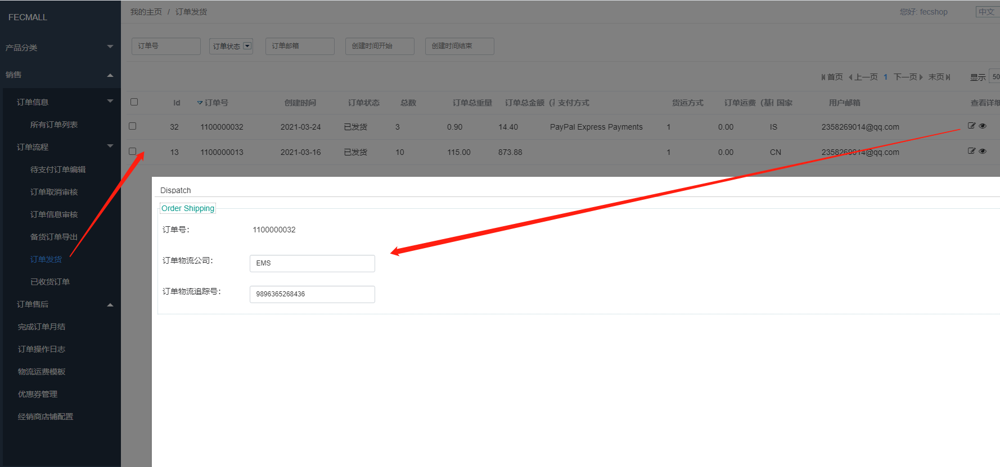

Fecwbbc 跨境多商户系统 - 订单发货
==========

> 订单审核通过后，经销商将订单信息导出，进行订单发货操作

### 跨境多商户系统-订单发货

> `备货中`的订单可以进行`订单发货`操作

在弹框中填写`物流公司`，`物流追踪号`，保存即可完成`订单发货`的操作

 

操作完成后，订单状态为`已发货`，用户在前端商城可以看到
订单的状态的变化。


### 订单状态变化

1.操作前的订单状态（只有满足下面条件的订单，才能进行订单发货操作）

```
// order_status
Yii::$service->order->info->orderStatusCanDispatchArr = [
    Yii::$service->order->status_processing,
]
// order_operate_status
Yii::$service->order->info->orderOperateStatusCanDispatchArr = [
    Yii::$service->order->operate_status_normal,
];
```

2.订单发货，详细代码参看函数

```
Yii::$service->order->process->dispatchOrder($orderModel, $tracking_number) 
```
发货后，进行订单状态的更改，订单状态改为`已发货`,
详细的操作，请参看上面的函数。


