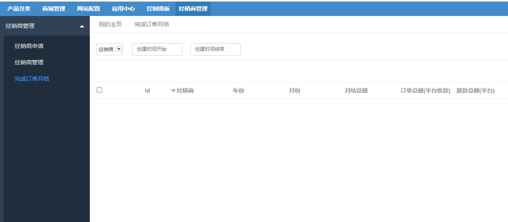
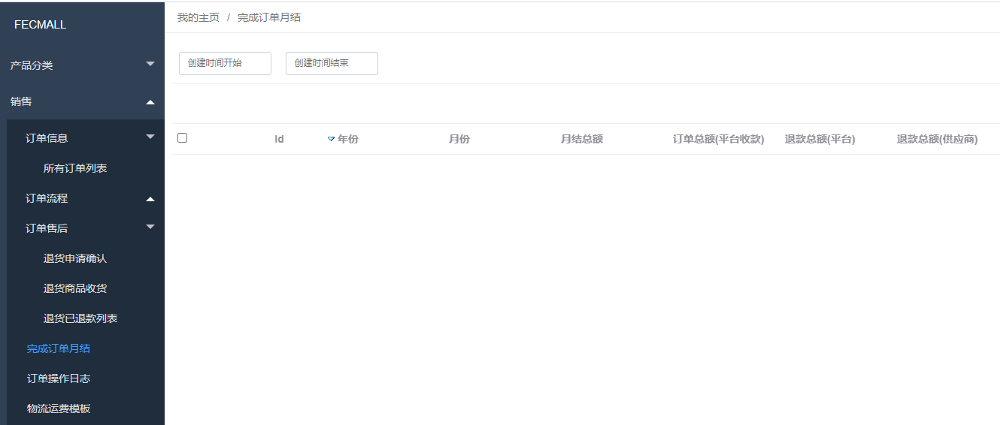

FecWbbc跨境多商户 - 订单结算
=========

> 按照月，对订单进行统计。

### 查看月结金额

1.平台商查看月结总额

2.经销商查看月结总额

### 月结计算

上面的数据，是由脚本计算而来，
详细参看文档：[FecWbbc订单月结脚本](fecwbbc-order-auto-month-yj.md)

作为平台商，可以在每个月的15号，或者其他的一些时间，对上个月的订单进行月结（这个看自己的情况）

`结算的金额` = `平台代收的订单总额` - `订单退款的总额`

### 月结金额打款

然后在经销商管理部分，查看录入的经销商信息，查看经销商的银行账户，进行线下打款即可。

