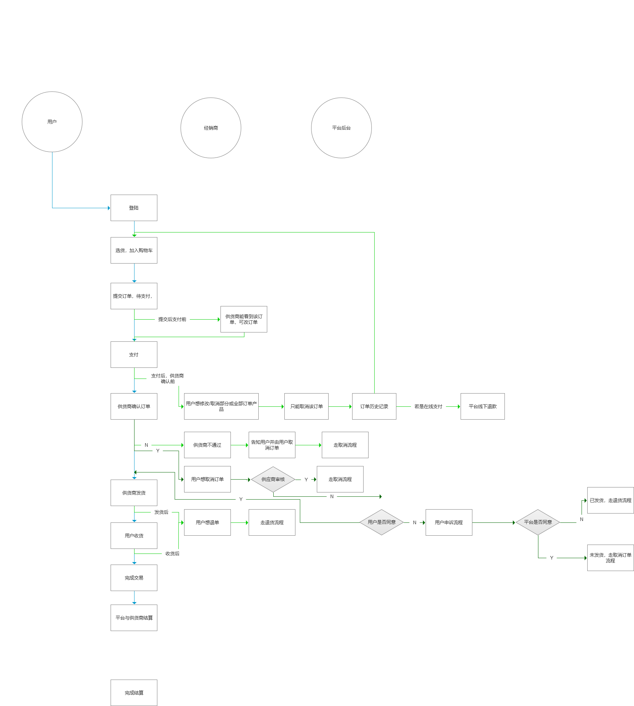

Fecwbbc 跨境多商户 - 订单处理流程
============

> 对于多商户跨境电商，订单处理是比较麻烦的一个流程部分，该部分对订单
的订单处理流程进行了讲解

### 订单流程图

下面是订单处理的流程图部分，如果看不清可以放到浏览器来阅读该
图片的内容，下面是一个完整的订单处理流程。



因为图片比较大，如果看不清，可以保存到本地查看（或者放大浏览器）。


### 订单状态

对于Fecwbbc 跨境多商户版的订单状态，在数据表`sales_flat_order`中用了两个字段来标识
`order_status`和 `order_operate_status`

1.`order_status`:【订单流程状态】作为订单处理的流水线状态记录，
譬如订单创建，支付，审核，发货，收货等

2.`order_operate_status`【订单操作状态】作为订单处理过程中终端或者挂起等状态的标识，
譬如 `订单正常操作状态 `，`订单取消待确认状态`, `订单已取消`, `订单挂起`等等

3.订单的状态在`@fecwbbc/services/Order.php`的类变量中，您可以在这个
文件中查看 order services status

`@fecwbbc` 是文件路径  `./addons/fecmall/fecwbbc` 

4.对于`order_status`和 `order_operate_status`各个子项的详细

```
/**
 *  订单流程状态
 *
 */
// 等待付款状态
public $payment_status_pending          = 'payment_pending';

// 付款处理中，(支付处理中，因为信用卡有预售，因此需要等IPN消息来确认是否支付成功)
public $payment_status_processing       = 'payment_processing';

// 收款成功（支付状态已确认，代表已经收到钱了）
public $payment_status_confirmed        = 'payment_confirmed';

// 货到付款类型订单，创建成功后，用户订单创建完成后的状态（在流程方面，相当于上面的$payment_status_confirmed）
public $payment_no_need_status_confirmed        = 'payment_no_need_confirmed';

// 欺诈【当paypal的返回金额和网站金额不一致【以及货币类型】的情况，就会判定该状态】
public $payment_status_suspected_fraud  = 'payment_suspected_fraud';

// 订单支付已取消【用户进入paypal点击取消订单返回网站，或者payment_pending订单超过xx时间未支付被脚本取消，或者客服后台取消】
public $payment_status_canceled         = 'payment_canceled';

// 供应商后台审核不通过状态
public $status_audit_fail                   = 'order_audit_fail';

// 订单备货处理中，从成功收款进入erp并客服审核成功后，进入备货流程 到 发货前的状态
public $status_processing                   = 'order_processing'; 

// 订单已发货【订单包裹被物流公司收取后】
public $status_dispatched                   = 'order_dispatched';

// 订单已经收货 
public $status_received                 = 'order_received';

// 订单已完成，
public $status_completed                 = 'order_completed';

/**
 *  订单操作状态
 */
// 订单正常操作状态 
public $operate_status_normal   = 'operate_normal';

// 订单取消待确认状态，【用户付款后，因为纠纷进行取消订单后的状态】
public $operate_status_waiting_canceled   = 'operate_waiting_canceled';

// 订单已取消，【用户付款后，因为纠纷进行取消订单后的状态】
public $operate_status_canceled   = 'operate_canceled';

// 订单审核中（订单收款成功后，进入erp，需要客服审核，才能开始发货流程，或者可能存在某些问题，被客服暂时挂起）
public $operate_status_holded                   = 'operate_holded';

```


5.订单的各个流程处理部分，都需要对订单状态做判断，才能执行操作

订单的状态判断都在 `@fecwbbc/services/order/Info.php`进行的

各个入口进行订单的操作，都是由该services统一处理，以免发生订单状态混乱，
此外，对于用户二次开发，理顺订单状态结构，重构订单处理流程，也比较方便（只需要在该services更改即可，更改后，
各个入口都会更改）


