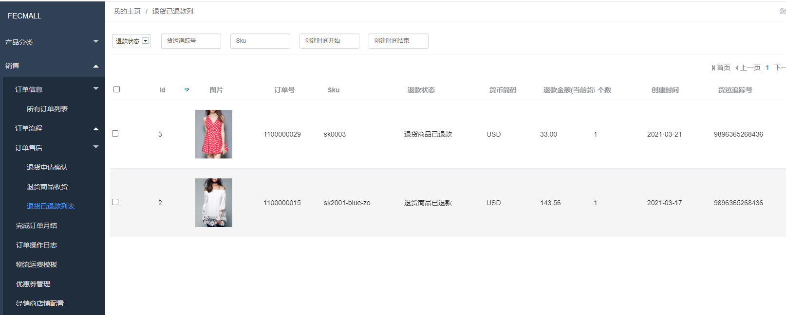
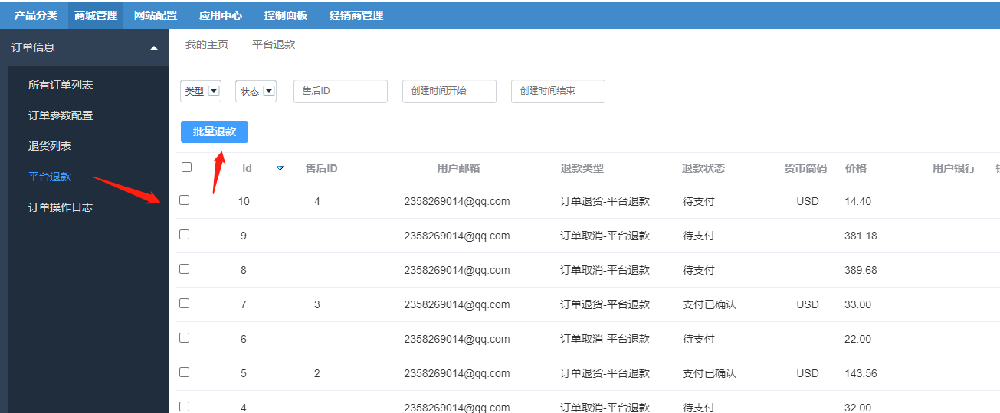

Fecwbbc跨境多商户 - 订单退款介绍
================

> Fecmall用户创建的订单，需要退款的各种情况的介绍

### 退款类型

`订单取消退款`: 当订单创建后，在线支付成功，平台收款完成后，如果用户进行订单
取消操作，通过后，将会进行订单取消退款，由平台进行退款操作（因为订单的钱由平台收取）

`售后退货退款-在线支付类型`：`在线支付`订单，那么由`平台收款`, 
那么当用户发起`订单退货`后，退货产品对应的退款金额，由平台进行退款

### 退款查看

经销商后台查看：推销商的退款记录：（经销商只能看到自己的退款信息）

平台商后台查看退款记录：（平台商后台可以看到所有经销商的退款信息）

### 退款操作

平台商，在平台后台查看需要退款的记录，核实后，即可进行退款打款操作

如图：

操作后，用户订单的退货部分，会更改为已退款

