FecMall Fecbo扩展-安装和配置
===============

> FecMall Fecbo 扩展安装和配置


准备工作READY
--------

1.安装Fecyo扩展，详细参看：[Fecyo 安装](fecmall-fecyo-install.md)

2.安装Wallet扩展，详细参看：[Walletyo扩展-关于和介绍](fecmall-fecyo-walletyo-about.md)

3.安装本扩展，应用市场地址：http://addons.fecmall.com/21687967

关于如何安装应用，详细参看文档：[Fecmall应用市场-安装应用扩展文档](http://www.fecmall.com/doc/fecshop-guide/addons/cn-2.0/guide-fecmall-addons-install.html)


Fecbo配置
-----------


1.Store设置（配置第三方模板路径）

1.1网站配置 --> Appfront配置  -->  Store配置

编辑，弹出框，第三方模板路径： `@fecbo/app/appfront/theme/fecbo,@walletyo/app/appfront/theme,@fecyo/app/appfront/theme/fecyo`

1.2网站配置 --> Apphtml5配置  -->  Store配置

编辑，弹出框，第三方模板路径： `@fecbo/app/apphtml5/theme/fecbo,@walletyo/app/apphtml5/theme,@fecyo/app/apphtml5/theme/fecyo`


Fecbo Appfront配置
-----------


1.首页大图

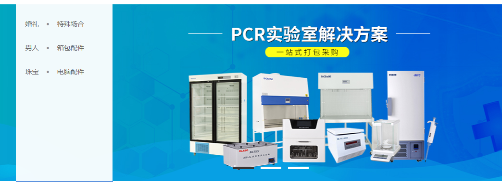


配置：(后台：`CMS` -> `静态块`)

标识符：`pc-home-big-img`

标题：`PC：首页大图`

内容：

```
<div class="www51buycom">                
	<ul class="lbtop">                    
		<li style="height: 100%;width: 100%;background: url('{{imgBaseUrl}}/addons/fecbo/f7b3180ddbd64c67a740f9c8b345b2fb.jpg')50% 50% no-repeat;">                        
			<a href="{{homeUrl}}" id="indexa165" target="_blank"></a>                    
		</li>                    
		<li style="height: 100%;width: 100%;background: url('{{imgBaseUrl}}/addons/fecbo/871b6f5e845f48c2bcc9b315bfe3c88d.jpg')50% 50% no-repeat;">
			                        <a href="{{homeUrl}}" id="indexa170" target="_blank"></a>                    
		</li>                    
		<li style="height: 100%;width: 100%;background: url('{{imgBaseUrl}}/addons/fecbo/27d364f47b4b47a3992fa50a3526dd99.jpg')50% 50% no-repeat;">                        
			<a href="{{homeUrl}}" id="indexa175" target="_blank"></a>                    
		</li>                
	</ul>                
	<ul id="numul" class="numul">                    
		<li>
		</li>                    
		<li>
		</li>                    
		<li>
		</li>                
	</ul>            
</div>
```

2.首页品牌列表

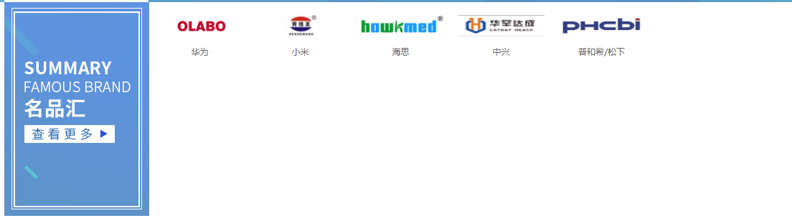


后台：`产品分类` --> `产品管理` --> `产品品牌`

这里添加品牌

3.首页广告banner


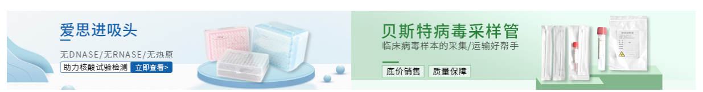


配置：(后台：`CMS` -> `静态块`)

标识符：`pc-home-top-market`

标题：`PC：首页顶部四张广告图`

内容：

```
<ul class="guanggaoimgul">                    
	<li>
		                        <a href="">                                                    </a>                    
	</li>                    
	<li>                        
		<a href="">                                                    </a>                    
	</li>                    
	<li>                        
		<a href="">                                                    </a>                    
	</li>                    
	<li>                        
		<a href="">                                                    </a>                    
	</li>                  
</ul>
```

4.首页一楼部分

4.1左侧文字部分

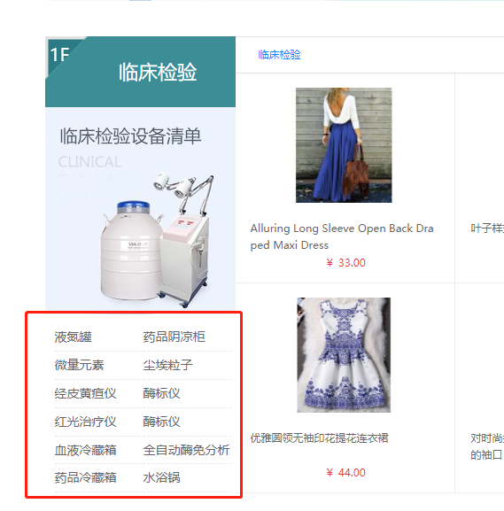


配置：(后台：`CMS` -> `静态块`)

标识符：`pc-home-floor1-left-items`

标题：`PC：首页一楼左侧子项`

内容：

```
<li>                                
	<a href="" title="" target="_blank">                                    液氮罐                                </a>                            
</li>                            
<li>                                
	<a href="" title="" target="_blank">                                    药品阴凉柜                                </a>                            
</li>                            
<li>                                
	<a href="" title="" target="_blank">                                    微量元素                                </a>                            
</li>                            
<li>                                
	<a href="" title="" target="_blank">                                    尘埃粒子                                </a>                            
</li>                            
<li>                                
	<a href="" title="" target="_blank">                                    经皮黄疸仪                                </a>                            
</li>                            
<li>                                
	<a href="" title="" target="_blank">                                    酶标仪                                </a>                            
</li>                            
<li>                                
	<a href="" title="" target="_blank">                                    红光治疗仪                                </a>                            
</li>                            
<li>                                
	<a href="" title="" target="_blank">                                    酶标仪                                </a>                            
</li>                            
<li>                                
	<a href="" title="" target="_blank">                                    血液冷藏箱                                </a>                            
</li>                            
<li>                                
	<a href="" title="" target="_blank">                                    全自动酶免分析系统                                </a>                            
</li>                            
<li>                                
	<a href="" title="" target="_blank">                                    药品冷藏箱                                </a>                            
</li>                            
<li>                                
	<a href="" title="" target="_blank">                                    水浴锅                                </a>                            
</li>                            
<li>                                
	<a href="" title="" target="_blank">                                    高压蒸汽灭菌器                                </a>                            
</li>                            
```

4.2右侧产品图片


后台：`网站配置`  ->  `首页产品配置`   `Chaoliu Top Sku1`


5.首页二楼部分

5.1左侧文字部分

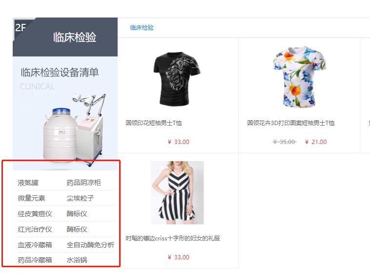


配置：(后台：`CMS` -> `静态块`)

标识符：`pc-home-floor2-left-items`

标题：`PC：首页二楼左侧子项`

内容：

```
<li>                                
	<a href="" title="" target="_blank">                                    液氮罐                                </a>                            
</li>                            
<li>                                
	<a href="" title="" target="_blank">                                    药品阴凉柜                                </a>                            
</li>                            
<li>                                
	<a href="" title="" target="_blank">                                    微量元素                                </a>                            
</li>                            
<li>                                
	<a href="" title="" target="_blank">                                    尘埃粒子                                </a>                            
</li>                            
<li>                                
	<a href="" title="" target="_blank">                                    经皮黄疸仪                                </a>                            
</li>                            
<li>                                
	<a href="" title="" target="_blank">                                    酶标仪                                </a>                            
</li>                            
<li>                                
	<a href="" title="" target="_blank">                                    红光治疗仪                                </a>                            
</li>                            
<li>                                
	<a href="" title="" target="_blank">                                    酶标仪                                </a>                            
</li>                            
<li>                                
	<a href="" title="" target="_blank">                                    血液冷藏箱                                </a>                            
</li>                            
<li>                                
	<a href="" title="" target="_blank">                                    全自动酶免分析系统                                </a>                            
</li>                            
<li>                                
	<a href="" title="" target="_blank">                                    药品冷藏箱                                </a>                            
</li>                            
<li>                                
	<a href="" title="" target="_blank">                                    水浴锅                                </a>                            
</li>                            
<li>                                
	<a href="" title="" target="_blank">                                    高压蒸汽灭菌器                                </a>                            
</li>                            
```

5.2右侧产品图片


后台：`网站配置`  ->  `首页产品配置`   `Chaoliu Top Sku2`

6.首页产品-发现好货部分


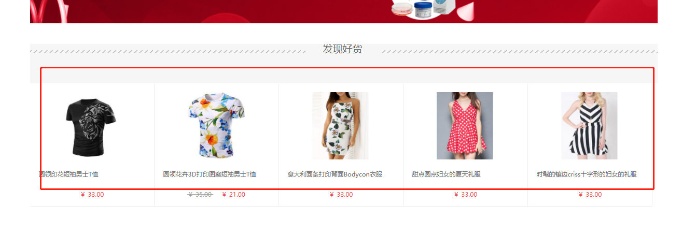


后台：`网站配置`  ->  `首页产品配置`   `Hot Product Skus`


7.首页底部文字


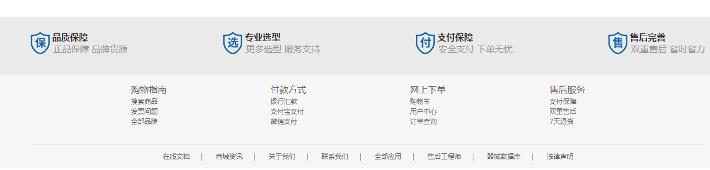


配置：(后台：`CMS` -> `静态块`)

标识符：`pc-footer-text`

标题：`PC：底部Footer文字条款`

内容：

```
<div class="foot-nav2020">    
	<ul>        
		<li class="foot-item2020">            
			<div class="lab_service2020">                
				                <span class="lab_service_txt2020">品质保障</span>                 <span class="lab_service_info2020">正品保障  品牌货源</span>            
			</div>        
		</li>        
		<li class="foot-item2020">            
			<div class="lab_service2020">                
				                <span class="lab_service_txt2020">专业选型</span>                <span class="lab_service_info2020">更多选型  服务支持</span>            
			</div>        
		</li>        
		<li class="foot-item2020">            
			<div class="lab_service2020">                
				                <span class="lab_service_txt2020">支付保障</span>                 <span class="lab_service_info2020">安全支付  下单无忧</span>            
			</div>        
		</li>        
		<li class="foot-item2020">            
			<div class="lab_service2020">                
				                <span class="lab_service_txt2020">售后完善</span>                 <span class="lab_service_info2020">双重售后  省时省力</span>            
			</div>        
		</li>    
	</ul>
</div>
<div class="footer" style="width: 100%; margin: 0 auto;background-color:#f6f6f6;">    
	<div class="bottom-2016">        
		<div class="footcon">            
			<dl class="botcon1">                
				<dt class="b_title">
					购物指南
				</dt>                
				<dd class="b_con">                    
					<div>
						<a href="" rel="nofollow">搜索商品</a>
					</div>                    
					<div>
						<a href="" rel="nofollow">发票问题</a>
					</div>                    
					<div>
						<a href="">全部品牌</a>
					</div>                
				</dd>            
			</dl>            
			<dl class="botcon2">                
				<dt class="b_title">
					付款方式
				</dt>                
				<dd class="b_con">                    
					<div>
						<a href="" target="_blank" rel="nofollow">银行汇款</a>
					</div>                    
					<div>
						<a href="" target="_blank" rel="nofollow">支付宝支付</a>
					</div>                    
					<div>
						<a href="" target="_blank" rel="nofollow">微信支付</a>
					</div>                
				</dd>            
			</dl>            
			<dl class="botcon3">                
				<dt class="b_title">
					网上下单
				</dt>                
				<dd class="b_con">                    
					<div>
						<a href="" target="_blank" rel="nofollow">购物车</a>
					</div>                    
					<div>
						<a href="" target="_blank" rel="nofollow">用户中心</a>
					</div>                    
					<div>
						<a href="" target="_blank" rel="nofollow">订单查询</a>
					</div>                
				</dd>            
			</dl>            
			<dl class="botcon4">                
				<dt class="b_title">
					售后服务
				</dt>                
				<dd class="b_con">                    
					<div>
						<a href="" target="_blank" rel="nofollow">支付保障</a>
					</div>                    
					<div>
						<a href="" target="_blank" rel="nofollow">双重售后</a>
					</div>                    
					<div>
						<a href="" target="_blank" rel="nofollow">7天退货</a>
					</div>                
				</dd>            
			</dl>            
			<div class="clear">            
			</div>        
		</div>    
	</div>    
	<div class="foot" style="color: #666;">        
		<div class="links">            
			<a href="" rel="nofollow" target="_blank">在线文档</a>|            <a href="" rel="nofollow" target="_blank">商城资讯</a>|            <a href="" rel="nofollow" target="_blank">关于我们</a>|            <a href="" rel="nofollow" target="_blank">联系我们</a>|            <a href="" rel="nofollow" target="_blank">全部应用</a>|            <a rel="nofollow" target="_blank" href="">售后工程师</a>|            <a rel="nofollow" target="_blank" href="">器械数据库</a>|            <a href="" rel="nofollow" target="_blank">法律声明</a>        
		</div>    
	</div>
</div>
```

Fecbo Apphtml5配置
-----------

1.首页大图部分


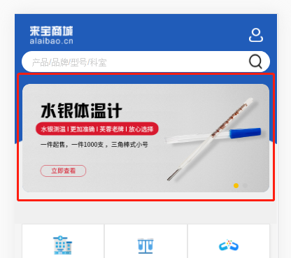


配置：(后台：`CMS` -> `静态块`)

标识符：`h5-home-big-img`

标题：`HTML5:首页大图`

内容：

```
<div class="aui-slide-node aui-slide-node-middle aui-slide-node-center" style="border-radius:10px;background-color:#205cb9">                
	<div class="aui-content aui-padded-15" style="border-radius:10px;">
		                    <a href="">                                            </a>                
	</div>            
</div>                    
<div class="aui-slide-node aui-slide-node-middle aui-slide-node-center" style="border-radius:10px;background-color:#205cb9">                
	<div class="aui-content aui-padded-15" style="border-radius:10px;">                    
		<a href="">                                            </a>                
	</div>            
</div>                               
```


2.首页分类banner


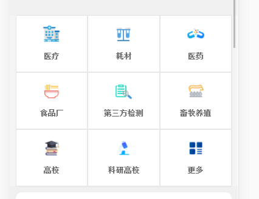


配置：(后台：`CMS` -> `静态块`)

标识符：`h5-home-banner-1`

标题：`HTML5:首页banner-1`

内容：

```
<ul class="specialArea">        
	<li>           
		           <label>医疗</label>        
	</li>        
	<li>           
		           <label>耗材</label>        
	</li>         
	<li>           
		           <label>医药</label>        
	</li>         
	<li>           
		           <label>食品厂</label>        
	</li>        
	<li>           
		           <label>第三方检测</label>        
	</li>         
	<li>           
		           <label>畜牧养殖</label>        
	</li>         
	<li>           
		           <label>高校</label>        
	</li>         
	<li>           
		           <label>科研高校</label>        
	</li>         
	<li>           
		           <label>更多</label>        
	</li>     
</ul>                            
```


3.首页品牌bannner


后台：`产品分类` --> `产品管理` --> `产品品牌`

这里添加品牌


4.首页产品


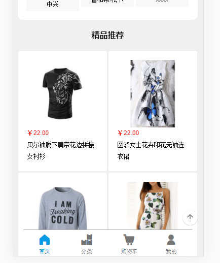

后台：`网站配置` --> `Apphtml5配置` --> `首页配置`


5.首页底部文字


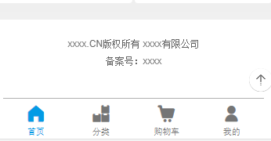


配置：(后台：`CMS` -> `静态块`)

标识符：`h5-home-footer`

标题：`HTML5:首页底部文本`

内容：

```
<div class="copyright" style="padding-top:20px">        
	xxxx.CN版权所有 xxxx有限公司<br />
	 备案号：xxxx
</div>                          
```


