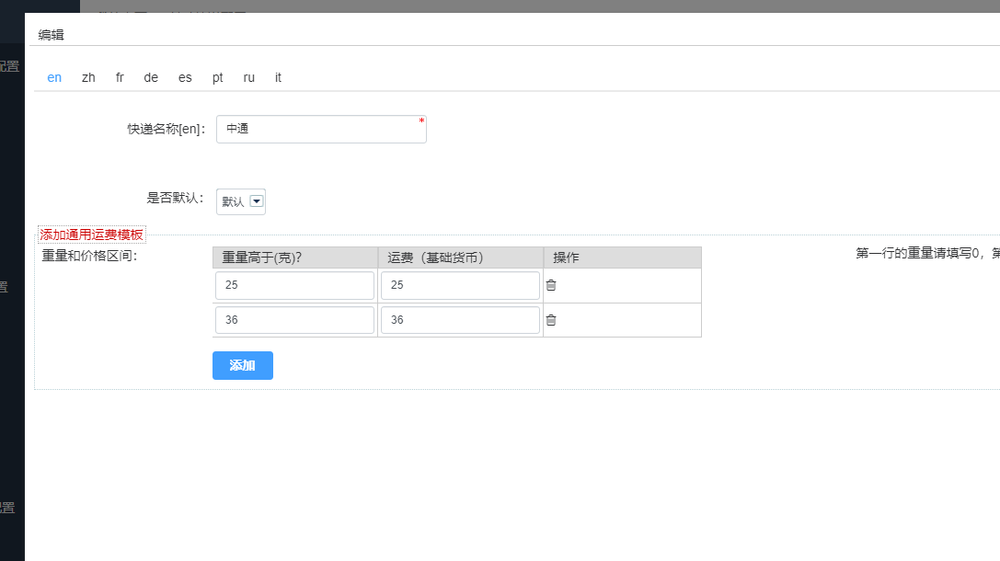
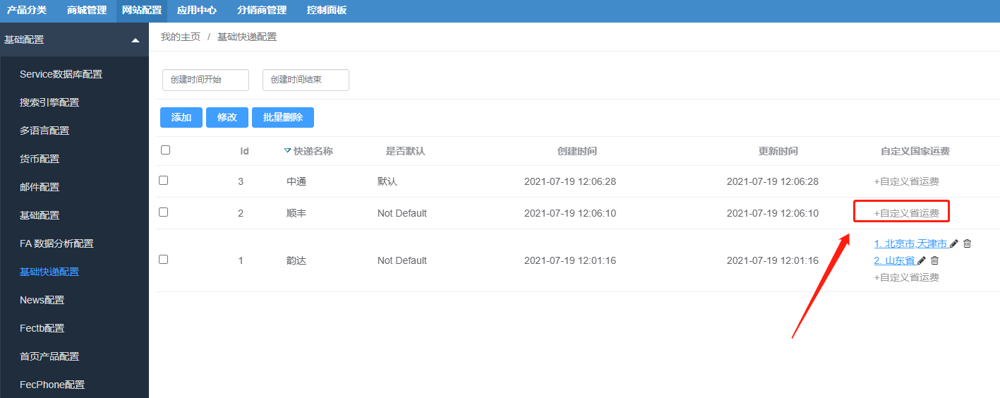

FecCnShipping扩展
=================

> fecmall默认的运费设置是在文件里面，本扩展对shipping部分进行了重写，您可以方便
的在后台进行配置物流快递以及运费

### Fecyo Shipping 运费扩展

注意：该扩展是用于**Fecyo单商户**电商的扩展。

您需要先安装fecmall开源系统，然后再进行插件的安装

1.fecmall应用市场地址：http://addons.fecmall.com/25572974

2.如何应用市场`安装`应用，请参看文档：[Fecmall安装应用](https://www.fecmall.com/doc/fecshop-guide/addons/cn-2.0/guide-fecmall-addons-install.html)

3.您需要先安装fecyo，然后再安装feccnshipping，安装扩展成功后，进入fecmall后台，进入`基础快递配置`菜单, 如下图

3.1您可以创建新的物流方式

填写各个重量区间，对应的快递的费用，创建完成后保存即可

3.2如果您对某些省进行自定义，可以点击`自定义省运费`

勾选省，然后设置重量区间运费即可。

本扩展让用户可以在后台设置各个省/市运费，不需要到配置文件中设置货运方式以及运费，省时省力。

