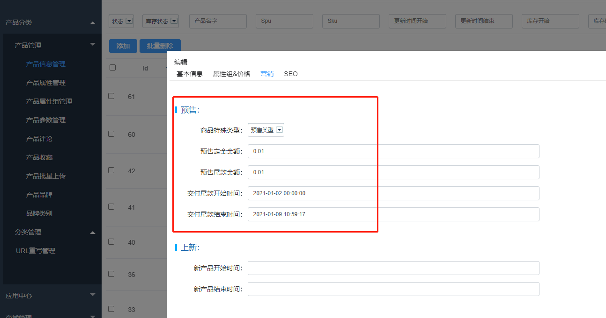
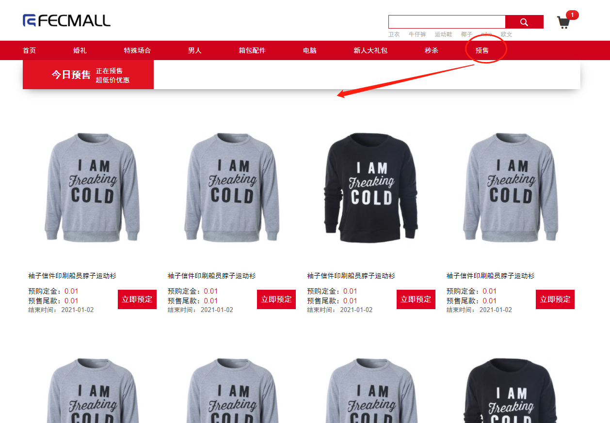
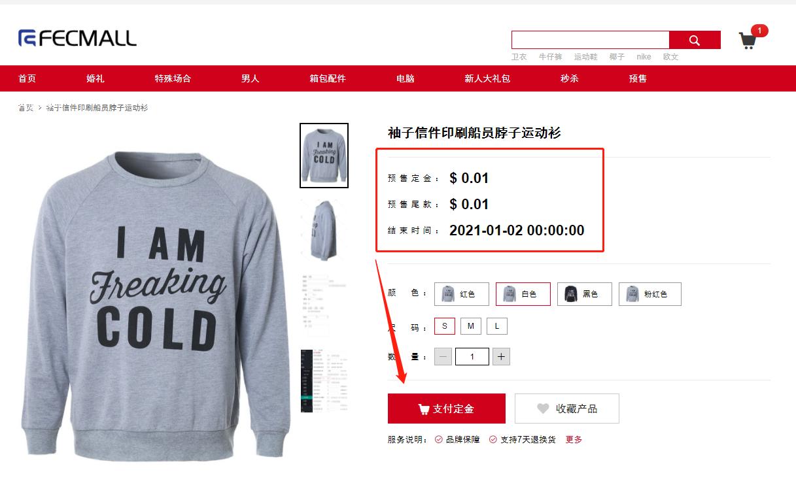
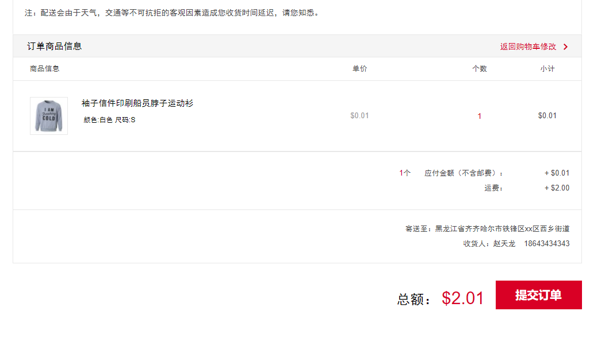
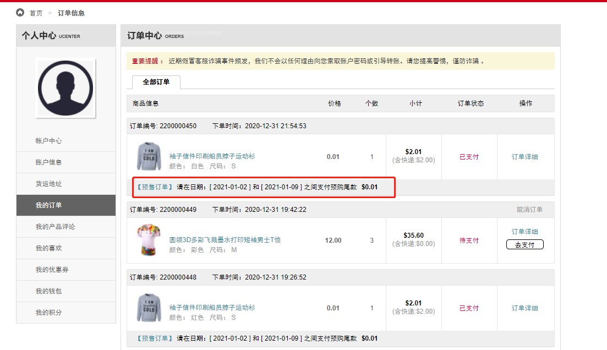
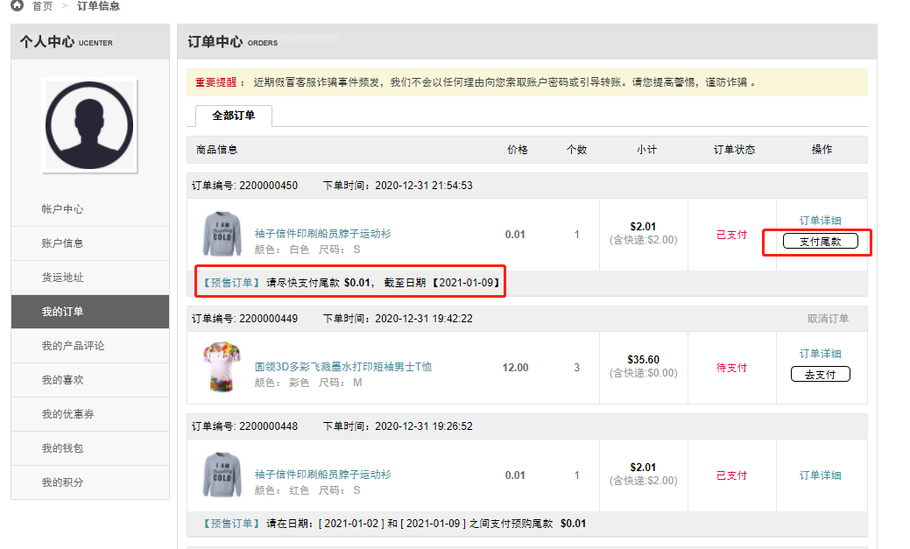
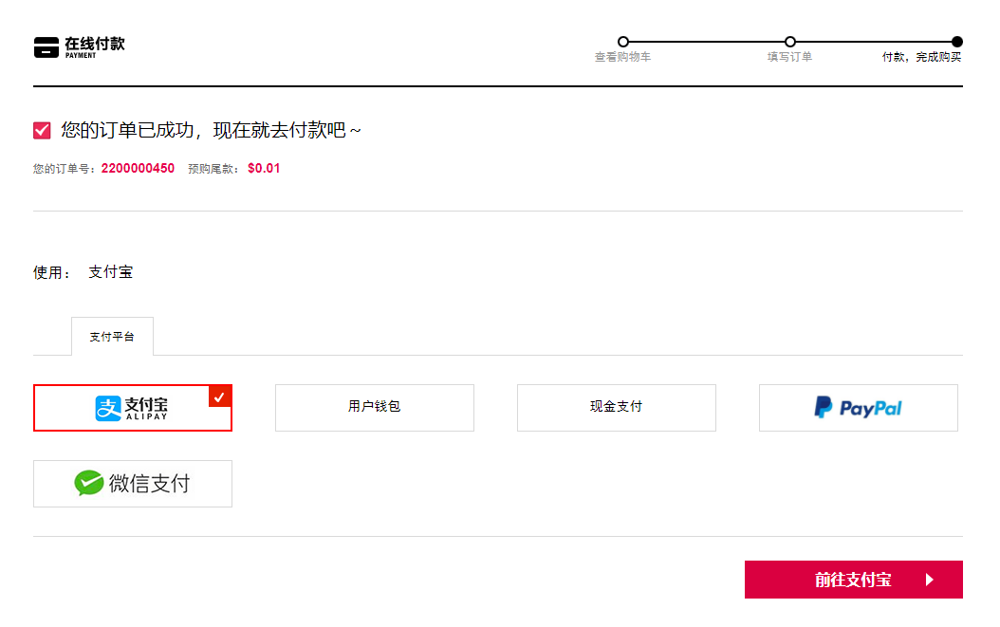
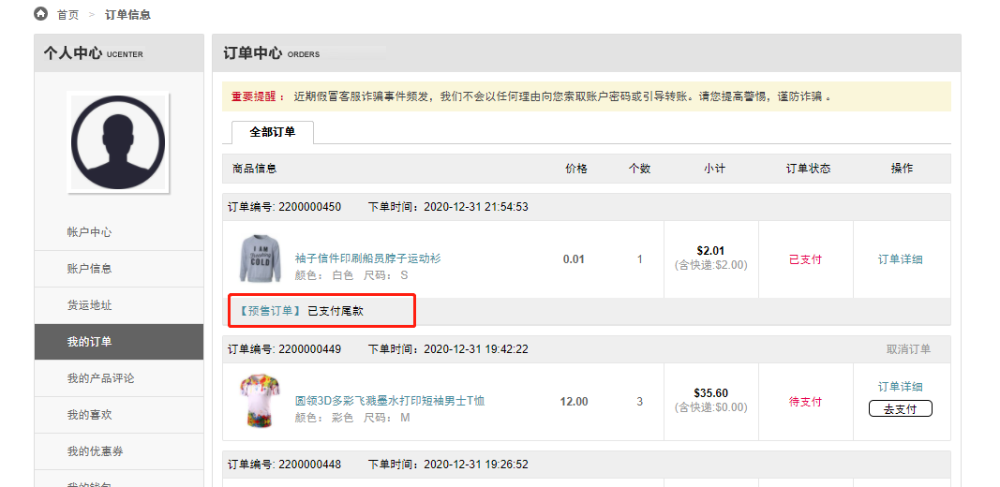
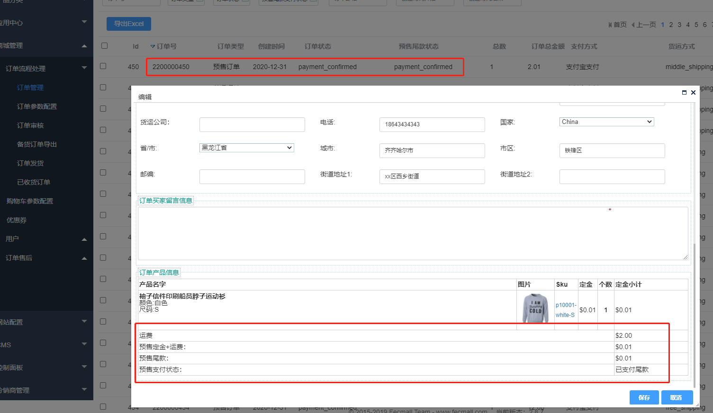

【Fecyo扩展】Fecpresale预售详细操作说明
============

> 本部分是预售操作的详细说明

### 预售产品编辑

在后台产品编辑页面，设置产品预售参数，如图：

`商品特殊类型`：默认是`关闭`状态，您可以将产品设置为`预售类型`

`预售定金金额`：用户预购该产品，需要支付`定金`，也就是此处设置的值，设置后，产品的价格部分将会无效。

`预售尾款金额`：用户支付`定金`后，等待一段时间，当到了交付`尾款`的时间，就可以在账户中心，交付预购`商品尾款`，此处设置尾款的金额。

`交付尾款开始时间`：用户支付定金后，在`未来时间`  > `交付尾款开始时间`，才可以支付尾款，
当`未来时间`  > `交付尾款开始时间`的时候，预购商品`支付定金环节结束`，进入`支付尾款`阶段。

`交付尾款结束时间`：用户支付定金后，当`未来时间`  > `交付尾款结束时间`，支付尾款环节结束，
如果用户支付了定金，但是没有支付尾款，当支付尾款环节结束的时候，用户预购失败，`定金不退`

编辑完成后，保存即可，预售商品编辑完成

### 预售商品查看,支付定金，支付尾款

1.在商城，点击预售菜单，进入预售产品列表

2.点击产品，进入预售产品详情

用户可以点击`支付定金`按钮, 先支付预售产品的定金。

3.点击`支付定金`按钮后，进入支付环节，如果账户没有地址，则会先编辑地址，然后进入支付页面

支付即可

4.账户中心，订单管理，查看已支付定金的预购订单

可以看到，需要用户在将来的某个时间段，支付预购订单尾款，并显示尾款金额

5.支付尾款

当到了可以支付尾款的时间，订单中心可以看到如下图

您可以点击支付尾款，进行预购订单预购尾款的支付

6.用户预购完成

### 管理员查看预购订单

管理员后台，在订单管理部分，查看预购订单信息。

注意：

1.订单状态：指的是`普通订单支付`状态，以及`预购订单` `支付定金`的状态

2.预售尾款状态：指的是预购订单，`尾款支付`的状态。

